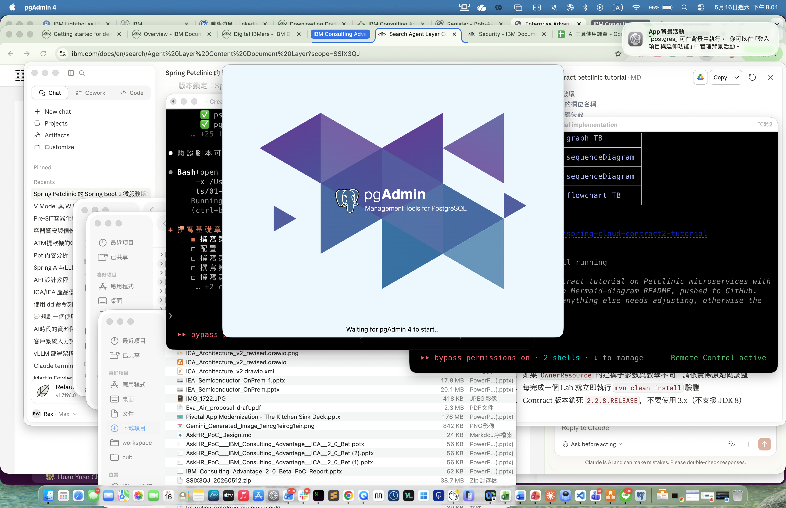

# 第 2 章 pgAdmin 4 介紹與基本操作

> 目標:認識 pgAdmin 4 介面、建立伺服器連線、使用 Query Tool 執行 SQL。
>
> 🧰 **前置準備**:本章範例使用 `bookstore` 資料庫 (`shop` schema 與範例資料)。尚未建立的話,先在 repo 根目錄執行 `psql -d postgres -f setup/01-create-tutorial-db.sql` 與 `psql -d bookstore -f setup/02-sample-data.sql`,詳見[第 1 章 1.8 節](../01-installation/README.md#18-建立教學用資料庫)。

## 2.1 pgAdmin 是什麼

pgAdmin 4 是 PostgreSQL **官方推薦**的開源 GUI 管理工具,可:
- 視覺化瀏覽資料庫物件 (Schema / Table / View / Function / Index…)
- 執行 SQL 並查看結果
- 監看 server 狀態、Session、查詢計畫圖形化 (Explain Visualizer)
- 設計 ERD、權限管理

> 你也可以用 [DBeaver](https://dbeaver.io/) 或 [TablePlus](https://tableplus.com/),但本教程以 pgAdmin 4 為主。

## 2.2 首次啟動

```bash
open -a "pgAdmin 4"
```

第一次啟動會要求**設定 master password** (用於加密儲存其他資料庫密碼)。這是 pgAdmin 本機的密碼,**與 PostgreSQL 帳號無關**。



## 2.3 建立伺服器連線

左側 **Object Explorer** → 右鍵 `Servers` → `Register` → `Server...`

**General 分頁**
- **Name**: `LocalPostgres17` (任意命名)

**Connection 分頁**
| 欄位 | 值 |
|------|-----|
| Host name/address | `localhost` 或 `/tmp` (Unix socket) |
| Port | `5432` |
| Maintenance database | `postgres` |
| Username | `rexwang` (您的 macOS 使用者名稱) |
| Password | 留空 (Homebrew 預設 trust 認證) |
| Save password | ☑ 勾選 |

按 **Save**。連線成功後,左側樹狀目錄會展開,看到 `Databases` → `bookstore`,以及 `Login/Group Roles`、`Tablespaces`。

## 2.4 介面導覽

```
┌─ 頂部 Menu Bar ───────────────────────────────────┐
│ File  Object  Tools  Help                          │
├──────────────┬────────────────────────────────────┤
│              │                                    │
│ Object       │ Dashboard / Properties / SQL /     │
│ Explorer     │ Statistics / Dependencies          │
│ (左側樹狀)   │                                    │
│              │   (右側 工作面板)                  │
│              │                                    │
└──────────────┴────────────────────────────────────┘
```

**Object Explorer 階層**:
```
Servers
└── LocalPostgres17
    ├── Databases
    │   ├── bookstore
    │   │   ├── Schemas
    │   │   │   ├── public
    │   │   │   └── shop          ← 我們的主要 schema
    │   │   │       ├── Tables
    │   │   │       │   ├── books
    │   │   │       │   ├── authors
    │   │   │       │   └── ...
    │   │   │       ├── Views
    │   │   │       ├── Functions
    │   │   │       ├── Sequences
    │   │   │       └── Types
    │   │   └── Extensions
    │   ├── postgres
    │   └── template1
    ├── Login/Group Roles
    └── Tablespaces
```

## 2.5 Query Tool (查詢工具)

**開啟方式**:選定資料庫 → 工具列閃電圖示 ⚡ 或選單 **Tools → Query Tool**。

Query Tool 主要分三區:
1. **SQL 編輯區** — 寫 SQL,支援 syntax highlight、autocomplete (Ctrl+Space)
2. **訊息/結果區** — 切換 *Data Output* / *Messages* / *Notifications* / *Explain*
3. **工具列** — 執行 (F5)、Explain (F7)、Explain Analyze (Shift+F7)、儲存、匯出

**快捷鍵**:
| 鍵 | 動作 |
|----|------|
| F5 | 執行整個 buffer (或選取片段) |
| F7 | EXPLAIN |
| Shift+F7 | EXPLAIN ANALYZE |
| Ctrl+Space | 自動完成 |
| Ctrl+/ | 註解/取消註解 |
| Ctrl+L | 載入 SQL 檔 |
| Alt+Shift+Q | 將結果儲存為 CSV |

## 2.6 第一個查詢

在 Query Tool 內貼上並執行:

```sql
-- 列出書店所有書籍
SELECT b.id, b.title, a.name AS author, c.name AS category, b.price
FROM shop.books b
LEFT JOIN shop.authors a    ON a.id = b.author_id
LEFT JOIN shop.categories c ON c.id = b.category_id
ORDER BY b.id;
```

預期輸出 8 筆書籍資料。下方 **Messages** 分頁會顯示 `成功傳回 8 筆紀錄,...ms`。

## 2.7 物件導覽:資料表詳情

點開 `Schemas > shop > Tables > books`:
- **Properties** 分頁:基本屬性、Owner、Tablespace
- **SQL** 分頁:**自動產生的 CREATE TABLE 語句** (學習語法的好幫手!)
- **Statistics** 分頁:大小、行數估計、I/O 統計
- **Dependencies / Dependents** 分頁:看 FK 關係

## 2.8 ERD 工具 (Entity-Relationship Diagram)

**Object Explorer** → 右鍵 `bookstore` → `Generate ERD`。pgAdmin 會自動畫出整個資料庫的 FK 關係圖,可拖曳排版、匯出 PNG/SVG。

## 2.9 Server Dashboard

點選 server 節點 (`LocalPostgres17`),右側 **Dashboard** 分頁顯示:
- **Session activity** — 即時連線數
- **Transactions per second** — TPS 折線圖
- **Tuples in/out** — 行的讀寫
- **Block I/O** — 區塊讀寫
- 下方的 **Server activity** 顯示目前所有 session 與其執行中的 SQL

## 2.10 練習

1. 建立連線到 `bookstore` 資料庫。
2. 用 Query Tool 執行以下查詢並查看結果:
   ```sql
   SELECT status, COUNT(*) FROM shop.orders GROUP BY status;
   ```
3. 點開 `shop > Tables > orders` 的 **SQL** 分頁,把生成的 `CREATE TABLE` 複製貼到 Query Tool 觀察結構。
4. 嘗試右鍵 `bookstore` → **Generate ERD**,觀察 FK 關係。

## 章節腳本

- [`scripts/01-first-queries.sql`](./scripts/01-first-queries.sql) — Query Tool 內可直接執行的範例

---

下一章 ➡ [第 3 章:資料庫與 Schema 基礎](../03-database-schema/)
