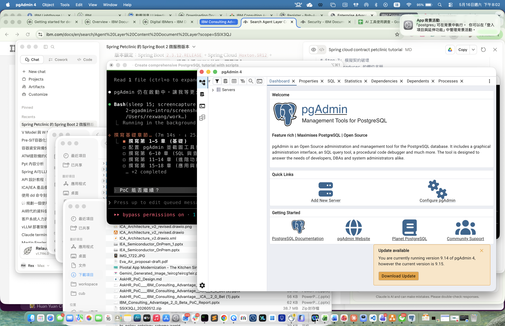

# 第 2 章 pgAdmin 4 介紹與基本操作

> 目標:知道 GUI 工具能幫你什麼、**什麼時候不該用它**、如何正確建立連線與使用 Query Tool,以及 pgAdmin 常見的「連不上 / 卡住 / 語法錯誤」怎麼有系統地排查。
>
> 🧰 **前置準備**:本章範例使用 `bookstore` 資料庫 (`shop` schema 與範例資料)。尚未建立的話,先在 repo 根目錄執行 `psql -d postgres -f setup/01-create-tutorial-db.sql` 與 `psql -d bookstore -f setup/02-sample-data.sql`,詳見[第 1 章 1.8 節](../01-installation/README.md#18-建立教學用資料庫)。
>
> 📐 **本章讀法**:每一節先講「為什麼會需要這個」,再講「怎麼做」。2.2 是選工具前的決策清單,2.13 是六個常見故障情境與排查順序 (其中三個可以用腳本重現)。

## 2.1 pgAdmin 是什麼

**為什麼需要 GUI**:第 1 章的 psql 什麼都能做,但有三件事在純文字介面裡很吃力 — **看全貌** (一個資料庫有幾十張表、彼此怎麼關聯)、**讀長結果** (幾十個欄位的查詢在終端機會折行到看不懂)、**讀執行計畫** (第 9 / 18 章的 `EXPLAIN` 輸出是縮排文字,圖形化後一眼看出瓶頸)。GUI 就是為了這三件事存在。

pgAdmin 4 是 PostgreSQL **官方推薦**的開源 GUI 管理工具,可:
- 視覺化瀏覽資料庫物件 (Schema / Table / View / Function / Index…)
- 執行 SQL 並查看結果
- 監看 server 狀態、Session、查詢計畫圖形化 (Explain Visualizer)
- 設計 ERD、權限管理

**但 GUI 不是萬能的**:它是一條「比較重」的連線 — 每個 Query Tool 分頁都是一條獨立的 server 連線,而且預設行為 (autocommit、結果列數上限) 跟 psql 不同,不理解這些差異就會踩到 2.13 的坑。

> 你也可以用 [DBeaver](https://dbeaver.io/) 或 [TablePlus](https://tableplus.com/),但本教程以 pgAdmin 4 為主。

## 2.2 設計前的決策條件與考量重點

**為什麼要先想再裝**:工具選錯不會報錯,只會讓你在錯的地方花時間 — 用 GUI 跑遷移腳本、用 GUI 連生產環境的超級使用者帳號、把 psql 教學的指令貼進 Query Tool,都是常見的時間黑洞,甚至是事故來源。

### 先確認的前提

| 問題 | 為什麼重要 | 怎麼確認 |
|------|-----------|---------|
| **這個操作是「看」還是「改」?** | 看 (瀏覽結構、讀計畫、看 dashboard) 是 GUI 的強項;改 (遷移、批次更新、DDL) 應該進版本控制、用 psql 或遷移工具跑,才能重複、能 review | 問自己:這段 SQL 明天還要再跑一次嗎?會的話它該是檔案 |
| **要連的是哪個環境?** | 連生產環境的 GUI 分頁是「開著的超級使用者連線」,手滑一個 UPDATE 沒 WHERE 就是事故 | 生產環境只用唯讀角色連 (第 16 章);顏色標記 server (pgAdmin 支援) |
| **結果會有多大?** | GUI 要把每一列傳回、渲染成表格;幾十萬列會讓 pgAdmin 卡死或吃光記憶體 (2.13 情境 E) | 先 `count(*)`,再決定要不要 `LIMIT` |
| **你需要 psql 專屬指令嗎?** | `\c`、`\d`、`\copy`、`\i` 是 psql 客戶端指令,pgAdmin 沒有 (2.13 情境 C);教學/文件裡的反斜線指令在 GUI 裡全部無效 | 看到反斜線開頭的指令,就是 psql 的活 |
| **是本機還是遠端 / 容器?** | 本機 Homebrew 用 Unix socket + 本機帳號免密碼;遠端與容器走 TCP,要密碼、可能要 SSL 或 SSH tunnel | `pg_isready -h <host> -p <port>` 先確認能不能碰到 |
| **多人共用還是個人用?** | 個人用 desktop mode 最省事;團隊共用 (Web/Server mode 或 Docker 版) 才有帳號管理與集中設定,但要管 master password 與備份 `pgadmin4.db` | 一個人用就 desktop |

### 決策對照:什麼情況用什麼

| 情況 | 選擇 | 理由 |
|------|------|------|
| 學習、探索結構、讀 EXPLAIN、看 ERD | pgAdmin (或 DBeaver) | 視覺化是 GUI 唯一的不可替代價值 |
| 執行 `.sql` 檔、遷移、CI、備份腳本 | psql / pg_dump (第 1、17 章) | 可重複、可版本控制、可放進 cron;GUI 做不到 |
| 匯出大量資料、`\copy` | psql | GUI 的匯出要先把結果撈進記憶體 |
| 跨多種資料庫 (MySQL、Oracle 也要) | DBeaver / DataGrip | pgAdmin 只做 PostgreSQL;多 DB 團隊統一一套工具較省學習成本 |
| 只想在編輯器裡順手查一下 | VS Code 的 PostgreSQL 擴充 | 少切視窗;但功能遠不如 pgAdmin |
| macOS 個人使用 | pgAdmin desktop 模式 (`.app`) | 免架 web server、免帳號 |
| Linux / WSL / 團隊共用 | Docker `dpage/pgadmin4` (web 模式) | 一行 `docker run` 就有,瀏覽器開;設定可用 `servers.json` 預載 |
| 連生產環境 | 唯讀角色 + SSH tunnel / SSL,**永遠不用 superuser** | GUI 分頁是長駐連線,權限越大事故越大 |

### 上線 / 實務考量

- **autocommit**:Query Tool 預設 autocommit **開**,每段 SQL 各自提交。若你關掉它 (工具列的交易圖示),沒 COMMIT 就去做別的事,鎖會一直握著,其他人全卡住 (2.13 情境 D)。要用交易就明確寫 `BEGIN; ... COMMIT;`,做完就關分頁。
- **結果列數上限**:Preferences → Query Tool → *Max rows to display* (預設 1000)。這是保護你的瀏覽器,不是 SQL 的 `LIMIT`;真正的限制要寫在 SQL 裡。
- **儲存密碼**:desktop 模式的 *Save password* 用 master password 加密存在本機 `pgadmin4.db`;丟了 master password 就要重設、重打所有連線密碼 (2.13 情境 F)。
- **一個分頁 = 一條連線**:開十個 Query Tool 就佔十條 `max_connections`;在連線數吃緊的環境 (第 18 章) 這很有感。用完就關。
- **pgAdmin 版本要跟得上 server**:舊版 pgAdmin 連新版 PostgreSQL 可能少功能或顯示錯誤;升級 server 時一併升級 pgAdmin。
- **不要在 GUI 裡做「一次性但不可逆」的事**:DROP / TRUNCATE / 無 WHERE 的 UPDATE,先 `BEGIN;` 看 `RETURNING` 或影響列數,確認再 `COMMIT` (第 6 章)。

## 2.3 首次啟動

**為什麼有 master password**:pgAdmin 會幫你「記住」各個資料庫的密碼;這些密碼要存在本機檔案裡,總得有一把鑰匙加密它們,這把鑰匙就是 master password。它是 pgAdmin 自己的密碼,**跟 PostgreSQL 任何帳號無關**,忘了它不會讓你連不上資料庫,只是 pgAdmin 記住的密碼都要重打。

```bash
open -a "pgAdmin 4"
```

第一次啟動會要求**設定 master password** (用於加密儲存其他資料庫密碼)。


設定完成後進入主視窗:左側是物件樹 (Object Explorer),右側是工作面板;下一節建立連線後,左側樹才會出現你的 server。



## 2.4 建立伺服器連線

**為什麼每個欄位都要填對**:pgAdmin 的 server 註冊就是把第 1 章 `psql -h -p -d -U` 的參數填進表單;任何一個跟 server 實際設定不符,錯誤訊息都只會告訴你「連不上」,要靠 2.13 情境 A / B 的順序去縮小範圍。填的時候就想清楚:**server 在哪 (Host/Port)、用哪個帳號 (Username)、那個帳號怎麼認證 (Password / pg_hba)**。

左側 **Object Explorer** → 右鍵 `Servers` → `Register` → `Server...`

**General 分頁**
- **Name**: `LocalPostgres17` (任意命名)

**Connection 分頁**
| 欄位 | 值 |
|------|-----|
| Host name/address | `localhost` 或 `/tmp` (Unix socket) |
| Port | `5432` |
| Maintenance database | `postgres` |
| Username | `rexwang` (您的 macOS 使用者名稱) |
| Password | 留空 (Homebrew 預設 trust 認證) |
| Save password | ☑ 勾選 |

按 **Save**。連線成功後,左側樹狀目錄會展開,看到 `Databases` → `bookstore`,以及 `Login/Group Roles`、`Tablespaces`。

> Username 填 `postgres` 是最常見的失誤:Homebrew 安裝的 PostgreSQL **沒有** `postgres` 這個角色,超級使用者是你的 macOS 帳號 (第 1 章 1.7 節)。Docker 官方映像則相反,預設就是 `postgres`。

## 2.5 介面導覽

**為什麼要先認識版面**:pgAdmin 的每個面板都對應一種「問題」— 找物件用左側樹、看定義用 SQL 分頁、看誰在連線用 Dashboard。知道問題該去哪個面板找答案,才不會每件事都用 SQL 硬查。

```
┌─ 頂部 Menu Bar ───────────────────────────────────┐
│ File  Object  Tools  Help                          │
├──────────────┬────────────────────────────────────┤
│              │                                    │
│ Object       │ Dashboard / Properties / SQL /     │
│ Explorer     │ Statistics / Dependencies          │
│ (左側樹狀)   │                                    │
│              │   (右側 工作面板)                  │
│              │                                    │
└──────────────┴────────────────────────────────────┘
```

**Object Explorer 階層**:
```
Servers
└── LocalPostgres17
    ├── Databases
    │   ├── bookstore
    │   │   ├── Schemas
    │   │   │   ├── public
    │   │   │   └── shop          ← 我們的主要 schema
    │   │   │       ├── Tables
    │   │   │       │   ├── books
    │   │   │       │   ├── authors
    │   │   │       │   └── ...
    │   │   │       ├── Views
    │   │   │       ├── Functions
    │   │   │       ├── Sequences
    │   │   │       └── Types
    │   │   └── Extensions
    │   ├── postgres
    │   └── template1
    ├── Login/Group Roles
    └── Tablespaces
```

這棵樹就是第 3 章要講的「Cluster → Database → Schema → 物件」階層的具象版。

## 2.6 Query Tool (查詢工具)

**為什麼要理解它跟 psql 的差別**:Query Tool 看起來像「有顏色的 psql」,但底層是不同的東西 — 它把編輯區的文字**原封不動送給伺服器**,所以 psql 的反斜線指令在這裡是語法錯誤;它一個分頁綁一條連線、一個資料庫,所以沒有 `\c` 可以切換;它有自己的 autocommit 開關與結果列數上限。把它當成「一條連到特定 DB 的長駐連線 + 編輯器」就對了。

**開啟方式**:選定資料庫 → 工具列閃電圖示 ⚡ 或選單 **Tools → Query Tool**。

Query Tool 主要分三區:
1. **SQL 編輯區** — 寫 SQL,支援 syntax highlight、autocomplete (Ctrl+Space)
2. **訊息/結果區** — 切換 *Data Output* / *Messages* / *Notifications* / *Explain*
3. **工具列** — 執行 (F5)、Explain (F7)、Explain Analyze (Shift+F7)、儲存、匯出

**快捷鍵**:
| 鍵 | 動作 |
|----|------|
| F5 | 執行整個 buffer (或選取片段) |
| F7 | EXPLAIN |
| Shift+F7 | EXPLAIN ANALYZE |
| Ctrl+Space | 自動完成 |
| Ctrl+/ | 註解/取消註解 |
| Ctrl+L | 載入 SQL 檔 |
| Alt+Shift+Q | 將結果儲存為 CSV |

> **選取片段再按 F5** 是最實用的習慣:一個分頁放整章的腳本,反白哪一段就跑哪一段,不會誤跑到後面的 DROP。

## 2.7 第一個查詢

**為什麼從 JOIN 開始**:第一個查詢的目的不是學 SQL,是**驗證整條路通了** — 連線對、資料庫對、schema 對、範例資料有載入。一個跨三張表的 JOIN 一次驗證全部;若回傳 8 筆,後面各章的前置準備就都沒問題。

在 Query Tool 內貼上並執行:

```sql
-- 列出書店所有書籍
SELECT b.id, b.title, a.name AS author, c.name AS category, b.price
FROM shop.books b
LEFT JOIN shop.authors a    ON a.id = b.author_id
LEFT JOIN shop.categories c ON c.id = b.category_id
ORDER BY b.id;
```

預期輸出 8 筆書籍資料。下方 **Messages** 分頁會顯示 `成功傳回 8 筆紀錄,...ms`。若是 0 筆或 `relation "shop.books" does not exist`,回到前置準備重跑 setup 腳本。

## 2.8 物件導覽:資料表詳情

**為什麼要看這幾個分頁**:這是「不用寫 SQL 就能回答的問題」的清單 — 這張表誰擁有?定義長什麼樣?多大?誰依賴它?第 5 章學 `CREATE TABLE` 語法時,直接看 pgAdmin 幫你反推出來的 DDL 是最快的學法;第 10 章刪欄位被擋時,Dependents 分頁一眼看出是哪個 view 擋的。

點開 `Schemas > shop > Tables > books`:
- **Properties** 分頁:基本屬性、Owner、Tablespace
- **SQL** 分頁:**自動產生的 CREATE TABLE 語句** (學習語法的好幫手!)
- **Statistics** 分頁:大小、行數估計、I/O 統計
- **Dependencies / Dependents** 分頁:看 FK 關係

## 2.9 ERD 工具 (Entity-Relationship Diagram)

**為什麼**:接手一個陌生資料庫,第一個問題永遠是「這些表怎麼串起來」。逐張表看 FK 要花一小時;ERD 一張圖三分鐘。

**Object Explorer** → 右鍵 `bookstore` → `Generate ERD`。pgAdmin 會自動畫出整個資料庫的 FK 關係圖,可拖曳排版、匯出 PNG/SVG。

## 2.10 Server Dashboard

**為什麼**:當「資料庫變慢了」的抱怨進來,第一個要回答的是**現在到底發生什麼事** — 幾條連線?有沒有人卡在等鎖?TPS 是不是暴增?Dashboard 就是這幾個問題的即時儀表板,也是 2.13 情境 D、第 13 章、第 18 章排查的起點。底層其實就是 `pg_stat_activity` 等系統 view,後面章節會教你用 SQL 問一樣的問題。

點選 server 節點 (`LocalPostgres17`),右側 **Dashboard** 分頁顯示:
- **Session activity** — 即時連線數
- **Transactions per second** — TPS 折線圖
- **Tuples in/out** — 行的讀寫
- **Block I/O** — 區塊讀寫
- 下方的 **Server activity** 顯示目前所有 session 與其執行中的 SQL

## 2.11 練習

1. 建立連線到 `bookstore` 資料庫。
2. 用 Query Tool 執行以下查詢並查看結果:
   ```sql
   SELECT status, COUNT(*) FROM shop.orders GROUP BY status;
   ```
3. 點開 `shop > Tables > orders` 的 **SQL** 分頁,把生成的 `CREATE TABLE` 複製貼到 Query Tool 觀察結構。
4. 嘗試右鍵 `bookstore` → **Generate ERD**,觀察 FK 關係。

## 2.12 用 Docker 跑 pgAdmin (非 macOS 或團隊共用)

**為什麼**:Linux / WSL 沒有 `.app` 可以裝,團隊共用也不希望每個人各自設定連線。Docker 版一行起來,還能用 `servers.json` 預載連線。

```bash
docker run -d --name pgadmin4 -p 5050:80 \
  -e PGADMIN_DEFAULT_EMAIL=admin@example.com \
  -e PGADMIN_DEFAULT_PASSWORD=admin \
  dpage/pgadmin4
# 瀏覽器開 http://localhost:5050
```

要連到同一台機器上的 PostgreSQL 時,Host 不能填 `localhost` (那是 pgAdmin 容器自己);用 `host.docker.internal` (Docker Desktop) 或把兩個容器放進同一個 docker network 後用容器名稱。

## 2.13 問題排查:情境模擬與排查順序

**為什麼要練這個**:GUI 的錯誤訊息通常只有一行 — 「Unable to connect」、「syntax error」、轉圈圈不動 — 而背後可能是六七種不同原因。能不能有順序地縮小範圍,決定你是花三分鐘還是三小時。

> 🧪 情境 C、D、E 可以用 [`scripts/02-troubleshooting-scenarios.sql`](./scripts/02-troubleshooting-scenarios.sql) 在 psql 裡重現 (D 用 `dblink` 模擬「另一個 pgAdmin 連線」);A、B、F 需要環境故障才會發生,下面給的是診斷指令與正常 / 異常輸出的長相。

### 通用排查順序:「pgAdmin 連不上 / 卡住 / 報錯」

順序的邏輯是**先排除 pgAdmin 以外的層,再看 pgAdmin 自己**:

```
1. server 活著嗎?
   → pg_isready -h <host> -p <port>;brew services list / docker ps
2. 用 psql 帶「一模一樣的參數」連得上嗎?
   → psql -h <host> -p <port> -U <user> -d <db>
     連得上 → 問題在 pgAdmin 的設定;連不上 → 問題在 server / 網路 / 認證 (第 1 章 1.9)
3. 對照 Connection 分頁的每個欄位
   → Host / Port / Maintenance DB / Username / 密碼是否過期 / SSL mode
4. 是 pgAdmin 自己的狀態嗎?
   → master password、pgadmin4.db 損壞、版本太舊
5. 是這個 Query Tool 分頁的狀態嗎?
   → 交易開著沒 COMMIT?autocommit 關了?結果列數太多?
6. 才動手改
   → 改連線設定 > 改 pg_hba > 重設 pgAdmin;每改一項就回到第 2 步驗證
```

### 情境 A:「Unable to connect to server: connection refused」(需環境故障,示意)

**症狀**:按 Save 後跳出紅色錯誤,`connection refused` 或 `could not connect to server: No such file or directory`。

| 步驟 | 做什麼 | 正常 vs 異常 |
|------|-------|-------------|
| 1 | `pg_isready -h localhost -p 5432` | 正常 `localhost:5432 - accepting connections`;異常 `no response` → server 沒跑或 port 錯 |
| 2 | `brew services list` (macOS) / `docker ps` (容器) | 看到 `postgresql@17 started`;`stopped`/`error` 就是沒起來 |
| 3 | `lsof -i :5432` | 有 `postgres` 在聽才對;空的代表沒起來;是別的程式代表 port 被佔 |
| 4 | Host 填的是 `localhost` 還是 socket 目錄?Docker 版 pgAdmin 填 `localhost` 一定連不上 (那是容器自己) | 改成 `host.docker.internal` 或容器名稱 (2.12) |

**根因**:九成是 server 根本沒在跑,或 pgAdmin 連的 host/port 跟 server 聽的不一樣。**修正**:`brew services start postgresql@17` / 修正 Host、Port。**驗證**:步驟 1 回到 `accepting connections`,再回 pgAdmin 按 Save。

### 情境 B:`FATAL: password authentication failed` / `role "postgres" does not exist` (需環境故障,示意)

**症狀**:能碰到 server (不是 refused),但認證被拒。

| 步驟 | 做什麼 | 看到什麼 |
|------|-------|---------|
| 1 | 讀完整錯誤:是 `role ... does not exist` 還是 `password authentication failed`? | 前者是帳號名錯,後者是密碼或 pg_hba 方法錯 |
| 2 | 用 psql 試同樣帳號:`psql -h localhost -U postgres -d postgres` | 同樣失敗 → 跟 pgAdmin 無關 |
| 3 | 列出實際存在的角色:`psql -d postgres -c '\du'` (本機免密碼連線) | Homebrew 環境只會看到你的 macOS 帳號,**沒有** `postgres` |
| 4 | 看認證方法:`psql -d postgres -c 'SHOW hba_file'`,開檔案看 `local` / `host` 行的 method | `trust` 免密碼、`scram-sha-256` 要密碼、`peer` 只認 OS 帳號 (走 TCP 時 peer 不適用) |

**根因**:Connection 分頁的 Username 填了教學/網路上常見的 `postgres`,但這台 server 的超級使用者是 OS 帳號;或 pg_hba 對 TCP 連線要求密碼而你沒設。**修正**:Username 改成 `\du` 看到的帳號;要用密碼就 `ALTER ROLE ... PASSWORD '...'` 並確認 pg_hba 該行是 `scram-sha-256`,改完 `SELECT pg_reload_conf();`。**驗證**:步驟 2 的 psql 連得上,pgAdmin 再 Save。

### 情境 C:在 Query Tool 貼 `\d books` 或 `\c bookstore` 報 syntax error

**症狀**:從教學或網路複製指令貼進 Query Tool,按 F5 出現 `ERROR: syntax error at or near "\"`。

| 步驟 | 做什麼 | 看到什麼 |
|------|-------|---------|
| 1 | 看錯誤位置:指向第一個字元 `\` | 伺服器在 SQL 的第一個字就看不懂 |
| 2 | 問「這是 SQL 還是 psql 指令?」— 反斜線開頭的一律是 psql 客戶端指令 | `\d` `\dt` `\c` `\copy` `\i` `\x` 全部不是 SQL |
| 3 | 腳本重現:把 `\d books` 當 SQL 送出 | `SQLSTATE 42601 : syntax error at or near "\"` — 跟 pgAdmin 看到的一模一樣 |

**根因**:psql 自己攔截並處理反斜線指令,從不送給伺服器;pgAdmin 沒有這一層,整段文字原樣送出,伺服器只會 SQL。

**修正**:用 GUI 或系統目錄的 SQL 版本代替:

| psql 指令 | pgAdmin 做法 |
|----------|-------------|
| `\d shop.books` | 物件樹點 `books` → SQL / Properties 分頁;或 `SELECT column_name, data_type, is_nullable, column_default FROM information_schema.columns WHERE table_schema='shop' AND table_name='books' ORDER BY ordinal_position;` |
| `\dt shop.*` | 展開 `Schemas > shop > Tables`;或 `SELECT tablename FROM pg_tables WHERE schemaname='shop';` |
| 看索引 / 約束 | `SELECT conname, pg_get_constraintdef(oid) FROM pg_constraint WHERE conrelid='shop.books'::regclass;` |
| `\c bookstore` | **沒有對應** — 一個分頁綁一個 DB;對 `bookstore` 節點另開 Query Tool |
| `\copy` | 結果格右上角的匯出 (CSV) 按鈕,或改用 psql |

**驗證**:`SELECT current_database(), current_user;` 確認這個分頁連的是對的 DB 與角色。

### 情境 D:同事在 pgAdmin 改了一筆資料就去開會,應用程式全部逾時

**症狀**:應用程式對某張表的 UPDATE 全部 `canceling statement due to lock timeout` 或直接卡住;沒有人 deploy、server 也沒滿載。

| 步驟 | 做什麼 | 看到什麼 (腳本實跑) |
|------|-------|-------------------|
| 1 | 通用順序第 5 步:有沒有交易開著沒 COMMIT?查 `pg_stat_activity WHERE state = 'idle in transaction'` | `pid 143 \| pgAdmin 4 - CONN:1234 \| idle in transaction \| xact_age 00:00:01 \| UPDATE shop.ts_books ...` — **`application_name` 直接告訴你是 pgAdmin** |
| 2 | 確認就是它擋住我們:`pg_blocking_pids(<卡住的 pid>)` | 應用程式 `my-app` 的 `wait_event_type = Lock`,`blocked_by = {143}`,blocker 狀態 `idle in transaction` |
| 3 | 回頭看那個分頁:工具列的 autocommit 是關的,或有人手動 `BEGIN;` 沒收尾 | — |

**根因**:Query Tool 的 autocommit 關掉後,同一分頁的所有 SQL 都在一個交易裡,UPDATE 取得的列鎖要到 COMMIT / ROLLBACK 才釋放;分頁沒關、人走了,鎖就一直在。這種鎖不會自己過期。

**修正**:請對方回來 COMMIT 或 ROLLBACK;找不到人就 `SELECT pg_terminate_backend(143);` (它的未提交變更會被回滾)。長期解法:`ALTER ROLE <pgadmin 用的角色> SET idle_in_transaction_session_timeout = '5min';` (第 13 章)。

**驗證**:被擋住的應用程式更新立刻回 `UPDATE 1`;`still_idle_in_txn = 0`;`stock` 只少了應用程式那一次 (pgAdmin 未提交的那次被回滾)。

### 情境 E:一個 SELECT 在 pgAdmin「跑不完」,結果格一直轉圈

**症狀**:對某張表按 F5,幾十秒沒反應、pgAdmin 記憶體暴增,但同一條 SQL 在 psql 幾毫秒就好。

| 步驟 | 做什麼 | 看到什麼 (腳本實跑,200k 列) |
|------|-------|--------------------------|
| 1 | 先問表多大,別直接 `SELECT *`:`pg_size_pretty(pg_total_relation_size(...))`、`pg_class.reltuples` | `17 MB \| 200000` |
| 2 | 伺服器端到底花多久:`EXPLAIN (ANALYZE, BUFFERS) SELECT * FROM ...` (Query Tool 按 Shift+F7,只回計畫不回資料) | `Seq Scan ... actual rows=200000`,**Execution Time 5.4 ms** — 伺服器根本不慢 |
| 3 | 那慢在哪?— 在「把 200k 列送到 pgAdmin 並渲染成表格」這段,EXPLAIN 看不到 | — |

**根因**:GUI 要把每一列傳回、在前端建成表格,成本跟列數成正比;psql 是串流輸出到終端機所以沒感覺。*Max rows to display* 只保護瀏覽器,伺服器還是會把整個結果送過來。

**修正**:看資料就 `... ORDER BY id LIMIT 100` (腳本實跑 8.8 ms,回 100 列);要數字就用聚合 `SELECT count(*), min(created_at), max(created_at) ...`;要整批匯出就用 psql `\copy`。

**驗證**:結果格立即顯示;Messages 顯示 `成功傳回 100 筆紀錄`。

### 情境 F:「Failed to load preferences」/ master password 忘了 (需環境故障,示意)

**症狀**:pgAdmin 啟動後跳錯,或每次都要求 master password 但輸入什麼都不對。

| 步驟 | 做什麼 | 看到什麼 |
|------|-------|---------|
| 1 | 這是 pgAdmin 自己的問題,跟 PostgreSQL 無關 — 先用 psql 確認資料庫本身正常 | psql 連得上 → 通用順序第 4 步 |
| 2 | 找 pgAdmin 的設定檔:macOS `~/Library/Application Support/pgAdmin/` (Docker 版在 volume `/var/lib/pgadmin/`) | 裡面有 `pgadmin4.db` (SQLite,存 server 清單與加密後的密碼) |
| 3 | 忘了 master password:pgAdmin 登入視窗有 *Reset Master Password* | 重設會**清掉所有已儲存的密碼**,server 清單保留 |
| 4 | 檔案損壞 (`Failed to load preferences`、`database is locked`):關掉 pgAdmin,把 `pgadmin4.db` 改名備份,重開 | pgAdmin 會建一個全新的;server 要重新註冊 |

**根因**:`pgadmin4.db` 是 pgAdmin 的單一狀態來源,損壞或鑰匙丟了就是這些症狀。**修正**:如上;團隊共用 (server mode) 的環境要**定期備份這個檔案**。**驗證**:pgAdmin 正常啟動、重新註冊 server 後 2.7 的查詢回 8 筆。

## 章節腳本

- [`scripts/01-first-queries.sql`](./scripts/01-first-queries.sql) — Query Tool 內可直接執行的範例
- [`scripts/02-troubleshooting-scenarios.sql`](./scripts/02-troubleshooting-scenarios.sql) — 2.13 情境 C / D / E 的可重現版本 (在 psql 執行)

---

下一章 ➡ [第 3 章:資料庫與 Schema 基礎](../03-database-schema/)
