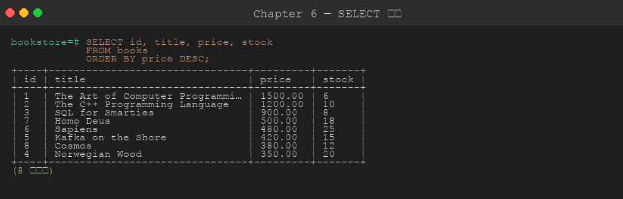
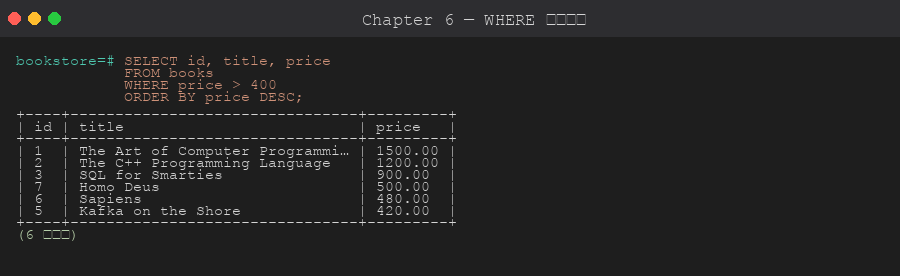
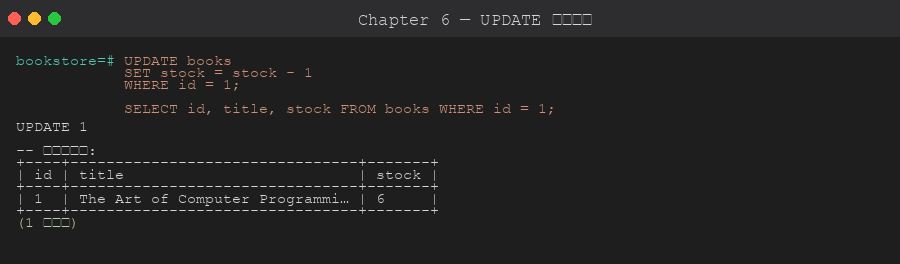

# 第 6 章 基本 SQL — CRUD

> 目標:熟練 `INSERT` / `SELECT` / `UPDATE` / `DELETE` 四大操作,**知道每種寫法適合什麼情況**,以及 PostgreSQL 特有的 `RETURNING` 與 `INSERT ... ON CONFLICT` (UPSERT);並且在「改錯資料」、「UPSERT 報錯」、「寫入被卡住」時知道怎麼有系統地排查。
>
> 🧰 **前置準備**:本章範例使用 `bookstore` 資料庫 (`shop` schema 與範例資料)。尚未建立的話,先在 repo 根目錄執行 `psql -d postgres -f setup/01-create-tutorial-db.sql` 與 `psql -d bookstore -f setup/02-sample-data.sql`,詳見[第 1 章 1.8 節](../01-installation/README.md#18-建立教學用資料庫)。
>
> 📐 **本章讀法**:每一節都先講「為什麼會需要這個」,再講「怎麼做」。6.2 是動手寫入資料前的決策清單,6.9 是四個可以實際重現的故障情境與排查順序。

## 6.1 為什麼 CRUD 值得認真學

`INSERT` / `SELECT` / `UPDATE` / `DELETE` 看起來是最基本的四句話,但**生產環境絕大多數的資料事故都發生在這四句話上**:少一個 `WHERE` 就改掉整張表、匯入時默默少了幾百筆、一個批次 UPDATE 讓全站寫入停擺。它們不會像語法錯誤那樣立刻報錯,而是安靜地把錯的資料留下來。

所以本章除了語法,更重要的是三個習慣:

- **寫入前先想清楚**:一筆還是一批?衝突要覆蓋還是跳過?改多少列?(6.2)
- **改資料先包在交易裡**:`BEGIN; ... ROLLBACK;` 是最便宜的後悔藥 (6.5、6.9 情境 A)
- **每次寫入都核對結果**:命令回應的列數 (`UPDATE 8`) 與 `RETURNING` 是最直接的回饋 (6.3、6.9)

## 6.2 寫入前的決策條件與考量重點

**為什麼要先想再寫**:SELECT 寫錯頂多結果不對,重下一次就好;寫入寫錯是**不可逆**的 — COMMIT 之後只剩備份能救 (第 17 章)。花 30 秒回答下面幾個問題,比事後從備份撈資料便宜得多。

### 先確認的前提

| 問題 | 為什麼重要 | 怎麼確認 |
|------|-----------|---------|
| **這句會影響幾列?** | `UPDATE`/`DELETE` 的殺傷力 = WHERE 命中的列數。預期改 1 列卻回 `UPDATE 8`,就是出事了 | 先用**同樣的 WHERE** 跑 `SELECT count(*)`;執行後對照命令回應的列數 |
| **有辦法後悔嗎?** | 交易內可以 `ROLLBACK`,COMMIT 之後不行 | 手動操作一律 `BEGIN;` 開頭;psql 可 `\set AUTOCOMMIT off` |
| **目標表有沒有我以為的約束?** | `ON CONFLICT (col)` 需要 `col` 上有 UNIQUE;用 `CREATE TABLE AS` / `INSERT SELECT` 複製出來的表**沒有**任何約束 (6.9 情境 B) | `\d 表名` 看 Indexes / Constraints |
| **來源資料乾淨嗎?** | 同一批裡的重複 key 會讓 `DO NOTHING` 默默丟資料、讓 `DO UPDATE` 整批失敗 (6.9 情境 C);NULL、尾端空白、大小寫讓等號對不上 (6.9 情境 A-2) | `GROUP BY key HAVING count(*) > 1`;`length(col)`、`col IS NULL` |
| **會鎖住別人多久?** | UPDATE/DELETE 對每一列取 row lock,直到 COMMIT 才放;改 20 萬列 = 握著 20 萬把鎖 (6.9 情境 D) | 大批次改成分批、各自 COMMIT;互動操作設 `lock_timeout` |
| **表有多大?會不會被 Seq Scan?** | 沒有索引的 WHERE 在大表上是全表掃描,UPDATE/DELETE 也一樣 | `EXPLAIN UPDATE ...` (第 9、18 章) |

### 決策對照:什麼情況用什麼寫法

| 情況 | 選擇 | 理由 |
|------|------|------|
| 應用程式寫入一筆 | 單列 `INSERT ... RETURNING` | 一次往返拿回 id 與 DEFAULT 產生的值,不必再 `SELECT` |
| 一次寫入幾十到幾千筆 | 多列 `INSERT ... VALUES (...), (...)` | 一句話一次解析、一次寫 WAL,比逐筆快一個數量級 |
| 匯入十萬筆以上 / 檔案匯入 | `COPY` (或 psql `\copy`) | 專為大量載入設計,略過 SQL 解析,比多列 INSERT 再快數倍 |
| 「有就更新、沒有就新增」 | `INSERT ... ON CONFLICT DO UPDATE` | 原子操作,兩個連線同時做也不會重複;先 `SELECT` 再決定 INSERT/UPDATE 有 race condition |
| 「有就跳過」 (冪等匯入) | `ON CONFLICT DO NOTHING` | 同上,但**一定要對帳**來源 vs 目的的列數,它不會告訴你丟了幾筆 |
| 多來源同步、需要 DELETE 分支或複雜條件 | `MERGE` (PG 15+) | 一句話涵蓋 MATCHED / NOT MATCHED 各種分支;但沒有 `ON CONFLICT` 的併發保證 |
| 從另一張表搬資料 | `INSERT INTO ... SELECT` | 純伺服器端,不經過客戶端;注意目標表要先存在且約束要自己建 |
| 改幾百萬列 | 分批 `UPDATE ... WHERE id BETWEEN a AND b`,每批 COMMIT | 鎖只握幾毫秒、WAL 平均分散、失敗只重跑一批 |
| 「刪除」使用者/訂單 | 軟刪除 (`deleted_at` 欄位) | 可追溯、可復原、FK 不會斷;代價是所有查詢都要加 `WHERE deleted_at IS NULL` |
| 清掉暫存/過期資料 | 硬 `DELETE`;整表清空用 `TRUNCATE` | 真的不需要就別留,表越小越快;`TRUNCATE` 不逐列掃描但會鎖表 (6.6) |
| 拿回剛寫入/修改/刪除的列 | `RETURNING` | 一次往返、原子;第二句 `SELECT` 在併發下可能已被別人改掉 |
| 翻頁 | 小資料 `LIMIT/OFFSET`;大資料 keyset (`WHERE id > ?`) | `OFFSET 100000` 仍要讀掉前十萬列再丟掉 (第 18 章) |

### 上線與實務考量

- **破壞性操作先在交易裡試**:`BEGIN;` → 執行 → 看列數與 `RETURNING` → 對就 `COMMIT`,不對就 `ROLLBACK`。這個習慣的成本是多打兩個字,收益是不用從備份還原。
- **應用程式不要 `SELECT *`**:欄位一多就傳輸浪費;表加了欄位後 ORM 對應可能直接壞掉。
- **UPDATE 記得同步 `updated_at`**:手動寫容易忘,第 12 章會用 trigger 自動維護。
- **批次作業不要「開著交易做別的事」**:`idle in transaction` 的連線握著鎖不放,是寫入卡住最常見的兇手 (6.9 情境 D);連線池設 `idle_in_transaction_session_timeout`。
- **匯入作業一定對帳**:來源列數 = 目的新增列數 + 預期跳過列數,對不上就是出事了。
- **`TRUNCATE` 不是 `DELETE` 的快版**:它不觸發 ROW trigger、不能用 WHERE、要 `ACCESS EXCLUSIVE` 鎖,且在 MVCC 下對其他交易的可見性行為不同 (6.6)。

## 6.3 INSERT

**為什麼有這麼多種寫法**:寫入的效能瓶頸在「每一句 SQL 的解析與往返」,不在資料本身。單筆 `INSERT` 一次往返寫一列;多列 `VALUES` 一次往返寫上千列;`INSERT ... SELECT` 完全在伺服器端搬資料,一列都不經過客戶端。依資料量選寫法,差距可以是 10~100 倍。

```sql
-- 基本
INSERT INTO shop.categories (name, description)
VALUES ('Tech', '科技');

-- 多列一次插入:一次解析、一次往返
INSERT INTO shop.categories (name, description) VALUES
    ('Art', '藝術'),
    ('Music', '音樂'),
    ('Sport', '體育');

-- 從另一張表 (目標表必須已存在,這裡先建一張示範用的封存表)
-- 注意:LIKE ... INCLUDING ALL 才會複製約束與索引;CREATE TABLE AS 不會 (見 6.9 情境 B)
CREATE SCHEMA IF NOT EXISTS archive;
CREATE TABLE IF NOT EXISTS archive.books_old (LIKE shop.books INCLUDING ALL);

INSERT INTO archive.books_old
SELECT * FROM shop.books WHERE published_at < '2000-01-01';
-- 練習完可清理:DROP SCHEMA archive CASCADE;

-- 用 DEFAULT:明確說「這欄用預設值」,比省略欄位更清楚意圖
INSERT INTO shop.customers (name, email, registered_at)
VALUES ('Test', 't@x.com', DEFAULT);
```

### RETURNING:取得剛插入的資料

**為什麼**:插入後通常馬上需要新列的 `id` (SERIAL 產生的) 或 DEFAULT 算出來的值 (`created_at`)。沒有 `RETURNING` 就得再下一句 `SELECT max(id)` — 多一次往返,而且在多人同時寫入時 `max(id)` 可能是別人的。

```sql
INSERT INTO shop.authors (name, country)
VALUES ('Test Author', 'TW')
RETURNING id, name;
-- 不必再下 SELECT max(id),直接拿到新 id
```

### INSERT ... ON CONFLICT (UPSERT)

**為什麼**:「有就更新、沒有就新增」若寫成「先 SELECT 看有沒有,再決定 INSERT 或 UPDATE」,兩個連線同時執行時,都會看到「沒有」、都去 INSERT,第二個就撞 UNIQUE 錯誤。`ON CONFLICT` 讓 PostgreSQL 在一句話裡原子地完成判斷與處理。

**怎麼做**:`ON CONFLICT (欄位)` 的欄位上**必須有 UNIQUE 約束或唯一索引**,這是 PostgreSQL 判斷「衝突」的依據 (6.9 情境 B)。

```sql
-- 衝突時什麼都不做 (冪等匯入;但要自己對帳列數,見 6.9 情境 C)
INSERT INTO shop.customers (email, name)
VALUES ('alice@x.com', 'Alice2')
ON CONFLICT (email) DO NOTHING;

-- 衝突時改為 UPDATE
INSERT INTO shop.books (isbn, title, price)
VALUES ('978-XXX', 'Title', 100)
ON CONFLICT (isbn) DO UPDATE
SET title = EXCLUDED.title,
    price = EXCLUDED.price,
    updated_at = NOW();
```

`EXCLUDED` 是「假設新值要被插入的那一筆」,可在 DO UPDATE 子句參照。

> 同一句 INSERT 裡若有兩列撞同一個 key,`DO UPDATE` 會報 `cannot affect row a second time`,`DO NOTHING` 則默默丟掉第二筆 — 來源要先去重 (6.9 情境 C)。

## 6.4 SELECT

**為什麼先講 SELECT 的「形狀」**:`UPDATE` 與 `DELETE` 的 `WHERE` 跟 `SELECT` 完全一樣。能精準寫出「我要哪些列」的 SELECT,就能精準地只改那些列 — 6.2 說的「先用同樣的 WHERE 數一次」正是這個道理。



```sql
-- 基本
SELECT id, title, price FROM shop.books;

-- 所有欄位 (production 不建議:傳輸浪費、加欄位後應用程式可能壞掉)
SELECT * FROM shop.books;

-- 別名與運算式
SELECT
    title,
    price,
    price * 0.9 AS sale_price,
    stock * price AS inventory_value
FROM shop.books;

-- DISTINCT
SELECT DISTINCT country FROM shop.authors;

-- DISTINCT ON (PostgreSQL 特色:每組保留一筆,由 ORDER BY 決定留哪筆)
SELECT DISTINCT ON (country) country, name
FROM shop.authors
ORDER BY country, name;
```

### WHERE 條件

**為什麼要特別小心**:WHERE 寫錯不會報錯,只會回錯的列。最常見的三個坑 — `= NULL` 永遠不成立 (要用 `IS NULL`)、字串比對區分大小寫且不忽略空白、`NOT IN` 遇到 NULL 整個結果為空 (第 7 章)。6.9 情境 A-2 會示範前兩個。



```sql
SELECT * FROM shop.books WHERE price > 500;
SELECT * FROM shop.books WHERE price BETWEEN 300 AND 600;
SELECT * FROM shop.books WHERE category_id IN (1, 2);
SELECT * FROM shop.books WHERE category_id NOT IN (3, 4);
SELECT * FROM shop.books WHERE title LIKE '%Programming%';
SELECT * FROM shop.books WHERE title ILIKE '%programming%';  -- 大小寫不敏感
SELECT * FROM shop.books WHERE author_id IS NULL;              -- 不能寫 = NULL
SELECT * FROM shop.books WHERE author_id IS NOT NULL;
SELECT * FROM shop.books WHERE published_at >= '2010-01-01';

-- 布林組合:AND 優先於 OR,混用時一定加括號
SELECT * FROM shop.books
WHERE (price > 500 OR stock > 20)
  AND category_id = 1;
```

### ORDER BY / LIMIT / OFFSET

**為什麼**:沒有 `ORDER BY` 的結果順序是**不保證的** — 今天照 id、VACUUM 之後可能就變了;`LIMIT` 沒配 `ORDER BY` 等於隨機取幾筆。分頁一定要有穩定的排序鍵。

```sql
-- 排序
SELECT * FROM shop.books ORDER BY price DESC, title ASC;

-- NULL 順序控制 (預設 NULL 在 DESC 時排最前,常不是你要的)
SELECT * FROM shop.books ORDER BY published_at DESC NULLS LAST;

-- 分頁
SELECT * FROM shop.books
ORDER BY id
LIMIT 10 OFFSET 20;     -- 第 21~30 筆

-- 標準 SQL 寫法 (等價)
SELECT * FROM shop.books
ORDER BY id
OFFSET 20 ROWS FETCH NEXT 10 ROWS ONLY;
```

> ⚠️ `OFFSET` 數字大時效能差:`OFFSET 100000` 仍要讀出前十萬列再丟掉。海量分頁請改 keyset 分頁 (`WHERE id > 上一頁最後的 id`,見第 18 章)。

## 6.5 UPDATE

**為什麼 UPDATE 是最危險的一句**:`DELETE` 錯了資料不見,你會馬上發現;`UPDATE` 錯了資料還在,只是值錯了 — 可能幾天後才有人察覺,而那時已經有新的正確更新疊上去,很難分辨。所以 UPDATE 前一定先數列數、包交易、看 `RETURNING`。



```sql
-- 基本
UPDATE shop.books
SET price = price * 1.1
WHERE category_id = 1;

-- 多欄
UPDATE shop.books
SET price = 999, stock = 50, updated_at = NOW()
WHERE id = 1;

-- 用另一張表的資料更新 (FROM 子句):一句話完成「依明細重算訂單總額」
UPDATE shop.orders o
SET total = sub.total
FROM (
    SELECT order_id, SUM(quantity * unit_price) AS total
    FROM shop.order_items
    GROUP BY order_id
) sub
WHERE sub.order_id = o.id;

-- RETURNING:當場看到改了哪些列、改成什麼
UPDATE shop.books
SET stock = stock - 1
WHERE id = 1
RETURNING id, title, stock;
```

> ⚠️ 沒寫 `WHERE` 就是全表更新,**先用 `BEGIN; ... ROLLBACK;` 練習較安全**。6.9 情境 A 會示範「已經下錯了」怎麼判斷還救不救得回來。

## 6.6 DELETE

**為什麼 DELETE 也需要 RETURNING**:刪掉的列不會再回來。`RETURNING *` 讓你在同一句話裡拿到被刪的內容 — 寫進稽核表、或至少留在 log 裡,是最便宜的保險。

```sql
-- 基本
DELETE FROM shop.customers WHERE id = 99;

-- 用 JOIN 條件刪 (USING 子句):依另一張表的狀態決定刪哪些
DELETE FROM shop.order_items oi
USING shop.orders o
WHERE oi.order_id = o.id
  AND o.status = 'cancelled';

-- RETURNING (拿回被刪資料,常用於審計)
DELETE FROM shop.books
WHERE published_at < '1980-01-01'
RETURNING *;

-- 整表清空 (保留結構,可重設 IDENTITY)
TRUNCATE TABLE temp_stage;
TRUNCATE TABLE shop.orders RESTART IDENTITY CASCADE;
```

**`TRUNCATE` vs `DELETE` — 為什麼不是「快版 DELETE」**:`DELETE` 逐列標記刪除、寫 WAL、觸發 trigger,之後靠 VACUUM 回收空間;`TRUNCATE` 直接換掉底層檔案。因此:

- `TRUNCATE` 更快 (不掃描每列),但**不會觸發 ROW level trigger**,也不能加 `WHERE`
- `TRUNCATE` 隱含 `ACCESS EXCLUSIVE LOCK`,連 SELECT 都會被擋,別於高峰期使用
- 兩者都可在交易內 ROLLBACK (PostgreSQL 的 TRUNCATE 是交易安全的,這點與部分資料庫不同)

## 6.7 CASE 運算式

**為什麼**:把「分類」邏輯放在 SQL 裡,而不是撈回應用程式再判斷 — 一句話完成、可以直接拿來 `GROUP BY`/`ORDER BY`,報表類需求尤其常用。

```sql
-- 搜尋式 CASE:條件可以是任意布林運算式,由上到下第一個成立的生效
SELECT
    title,
    price,
    CASE
        WHEN price < 400 THEN 'cheap'
        WHEN price < 1000 THEN 'normal'
        ELSE 'expensive'
    END AS price_tier
FROM shop.books;

-- 簡單 CASE:對同一個值做等值對照 (沒有 ELSE 且都不符時回 NULL)
SELECT
    status,
    CASE status
        WHEN 'pending'   THEN '待付款'
        WHEN 'paid'      THEN '已付款'
        WHEN 'shipped'   THEN '已出貨'
        WHEN 'completed' THEN '已完成'
        WHEN 'cancelled' THEN '已取消'
    END AS status_zh
FROM shop.orders;
```

## 6.8 COALESCE / NULLIF / GREATEST / LEAST

**為什麼**:NULL 會「傳染」— 任何運算碰到 NULL 結果就是 NULL,`price * NULL` 是 NULL、`'a' || NULL` 是 NULL。這幾個函數是處理 NULL 的標準工具:給預設值、把特定值變 NULL 以避免除以 0、在多個值裡挑一個。

```sql
-- COALESCE:回傳第一個非 NULL (給預設值)
SELECT COALESCE(phone, email, 'unknown') AS contact FROM shop.customers;

-- NULLIF:兩值相等回 NULL,常用於避免除 0 (除以 NULL 得 NULL,不會報錯)
SELECT total / NULLIF(quantity, 0) AS avg FROM ...;

-- GREATEST / LEAST:多值取最大/小 (忽略 NULL)
SELECT GREATEST(price, sale_price), LEAST(stock, 10) FROM ...;
```

## 6.9 問題排查:情境模擬與排查順序

**為什麼要練這個**:CRUD 的事故有兩種面貌 — 一種**沒有錯誤訊息** (改錯列、少匯入幾筆、卡住不動),一種**有錯誤訊息但看不懂為什麼** (`no unique constraint matching`、`cannot affect row a second time`)。兩種都需要一套固定的縮小範圍的順序,而不是看到什麼改什麼。

> 🧪 所有情境都在 [`scripts/04-troubleshooting-scenarios.sql`](./scripts/04-troubleshooting-scenarios.sql) 裡,用從 `shop.*` 複製出來的 demo 表,跑完自動清掉,**不會動到 bookstore 的範例資料**。建議一段一段執行,對照下面的說明。情境 D 用 `dblink` 模擬「另一個 session」,會刻意出現一個 `lock timeout` ERROR。

### 通用排查順序:「資料不對 / 寫入報錯 / 寫入卡住」

順序的邏輯是**先確認事實、先保住還能救的、再找根因**:

```
1. 看命令回應的列數:UPDATE 8 / DELETE 0 / INSERT 0 1000
   → 跟預期一樣嗎?這是最便宜、最早的線索
2. 交易還開著嗎?
   → 開著:先別 COMMIT,看災情 (SELECT) 再決定 ROLLBACK
   → 已 COMMIT:止血 (停掉會再寫的程式),之後靠 RETURNING 的輸出 / 稽核表 / 備份
3. 資料到底長什麼樣?把 WHERE 條件拆開一項一項驗
   → IS NULL / length() / lower() / btrim();= NULL、大小寫、空白是常客
4. 表結構是不是我以為的那樣?
   → \d 表名:有沒有 UNIQUE?有沒有 DEFAULT?CREATE TABLE AS 複製出來的表什麼約束都沒有
5. 來源資料乾淨嗎?
   → GROUP BY key HAVING count(*) > 1;來源 vs 目的列數對帳
6. 有沒有人在等鎖?
   → pg_stat_activity 的 wait_event_type = 'Lock'、pg_blocking_pids(pid)、idle in transaction
7. 才動手修
   → ROLLBACK > 補約束 / 去重 > 分批 COMMIT > 從備份還原 (第 17 章)
8. 驗證:重跑一次對帳 / 條件 / 鎖狀態,確認症狀消失
```

### 情境 A:UPDATE 忘了 WHERE,一句話改掉整張表

**症狀**:只想把 id=1 那本書降價,執行後命令回應 `UPDATE 8` — 整張表都變成同一個價格。

**排查順序與線索**:

| 步驟 | 做什麼 | 看到什麼 |
|------|-------|---------|
| 1 | 看命令回應 | `UPDATE 8`,預期是 `UPDATE 1` — 不用等任何人回報就知道出事了 |
| 2 | 交易還開著嗎?`pg_stat_activity` 看自己的 `xact_start` | `in_transaction = t`,`state = active` — 還沒 COMMIT,救得回來 |
| 3 | 看災情範圍 | `SELECT count(*) ... WHERE price = 99` → 8 列 |

**根因**:少了 `WHERE`。SQL 不會問你「確定要改全部嗎」。

**修正**:`ROLLBACK;` → `still_99 = 0`,一切回到原狀。**若已 COMMIT**:立刻停掉會繼續寫這張表的程式,從 `updated_at`、稽核表 (第 12 章) 或備份 (第 17 章) 復原。

**驗證 / 正確做法**:先 `SELECT count(*)` 用同樣的 WHERE (得到 `will_affect = 1`),再 `BEGIN; UPDATE ... RETURNING id, title, price;` 看到回傳 1 列且內容正確,才 `COMMIT`。

**A-2 反過來的情況:以為改到了,其實是 `DELETE 0`**。`WHERE phone = NULL` 永遠不成立;`WHERE email = 'mei@example.com'` 對不上資料裡的 `'Mei@Example.com '` (大小寫 + 尾端空白)。排查:把條件拆開,`SELECT email, length(email), email = '...' AS eq, phone IS NULL` — 一眼看到 `len = 16` (多一個空白) 與 `eq = f`。修正:`IS NULL`、`lower(btrim(email)) = ...`,得到 `DELETE 1`。

### 情境 B:ON CONFLICT 報錯 — no unique or exclusion constraint

**症狀**:UPSERT 語法照文件寫,卻回 `ERROR: there is no unique or exclusion constraint matching the ON CONFLICT specification` (SQLSTATE 42P10)。

**排查順序與線索**:

| 步驟 | 做什麼 | 看到什麼 |
|------|-------|---------|
| 1 | 錯誤訊息說「沒有符合的 UNIQUE」→ 通用順序第 4 步:`pg_constraint` / `pg_indexes` 看這張表 | 只有 `PRIMARY KEY (id)`,`email` 上**什麼都沒有** |
| 2 | 問「這張表怎麼來的」 | `CREATE TABLE crud_customers AS SELECT ... FROM customers` |

**根因**:`CREATE TABLE AS` / `INSERT ... SELECT` 只複製**資料**,不複製 UNIQUE、FK、DEFAULT、索引。原表 `customers.email` 是 UNIQUE,複製出來的表不是。`ON CONFLICT (email)` 需要 `email` 上有唯一約束/索引作為「什麼叫衝突」的依據,沒有就無從判斷。這在「先複製一張表出來測試 / 做 staging」的流程裡極常見。

**修正**:`ALTER TABLE ... ADD CONSTRAINT ... UNIQUE (email);` (或 `CREATE UNIQUE INDEX`)。要複製結構含約束,建表時用 `CREATE TABLE t (LIKE src INCLUDING ALL)`。

**驗證**:同一句 UPSERT 成功回傳 `INSERT 0 1`;再用同 email 插一次 → `id` 仍是 100、`name` 變成 `Alice v2`、`alice_rows = 1` — 是更新不是新增。

### 情境 C:批次匯入 1000 筆,結果少了 10 筆 / 或整批失敗

**症狀 1**:`INSERT ... SELECT FROM staging ON CONFLICT (email) DO NOTHING` 沒有任何錯誤,但來源 1010 筆、目的只有 1000 筆。
**症狀 2**:改成 `DO UPDATE` 想「以後者為準」,整批直接失敗:`ERROR: ON CONFLICT DO UPDATE command cannot affect row a second time` (SQLSTATE 21000)。

**排查順序與線索**:

| 步驟 | 做什麼 | 看到什麼 |
|------|-------|---------|
| 1 | 對帳:來源 vs 目的列數 | `source_rows = 1010`,`target_rows = 1000` — 差 10 |
| 2 | 通用順序第 5 步:來源本身有沒有重複 key? | `GROUP BY email HAVING count(*) > 1` → `user1@example.com` … 各 2 筆 |

**根因**:`ON CONFLICT` 處理的是「新列 vs 表中**既有**列」的衝突。同一句 INSERT 裡兩列撞同一個 key 時:`DO NOTHING` 把第二筆默默丟掉 (症狀 1);`DO UPDATE` 拒絕在一個敘述內對同一列改兩次 (症狀 2)。兩種都不是「後者為準」。

**修正**:先在來源端去重,用 `DISTINCT ON (email) ... ORDER BY email, <決定留哪筆的條件>` 明確指定保留規則,再 UPSERT。

**驗證**:`target_rows = 1000`、`distinct_emails = 1000`;`user3@example.com` 的電話是較新的 `0999999999`。**每次匯入都要對帳** — `DO NOTHING` 永遠不會主動告訴你丟了幾筆。

### 情境 D:一個「跑很久的 UPDATE」讓整個系統的寫入都卡住

**症狀**:後台批次在改 20 萬列;前台所有對同一張表的 UPDATE 都停在那裡不動、應用程式 timeout,但資料庫 CPU 很閒。

**排查順序與線索**:

| 步驟 | 做什麼 | 看到什麼 |
|------|-------|---------|
| 1 | 前台設 `lock_timeout = '2s'` 再試一次 | `ERROR: canceling statement due to lock timeout` — 確認是**等鎖**,不是慢查詢 |
| 2 | 通用順序第 6 步:`pg_stat_activity` + `pg_blocking_pids(pid)` | 前台 `wait_event_type = Lock`,`blocked_by = {200}`;pid 200 是 `idle in transaction`,最後一句是 `UPDATE shop.crud_big SET status = 'done'` |
| 3 | 那個 session 握著交易多久了?`now() - xact_start` | `xact_age ≈ 3s` 且持續增長 — 批次改完 20 萬列後**沒有 COMMIT**,還在做別的事 |

**根因**:`UPDATE` 對每一列取得 row lock,直到交易 COMMIT/ROLLBACK 才釋放。一次改 20 萬列 = 20 萬把鎖一直握著,任何要碰這些列的人都得排隊;批次程式「開著交易做別的事」(`idle in transaction`) 讓等待時間無限延長。

**修正 (當下止血)**:讓批次 COMMIT / ROLLBACK,或 `pg_terminate_backend(pid)`。示範中 `ROLLBACK` 後前台的 UPDATE 立刻完成 (`UPDATE 1`)。

**修正 (長期)**:批次改成小批量、每批各自 COMMIT — `UPDATE ... WHERE id BETWEEN 1 AND 50000;` × 4,每批鎖只握幾十毫秒。連線池設 `idle_in_transaction_session_timeout` 防止有人開著交易不放。

**驗證**:批次改用分批後,批次進行中前台 `UPDATE ... WHERE id = 150042` 不再逾時,直接回 `UPDATE 1`。

## 6.10 練習

```sql
-- 1) 新增一本書 (有 RETURNING)
INSERT INTO shop.books (title, author_id, category_id, isbn, price, stock, published_at, metadata)
VALUES ('Test Book', 1, 1, '978-TEST', 250.00, 10, '2024-01-01', '{}'::jsonb)
RETURNING id, title;

-- 2) 把所有 pending 訂單改為 cancelled (先數一次、包交易、看 RETURNING — 6.2 的習慣)
UPDATE shop.orders SET status = 'cancelled'
WHERE status = 'pending'
RETURNING id, status;

-- 3) 刪除剛才的測試書
DELETE FROM shop.books WHERE isbn = '978-TEST' RETURNING id, title;
```

## 章節腳本

- [`scripts/01-insert-and-returning.sql`](./scripts/01-insert-and-returning.sql) — INSERT / RETURNING / UPSERT
- [`scripts/02-select-where.sql`](./scripts/02-select-where.sql) — SELECT / WHERE / ORDER BY / 分頁
- [`scripts/03-update-delete-upsert.sql`](./scripts/03-update-delete-upsert.sql) — UPDATE / DELETE / TRUNCATE (交易內,自動 ROLLBACK)
- [`scripts/04-troubleshooting-scenarios.sql`](./scripts/04-troubleshooting-scenarios.sql) — 6.9 四個排查情境 (可重現)

---

下一章 ➡ [第 7 章:JOIN 與子查詢](../07-joins-subqueries/)
