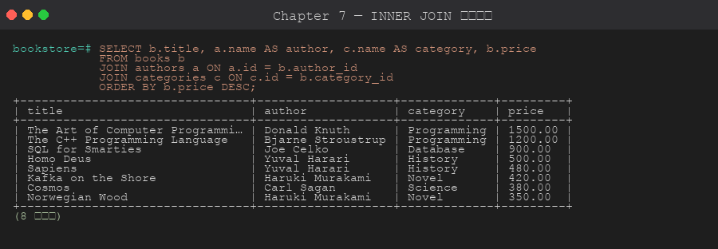
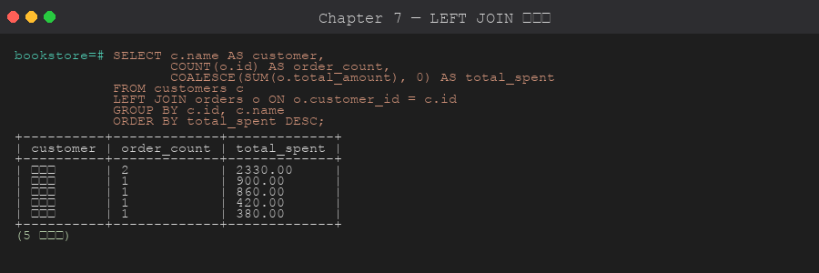

# 第 7 章 JOIN 與子查詢

> 目標:理解各種 JOIN 的差異與使用時機,學會用子查詢、CTE、LATERAL 解決複雜資料拼裝。
>
> 🧰 **前置準備**:本章範例使用 `bookstore` 資料庫 (`shop` schema 與範例資料)。尚未建立的話,先在 repo 根目錄執行 `psql -d postgres -f setup/01-create-tutorial-db.sql` 與 `psql -d bookstore -f setup/02-sample-data.sql`,詳見[第 1 章 1.8 節](../01-installation/README.md#18-建立教學用資料庫)。

## 7.1 JOIN 類型



```
A ── INNER JOIN ── B     :兩邊都有對應的列
A ── LEFT  JOIN ── B     :左邊全留,右邊沒對應補 NULL
A ── RIGHT JOIN ── B     :右邊全留,左邊沒對應補 NULL
A ── FULL  JOIN ── B     :兩邊全留,沒對應的補 NULL
A ── CROSS JOIN ── B     :笛卡兒積 (m × n)
```

```sql
-- INNER JOIN (預設)
SELECT b.title, a.name
FROM shop.books b
INNER JOIN shop.authors a ON a.id = b.author_id;

-- LEFT JOIN
SELECT a.name, b.title
FROM shop.authors a
LEFT JOIN shop.books b ON b.author_id = a.id;
-- 即使作者沒書,作者也會出現,title 為 NULL

-- FULL JOIN
SELECT COALESCE(a.name, '(無作者)') AS name,
       COALESCE(b.title,'(無書)')   AS title
FROM shop.authors a
FULL JOIN shop.books b ON b.author_id = a.id;
```

## 7.2 多表 JOIN



```sql
-- 訂單 + 客戶 + 訂單明細 + 書
SELECT
    o.id            AS order_id,
    c.name          AS customer,
    o.status,
    b.title,
    oi.quantity,
    oi.unit_price,
    oi.quantity * oi.unit_price AS subtotal
FROM shop.orders o
JOIN shop.customers   c  ON c.id = o.customer_id
JOIN shop.order_items oi ON oi.order_id = o.id
JOIN shop.books       b  ON b.id = oi.book_id
ORDER BY o.id, b.title;
```

## 7.3 USING 與自然 JOIN

```sql
-- 同名 join 欄位可以用 USING
SELECT * FROM shop.order_items JOIN shop.books USING (book_id);
-- 等價於 ON order_items.book_id = books.book_id (但 books 沒有此欄,所以不會成功)
-- 此例僅作語法示範
```

## 7.4 自我 JOIN

員工表展示主管關係:
```sql
SELECT
    e.name           AS employee,
    e.role,
    m.name           AS manager
FROM shop.employees e
LEFT JOIN shop.employees m ON m.id = e.manager_id
ORDER BY e.id;
```

## 7.5 子查詢的三種位置

```sql
-- (1) 在 SELECT 子句 (純量子查詢,只能回一列一欄)
SELECT
    b.title,
    (SELECT name FROM shop.authors WHERE id = b.author_id) AS author
FROM shop.books b;

-- (2) 在 FROM 子句 (派生表 / inline view)
SELECT t.category, t.cnt
FROM (
    SELECT c.name AS category, COUNT(*) AS cnt
    FROM shop.books b
    JOIN shop.categories c ON c.id = b.category_id
    GROUP BY c.name
) t
WHERE t.cnt > 1;

-- (3) 在 WHERE 子句
SELECT title FROM shop.books
WHERE category_id IN (SELECT id FROM shop.categories WHERE name LIKE 'P%');
```

## 7.6 EXISTS / NOT EXISTS

通常比 `IN` 效能更好,且能正確處理 NULL。

```sql
-- 有訂單的客戶
SELECT name FROM shop.customers c
WHERE EXISTS (SELECT 1 FROM shop.orders o WHERE o.customer_id = c.id);

-- 從未下訂單的客戶
SELECT name FROM shop.customers c
WHERE NOT EXISTS (SELECT 1 FROM shop.orders o WHERE o.customer_id = c.id);
```

## 7.7 相關子查詢

子查詢內部參照外層欄位:

```sql
-- 每位作者的書籍數
SELECT
    a.name,
    (SELECT COUNT(*) FROM shop.books b WHERE b.author_id = a.id) AS book_count
FROM shop.authors a;
```

> ⚠️ 相關子查詢對每一外層列都會跑一次,資料量大時效能差。改用 JOIN + GROUP BY 通常更快。

## 7.8 LATERAL JOIN

`LATERAL` 讓 FROM 子句中的子查詢能參照前面表的欄位,常用於「每組取 top-N」。

```sql
-- 每位客戶最近 2 筆訂單
SELECT c.name, t.order_id, t.ordered_at, t.total
FROM shop.customers c
LEFT JOIN LATERAL (
    SELECT id AS order_id, ordered_at, total
    FROM shop.orders
    WHERE customer_id = c.id
    ORDER BY ordered_at DESC
    LIMIT 2
) t ON TRUE
ORDER BY c.name, t.ordered_at DESC;
```

## 7.9 集合運算

```sql
-- UNION:聯集 (預設去重)
SELECT name FROM shop.authors
UNION
SELECT name FROM shop.customers;

-- UNION ALL:保留重複 (較快)
SELECT name FROM shop.authors
UNION ALL
SELECT name FROM shop.customers;

-- INTERSECT:交集
SELECT email FROM shop.authors WHERE email IS NOT NULL
INTERSECT
SELECT email FROM shop.customers;

-- EXCEPT:差集
SELECT id FROM shop.books
EXCEPT
SELECT book_id FROM shop.order_items;  -- 從沒賣出過的書
```

## 7.10 JOIN 的常見錯誤

1. **忘記 ON 條件 → CROSS JOIN**:列數爆炸。
2. **LEFT JOIN 後在 WHERE 過濾右表 NULL 欄位**:會把外連退化成內連。
   ```sql
   -- ❌ 把 LEFT 退化成 INNER
   SELECT * FROM a LEFT JOIN b ON a.id=b.aid WHERE b.x = 1;
   -- ✅ 過濾條件放在 ON
   SELECT * FROM a LEFT JOIN b ON a.id=b.aid AND b.x = 1;
   ```
3. **多對多 JOIN 沒去重**:結果列數膨脹,聚合錯誤。

## 章節腳本

- [`scripts/01-inner-outer.sql`](./scripts/01-inner-outer.sql)
- [`scripts/02-subqueries.sql`](./scripts/02-subqueries.sql)
- [`scripts/03-lateral-set-ops.sql`](./scripts/03-lateral-set-ops.sql)

---

下一章 ➡ [第 8 章:聚合與群組](../08-aggregations-grouping/)
