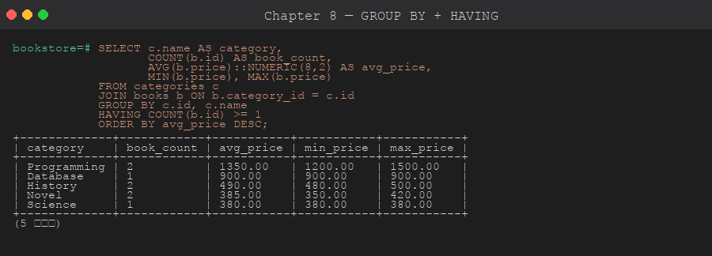
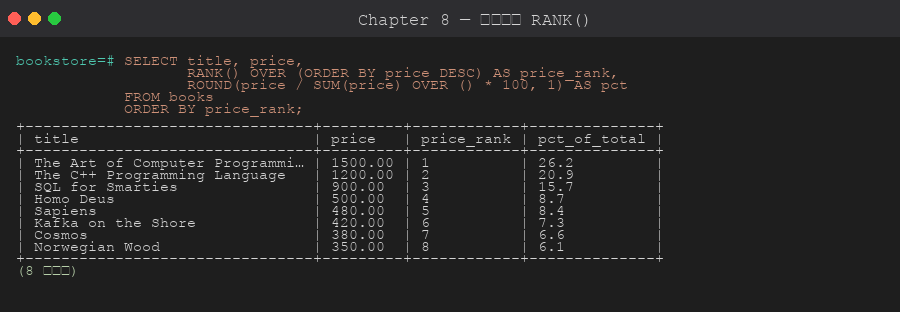

# 第 8 章 聚合與群組

> 目標:掌握 SQL 的「分組統計」 — 計數、加總、平均、條件聚合、GROUPING SETS / ROLLUP / CUBE。
>
> 🧰 **前置準備**:本章範例使用 `bookstore` 資料庫 (`shop` schema 與範例資料)。尚未建立的話,先在 repo 根目錄執行 `psql -d postgres -f setup/01-create-tutorial-db.sql` 與 `psql -d bookstore -f setup/02-sample-data.sql`,詳見[第 1 章 1.8 節](../01-installation/README.md#18-建立教學用資料庫)。

## 8.1 聚合函數總覽

| 函數 | 說明 |
|------|------|
| `COUNT(*)` | 列數 (含 NULL) |
| `COUNT(col)` | 該欄非 NULL 的列數 |
| `COUNT(DISTINCT col)` | 該欄不重複值數 |
| `SUM(col)` | 加總 |
| `AVG(col)` | 平均 |
| `MAX(col)` / `MIN(col)` | 最大 / 最小 |
| `BOOL_AND` / `BOOL_OR` | 布林全 TRUE / 任一 TRUE |
| `STRING_AGG(col, ',')` | 字串串接 |
| `ARRAY_AGG(col)` | 聚合為陣列 |
| `JSON_AGG(col)` / `JSONB_AGG` | 聚合為 JSON 陣列 |

## 8.2 GROUP BY



```sql
SELECT category_id, COUNT(*) AS book_count, AVG(price)::NUMERIC(10,2) AS avg_price
FROM shop.books
GROUP BY category_id;

-- GROUP BY 多欄
SELECT
    DATE_TRUNC('month', ordered_at) AS month,
    status,
    COUNT(*) AS cnt,
    SUM(total) AS revenue
FROM shop.orders
GROUP BY 1, 2
ORDER BY 1, 2;
```

**SQL 規則**:
- `SELECT` 清單中,非聚合欄位**必須**出現在 `GROUP BY`
- 可以用欄位序號 (`GROUP BY 1, 2`) 偷懶,但**正式 SQL 建議寫欄名**

## 8.3 HAVING

`WHERE` 在分組**前**過濾,`HAVING` 在分組**後**過濾。

```sql
SELECT category_id, COUNT(*) AS cnt
FROM shop.books
GROUP BY category_id
HAVING COUNT(*) > 1;
```

## 8.4 FILTER 子句

PostgreSQL 標準語法,讓你**在一個查詢中做多種條件統計**:

```sql
SELECT
    COUNT(*)                                          AS total_orders,
    COUNT(*) FILTER (WHERE status = 'completed')      AS completed,
    COUNT(*) FILTER (WHERE status = 'cancelled')      AS cancelled,
    SUM(total) FILTER (WHERE status = 'completed')    AS rev_completed,
    AVG(total) FILTER (WHERE status = 'completed')::NUMERIC(10,2) AS avg_completed
FROM shop.orders;
```

> 比起傳統的 `SUM(CASE WHEN ... THEN x ELSE 0 END)` 寫法更直覺。

## 8.5 字串 / 陣列聚合

```sql
-- 每分類有哪些書 (一行一分類)
SELECT
    c.name AS category,
    STRING_AGG(b.title, ', ' ORDER BY b.title) AS titles
FROM shop.books b
JOIN shop.categories c ON c.id = b.category_id
GROUP BY c.name;

-- 聚成陣列
SELECT
    c.name,
    ARRAY_AGG(b.title ORDER BY b.title) AS title_array
FROM shop.books b
JOIN shop.categories c ON c.id = b.category_id
GROUP BY c.name;

-- 聚成 JSON
SELECT
    o.id,
    JSON_AGG(JSON_BUILD_OBJECT('book_id', oi.book_id, 'qty', oi.quantity)) AS items
FROM shop.orders o
JOIN shop.order_items oi ON oi.order_id = o.id
GROUP BY o.id;
```

## 8.6 GROUPING SETS / ROLLUP / CUBE

當需要**同時看多個粒度**時,不需要寫多個 query + UNION,PostgreSQL 提供:

```sql
-- ROLLUP:逐層彙總
-- 等於 GROUPING SETS ((category, status), (category), ())
SELECT category_id, status, COUNT(*) AS cnt
FROM shop.books b
LEFT JOIN shop.order_items oi ON oi.book_id = b.id
LEFT JOIN shop.orders o       ON o.id = oi.order_id
GROUP BY ROLLUP (category_id, status);

-- CUBE:所有組合彙總
SELECT category_id, status, COUNT(*) AS cnt
FROM shop.books b
LEFT JOIN shop.order_items oi ON oi.book_id = b.id
LEFT JOIN shop.orders o       ON o.id = oi.order_id
GROUP BY CUBE (category_id, status);

-- GROUPING SETS:明確指定
SELECT
    COALESCE(c.name, '〔全部〕') AS category,
    COALESCE(o.status::text, '〔小計〕') AS status,
    COUNT(*) AS cnt
FROM shop.books b
JOIN shop.categories c ON c.id = b.category_id
LEFT JOIN shop.order_items oi ON oi.book_id = b.id
LEFT JOIN shop.orders o       ON o.id = oi.order_id
GROUP BY GROUPING SETS ((c.name, o.status), (c.name), ());
```

## 8.7 DISTINCT 與聚合

```sql
-- 客戶總數
SELECT COUNT(*) FROM shop.customers;

-- 有下單的客戶總數
SELECT COUNT(DISTINCT customer_id) FROM shop.orders;
```

## 8.8 NULL 在聚合中

- `COUNT(*)`:**包含** NULL
- `COUNT(col)`、`SUM(col)`、`AVG(col)`:**忽略** NULL
- `AVG` 是 `SUM / COUNT`,只算非 NULL 行,**不是除以總列數**

```sql
-- 測試
CREATE TEMP TABLE t(x INT);
INSERT INTO t VALUES (1), (2), (3), (NULL);
SELECT COUNT(*), COUNT(x), SUM(x), AVG(x) FROM t;
-- 4 | 3 | 6 | 2.0     ← AVG 是 6/3
```

## 8.9 實戰:銷售報表



```sql
SELECT
    DATE_TRUNC('month', o.ordered_at)::date    AS month,
    c.name                                     AS customer,
    COUNT(DISTINCT o.id)                       AS orders,
    SUM(oi.quantity * oi.unit_price)           AS revenue,
    SUM(oi.quantity * oi.unit_price)
       FILTER (WHERE o.status = 'completed')   AS rev_completed
FROM shop.orders o
JOIN shop.customers c   ON c.id = o.customer_id
JOIN shop.order_items oi ON oi.order_id = o.id
GROUP BY 1, 2
ORDER BY 1, 2;
```

## 章節腳本

- [`scripts/01-aggregation-basics.sql`](./scripts/01-aggregation-basics.sql)
- [`scripts/02-filter-and-multilevel.sql`](./scripts/02-filter-and-multilevel.sql)

---

下一章 ➡ [第 9 章:索引](../09-indexes/)
