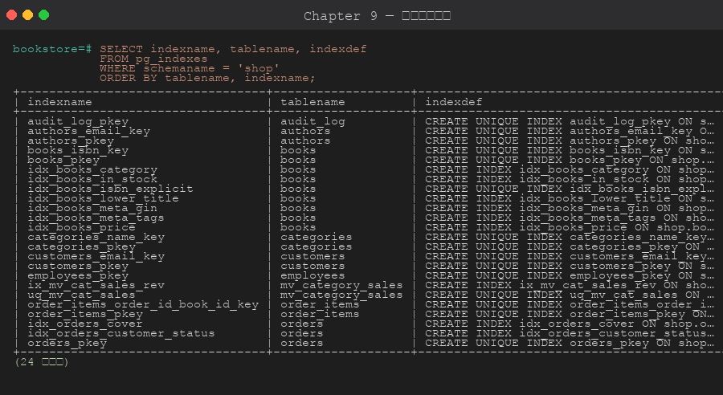
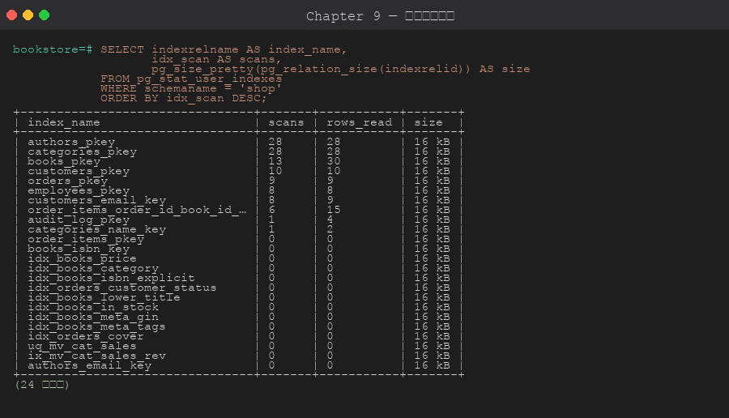

# 第 9 章 索引 (Index)

> 目標:理解 PostgreSQL 各種索引型別、何時建索引、如何用 EXPLAIN 驗證索引是否被使用。

## 9.1 為什麼需要索引

無索引時,PostgreSQL 必須**逐列掃描** (Sequential Scan) 整張表。當資料量大或查詢頻繁時,索引讓查詢從 O(n) 降到 O(log n)。

但索引**不是免費的**:
- 額外儲存空間 (一個索引通常 = 表大小的 10~30%)
- INSERT / UPDATE / DELETE 都會增加成本 (要同步更新索引)
- 不會被用到的索引純粹是負擔

## 9.2 索引類型

| 類型 | 適用 | 範例 |
|------|------|------|
| **B-Tree** (預設) | 等值、範圍、`<` `>` `BETWEEN` `LIKE 'abc%'` `ORDER BY` | `CREATE INDEX ON books(price)` |
| **Hash** | 純等值,不支援範圍 | `USING hash (col)` |
| **GIN** | 多值欄位 (陣列、JSONB、全文 tsvector) | `USING gin (tags)` |
| **GiST** | 幾何、範圍、近鄰、自訂 | `USING gist (period)` |
| **SP-GiST** | 不平衡資料 (IP 地址、四叉樹) | `USING spgist (ip)` |
| **BRIN** | 大表 + 物理排序天然 (時間序列) | `USING brin (ordered_at)` |

## 9.3 建立 / 刪除索引





```sql
-- 基本
CREATE INDEX idx_books_price ON shop.books(price);
CREATE INDEX idx_books_category ON shop.books(category_id);

-- 多欄複合索引 (順序很重要!)
CREATE INDEX idx_orders_customer_status ON shop.orders(customer_id, status);

-- UNIQUE
CREATE UNIQUE INDEX uq_authors_email ON shop.authors(email);

-- 大型表別鎖表 (CONCURRENTLY)
CREATE INDEX CONCURRENTLY idx_books_isbn ON shop.books(isbn);

-- 刪除
DROP INDEX shop.idx_books_price;
DROP INDEX CONCURRENTLY shop.idx_books_isbn;
```

## 9.4 進階索引技巧

### 部分索引 (Partial Index)

只索引符合條件的列,**索引小、查詢快**。

```sql
-- 只索引「進行中」訂單
CREATE INDEX idx_active_orders
    ON shop.orders(customer_id)
    WHERE status IN ('pending','paid','shipped');
```

### 表達式索引

```sql
-- 不分大小寫搜尋
CREATE INDEX idx_authors_lower_name
    ON shop.authors (LOWER(name));

-- 查詢時用同樣的表達式才會命中
SELECT * FROM shop.authors WHERE LOWER(name) = LOWER('CARL SAGAN');
```

### 包含欄位 (Covering Index, PG 11+)

```sql
-- INCLUDE 把欄位塞進索引葉節點,實現 Index-Only Scan
CREATE INDEX idx_orders_cover
    ON shop.orders (customer_id)
    INCLUDE (total, status);
```

## 9.5 GIN 索引 (常用於 JSONB / 陣列 / 全文)

```sql
-- 對 JSONB 建 GIN,所有 key 都可快速查
CREATE INDEX idx_books_meta_gin ON shop.books USING gin (metadata);

-- 查詢
SELECT * FROM shop.books WHERE metadata @> '{"language":"en"}';

-- 對特定 path
CREATE INDEX idx_books_meta_tags
    ON shop.books USING gin ((metadata->'tags'));
```

## 9.6 EXPLAIN — 看執行計畫

```sql
EXPLAIN
SELECT * FROM shop.books WHERE price > 500;

-- ANALYZE 會實際執行並回報耗時
EXPLAIN ANALYZE
SELECT * FROM shop.books WHERE price > 500;

-- 詳細版
EXPLAIN (ANALYZE, BUFFERS, VERBOSE)
SELECT * FROM shop.books WHERE price > 500;
```

**關鍵欄位**:
- `Seq Scan` — 全表掃描 (小表無妨,大表要警惕)
- `Index Scan` — 用索引
- `Index Only Scan` — 用索引且不必回表 (最快)
- `Bitmap Index Scan + Heap Scan` — 對中等選擇度的條件
- `cost=A..B` — 啟動成本..總成本 (估計值,不是時間)
- `actual time=...` (要加 ANALYZE) — 實際耗時 ms

## 9.7 何時不該建索引

- 表很小 (< 10000 列):seq scan 已很快
- 選擇度低 (例如 `is_active = TRUE` 但 95% 都是 TRUE)
- 寫入遠多於讀取 (索引讓寫慢)
- 已被其他複合索引前綴覆蓋

## 9.8 維護索引

```sql
-- 看索引大小與使用次數
SELECT
    schemaname,
    relname    AS table,
    indexrelname AS index,
    pg_size_pretty(pg_relation_size(indexrelid)) AS size,
    idx_scan,
    idx_tup_read
FROM pg_stat_user_indexes
ORDER BY pg_relation_size(indexrelid) DESC;

-- 找出可能無用的索引
SELECT
    schemaname || '.' || relname AS table,
    indexrelname AS index,
    pg_size_pretty(pg_relation_size(indexrelid)) AS size
FROM pg_stat_user_indexes
WHERE idx_scan = 0
ORDER BY pg_relation_size(indexrelid) DESC;

-- 重建索引 (修復 bloat,需獨佔鎖)
REINDEX INDEX shop.idx_books_price;
REINDEX TABLE shop.books;
-- PG 12+ 支援 CONCURRENTLY
REINDEX INDEX CONCURRENTLY shop.idx_books_price;
```

## 9.9 索引順序為什麼重要 (複合索引)

`CREATE INDEX i ON t(a, b)` 可被使用於:
- `WHERE a = ?`
- `WHERE a = ? AND b = ?`
- `WHERE a = ? ORDER BY b`

**不能**有效用於:
- `WHERE b = ?` (a 沒給條件)

> 原則:**選擇度高 (distinct 多) 的欄位放前面**,或常常單獨被 query 的欄位放前面。

## 章節腳本

- [`scripts/01-create-indexes.sql`](./scripts/01-create-indexes.sql)
- [`scripts/02-explain-analyze.sql`](./scripts/02-explain-analyze.sql)

---

下一章 ➡ [第 10 章:視圖 (View / Materialized View)](../10-views/)
