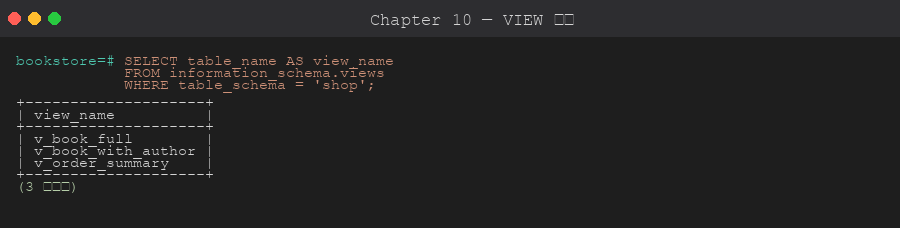

# 第 10 章 視圖 (View / Materialized View)

> 目標:理解 View 解決什麼問題、**建 View 之前要先想清楚哪些事**、View 與 Materialized View 的取捨,以及當 View 「擋住改表」或「數字不對」時怎麼有系統地排查。
>
> 🧰 **前置準備**:本章範例使用 `bookstore` 資料庫 (`shop` schema 與範例資料)。尚未建立的話,先在 repo 根目錄執行 `psql -d postgres -f setup/01-create-tutorial-db.sql` 與 `psql -d bookstore -f setup/02-sample-data.sql`,詳見[第 1 章 1.8 節](../01-installation/README.md#18-建立教學用資料庫)。
>
> 📐 **本章讀法**:每一節都先講「為什麼會需要這個」,再講「怎麼做」。10.2 是動手前的決策清單,10.9 是四個可以實際重現的故障情境與排查順序 — 建議先讀 10.1~10.2 建立判斷框架,再看語法。

## 10.1 為什麼需要 View

**沒有 View 時會發生什麼**:「一本書的完整資訊」要 JOIN `books`、`authors`、`categories` 三張表。這段 JOIN 會出現在報表、API、後台、匯出腳本…每個地方各抄一份。三個月後有人在其中一處把 `LEFT JOIN` 改成 `JOIN`,從此不同頁面的書籍數量對不起來,沒人知道哪個才是對的。

**View 怎麼解決**:View 是「**儲存起來的 SELECT 查詢**」— 把那段 JOIN 存成一個名字,用起來像表,但**每次查詢都會即時執行底層 SQL**。邏輯只存在一個地方,所有人查同一個定義。

```sql
CREATE VIEW shop.v_book_full AS
SELECT
    b.id,
    b.title,
    a.name AS author,
    c.name AS category,
    b.price,
    b.stock
FROM shop.books b
LEFT JOIN shop.authors a    ON a.id = b.author_id
LEFT JOIN shop.categories c ON c.id = b.category_id;

-- 使用
SELECT * FROM shop.v_book_full WHERE price > 500;
```


**View 帶來的三件事**:
- **抽象複雜邏輯**:應用端 SQL 變成一行,JOIN 細節集中管理
- **統一業務術語**:`v_active_users` 在每個地方都是同一個定義,不會各自解讀「活躍」
- **權限隔離**:可以只授權 View、不授權底層表,讓使用者只看得到該看的欄位與列

**但 View 不是免費的**,這是整章的核心矛盾:
- 它**不存資料**,每次查都重跑底層 SQL — 慢的查詢包成 View 還是慢,而且更難察覺 (10.9 情境 D)
- 它是底層表的**依賴者**:表要改欄位,會被 View 擋住 (10.9 情境 A)
- 它綁的是建立當下的欄位結構,底表變了它**不會自動跟上** (10.9 情境 B)

所以「要不要用 View、用哪一種」是**取捨**。下一節就是做這個取捨的清單。

## 10.2 設計前的決策條件與考量重點

**為什麼要先想再建**:View 建錯不會報錯。它會在幾個月後以「改個欄位要先砍十個 View」、「報表數字是昨天的」、「一個簡單查詢跑了五張表 JOIN」的形式冒出來,而且很難歸因到當初那個 `CREATE VIEW`。建之前回答下面幾個問題,比事後排查便宜得多。

### 先確認的前提

| 問題 | 為什麼重要 | 怎麼確認 |
|------|-----------|---------|
| **這段 SQL 真的會被重複使用嗎?** | 只用一次的查詢包成 View,只是多一個要維護的物件、多一個改表時的阻礙 | 數一下有幾個地方會用;只有一個就寫在那裡 |
| **要「即時」還是「夠快」?** | View 永遠最新但每次重算;Materialized View 快但會過時。兩者不能兼得,要先決定業務能容忍多舊的資料 | 問使用者:數字晚 5 分鐘 / 1 小時 / 1 天可以嗎? |
| **底層查詢有多重?** | 把一個 3 秒的聚合查詢包成 View,每個用它的頁面都是 3 秒。View 不會讓查詢變快 | `EXPLAIN ANALYZE` 底層 SQL;超過幾百 ms 就考慮 Materialized View |
| **底表多常改結構?** | 每個 View 都是 `ALTER TABLE` 的絆腳石 — 改型別、刪欄位都要先砍 View 再重建 | 看表的 migration 歷史;活躍開發中的表少疊 View |
| **誰會用、有什麼權限?** | View 是常見的權限邊界 (只給某些欄位/列),但預設以 **View 擁有者**的權限執行,設計錯就變成越權漏洞 | 列出使用的角色;讀 10.2 上線考量的 `security_invoker` |
| **需要透過 View 寫入嗎?** | 只有「單表、無聚合」的簡單 View 能自動寫入;複雜 View 要另外寫 INSTEAD OF trigger | 檢查 10.4 的可更新條件 |

### 決策對照:什麼情況選什麼

| 情況 | 選擇 | 理由 |
|------|------|------|
| 同一段 JOIN / 條件在多處重複,底層查詢本身很快 | **View** | 邏輯集中、零儲存成本、永遠最新 |
| 報表 / 儀表板慢,資料晚幾分鐘到幾小時可接受 | **Materialized View** + 排程 `REFRESH` | 查詢變成讀一張表;代價是過時與 refresh 成本 (10.6) |
| 報表要快、又要接近即時 (秒級) | **摘要表 + Trigger 維護** (第 12 章) | Materialized View 只能整個重算;trigger 可以增量更新。代價是寫入變慢、邏輯複雜 |
| 需要帶參數的「View」(例如依日期區間) | **函數** (第 11 章) 或應用端組 SQL | View 不能帶參數;`WHERE` 條件能推進 View 的話用 View 也行 (10.9 情境 D) |
| 只給某個角色看部分欄位 / 部分列 | **View + GRANT**,或 Row Level Security (第 16 章) | View 是最簡單的欄位級隔離;列級隔離 RLS 更嚴謹 |
| 需要透過 View 做 INSERT / UPDATE | 簡單 View (自動可更新) + `WITH CHECK OPTION` | 複雜 View 要 INSTEAD OF trigger,維護成本高 (10.4、10.5) |
| 一次性的分析查詢 | **CTE / 子查詢**,不建 View | 不會留下要維護的物件 |
| Materialized View 要在 refresh 期間仍可讀 | 建 **UNIQUE INDEX** + `REFRESH ... CONCURRENTLY` | 沒有 unique index 就不能 CONCURRENTLY,一般 refresh 會鎖住所有讀取 (10.9 情境 C) |

### 上線時的考量

- **依賴鎖定**:View 一旦存在,底表的 `DROP COLUMN`、`ALTER COLUMN TYPE` 都會被擋;`CREATE OR REPLACE VIEW` 只能「在尾端加欄位」,不能改名、刪除、改型別、換順序。改表的 migration 要包含「砍 View → 改表 → 重建 View」,而且要放在同一個交易 (10.9 情境 A)。
- **不要在 View 裡寫 `SELECT *`**:`*` 在建立當下就被展開成固定欄位清單,之後底表加欄位 View 不會有;欄位改名後 View 的欄位名不會跟著改 (10.9 情境 B)。
- **View 疊 View 的深度**:每一層都是一次改表時的依賴、一次排查時要展開的定義。planner 會把 View 內聯 (inline) 進查詢,所以效能上多層通常沒差,但**維護性**會很快惡化。經驗上兩層是上限。
- **權限模型**:預設 View 以**擁有者**的權限執行 (等同 `security_definer`) — 這正是「只授權 View 不授權底表」能運作的原因,但也表示 View 擁有者要是 superuser 時,任何能查 View 的人都間接用了 superuser 權限。PG 15+ 可以 `CREATE VIEW ... WITH (security_invoker = true)` 改成以**查詢者**權限執行;用來當權限邊界的 View 加 `security_barrier = true`,避免使用者自訂函數在條件被推入前偷看到不該看的列。
- **Materialized View 的 refresh 策略**:一般 `REFRESH` 期間整個 MV 不可讀;`CONCURRENTLY` 可讀但更慢、且需要 unique index。PostgreSQL **沒有內建「上次 refresh 時間」**,要自己記錄,否則排查「數字多舊」時沒有依據 (10.9 情境 C)。
- **View 不會讓查詢變快**:它只是語法糖。包成 View 之前先 `EXPLAIN ANALYZE` 底層 SQL;「萬用 View」JOIN 了所有表,只查一個欄位也會付全部 JOIN 的錢 (10.9 情境 D)。

## 10.3 建立、替換、修改、刪除

**為什麼 `CREATE OR REPLACE VIEW` 有限制**:View 被建立後,其他 View、函數、應用程式可能已經依賴它的欄位順序與型別。PostgreSQL 為了不讓「替換 View」默默弄壞依賴者,規定 `CREATE OR REPLACE` 只能**在尾端加新欄位**;改名、刪欄位、改型別、換順序都會報錯,得 `DROP` 後重建。

```sql
-- 替換:只能改邏輯、或在尾端加欄位
CREATE OR REPLACE VIEW shop.v_book_full AS
SELECT ... ;     -- 新 SELECT
-- 限制:不能改欄位順序或型別,不能拿掉欄位

-- 重新命名
ALTER VIEW shop.v_book_full RENAME TO v_books;

-- 刪除;若有其他 View 依賴它,要 CASCADE (會一起刪掉依賴者!) 或先處理依賴者
DROP VIEW shop.v_books;
```

找出誰依賴一個 View / 表,見 10.9 情境 A 的 `pg_depend` 查詢。

## 10.4 可更新 View

**為什麼有些 View 能寫入、有些不能**:對 View 做 `UPDATE`,PostgreSQL 必須能明確知道「這一列對應到底表的哪一列」。單表、沒有聚合、沒有 DISTINCT 的 View,每一列都能一對一回推到底表,所以可以自動改寫成對底表的操作;一旦有 GROUP BY 或 JOIN,一列 View 可能對應多列底表,PostgreSQL 就不猜了。

自動可更新的條件:
- 只 FROM 一張表
- 沒 GROUP BY / DISTINCT / Window / 聚合 / SET 運算
- 沒 WITH (CTE)
- 全部欄位是純粹欄位 (沒運算)

```sql
CREATE VIEW shop.v_in_stock AS
SELECT id, title, price, stock FROM shop.books WHERE stock > 0;

-- 直接更新 view 等同於更新底表
UPDATE shop.v_in_stock SET price = price * 1.05 WHERE id = 1;
```

**為什麼需要 `WITH CHECK OPTION`**:可更新 View 預設**不檢查**寫入的資料是否還在 View 的範圍內 — 你可以透過 `v_pending_orders` 插入一張 `completed` 的訂單,插入成功,然後它從 View 裡消失。對把 View 當權限邊界的場景,這等於使用者能寫入自己看不到的資料。

```sql
-- 帶 WITH CHECK OPTION:防止插入「跑出 view 範圍」的資料
CREATE VIEW shop.v_pending_orders AS
SELECT * FROM shop.orders WHERE status = 'pending'
WITH CHECK OPTION;

INSERT INTO shop.v_pending_orders (customer_id, status)
VALUES (1, 'completed');     -- ❌ 失敗:不在 view 條件內 (SQLSTATE 44000 with_check_option_violation)
```

## 10.5 INSTEAD OF Trigger (複雜 View 也能寫入)

**為什麼**:JOIN 多表的 View 不符合 10.4 的條件,但業務上常常還是想「對這個 View 寫入」— 例如 API 只認得 `v_book_full`,新增書時希望一次處理 `books` 與 `authors`。

**怎麼做**:用 INSTEAD OF trigger 接管對 View 的 INSERT / UPDATE / DELETE,自己決定要寫哪幾張底表。**進階主題**,第 12 章會詳述 trigger。

## 10.6 Materialized View

**為什麼需要**:View 每次都重算。分類銷售報表要 JOIN 四張表再 GROUP BY,資料量大時一次幾秒;儀表板每 10 秒刷新一次、20 個人同時開著,資料庫就在重複算同一份結果。這種「讀很多次、算一次就夠」的場景,應該把結果存下來。

**Materialized View (物化視圖)** 會把查詢結果**實際存成資料**,查詢時不需重新計算,但**內容會過時**,需要手動或排程 refresh。

```sql
-- 建立 (馬上計算)
CREATE MATERIALIZED VIEW shop.mv_category_sales AS
SELECT
    c.id AS category_id,
    c.name AS category,
    COUNT(DISTINCT o.id) AS orders,
    SUM(oi.quantity)     AS units_sold,
    SUM(oi.quantity * oi.unit_price) AS revenue
FROM shop.categories c
LEFT JOIN shop.books       b  ON b.category_id = c.id
LEFT JOIN shop.order_items oi ON oi.book_id    = b.id
LEFT JOIN shop.orders      o  ON o.id          = oi.order_id
GROUP BY c.id, c.name
WITH DATA;     -- 或 WITH NO DATA 先建空,稍後 refresh

-- 查詢 (跟普通表一樣快)
SELECT * FROM shop.mv_category_sales;
```

**為什麼 refresh 有兩種**:一般 `REFRESH` 是「整個重算、換掉舊資料」,期間對 MV 取得 `ACCESS EXCLUSIVE` 鎖 — **所有讀取都會被擋住**,直到 refresh 完成。儀表板在 refresh 那幾秒會整個卡住。`CONCURRENTLY` 改成「算好新結果、逐列比對差異、只更新有變的列」,讀取不受影響;但它需要一個 **unique index** 才知道怎麼比對列,而且比一般 refresh 慢。

```sql
-- 更新 (鎖表,期間查不到)
REFRESH MATERIALIZED VIEW shop.mv_category_sales;

-- 不鎖讀取 (需要 UNIQUE INDEX!沒有會報錯,見 10.9 情境 C)
CREATE UNIQUE INDEX ON shop.mv_category_sales(category_id);
REFRESH MATERIALIZED VIEW CONCURRENTLY shop.mv_category_sales;

-- 也能加普通索引 (MV 是實體資料,可以像表一樣建索引)
CREATE INDEX ON shop.mv_category_sales(revenue);
```

**View vs Materialized View**:
| 維度 | View | Materialized View |
|------|------|-------------------|
| 儲存 | 沒 (只存 SQL) | 有 (存結果) |
| 查詢成本 | 每次重跑底層 | 快 (像普通表) |
| 即時性 | 永遠最新 | 依 refresh 頻率 |
| 寫入 | 簡單 view 可寫 | 不可直接寫 |
| 索引 | 透過底表索引 | 自己可建索引 |
| 改表時 | 擋住 ALTER | 一樣擋住 ALTER |
| 用途 | 簡化查詢、權限 | 報表、儀表板加速 |

## 10.7 系統 View

**為什麼要認識它們**:排查 View 問題時,你需要的資訊 (有哪些 View、定義是什麼、誰依賴誰、MV 有沒有填資料) 全部在系統 catalog 裡,而 PostgreSQL 已經把常用的包成 View 給你。



```sql
-- 所有 view
SELECT viewname FROM pg_views WHERE schemaname = 'shop';

-- 某個 view 的定義 (排查時第一個看的東西)
SELECT pg_get_viewdef('shop.v_book_full'::regclass, true);

-- 所有 materialized view 與是否已填資料
SELECT matviewname, ispopulated, hasindexes FROM pg_matviews WHERE schemaname = 'shop';

-- 表的所有欄位
SELECT * FROM information_schema.columns
WHERE table_schema = 'shop' AND table_name = 'books';
```

## 10.8 何時用 View / Materialized View

10.2 決策表的速查版:

| 情境 | 用 |
|------|----|
| SQL 太長想複用 | View |
| 想授權只能看部分欄位 | View + GRANT |
| 報表很慢、即時性可妥協 | Materialized View + REFRESH 排程 |
| 多個 join 反覆出現 | View (邏輯封裝) |
| 跨資料庫整合中介 | View |
| 報表要快又要秒級即時 | 摘要表 + Trigger (第 12 章) |

## 10.9 問題排查:情境模擬與排查順序

**為什麼要練這個**:View 的問題有兩種面貌 — 一種是**明確報錯但訊息指向別處** (`cannot drop column ... because other objects depend on it`,問題在 View 不在表),一種是**完全不報錯只是數字不對或很慢**。兩種都需要先知道「去哪裡看 View 的定義與依賴」,再決定怎麼修。

> 🧪 所有情境都在 [`scripts/03-troubleshooting-scenarios.sql`](./scripts/03-troubleshooting-scenarios.sql) 裡,用自己的 demo 表與 View (`ts_` 開頭),跑完自動清掉,不會動到 `v_book_full` / `mv_category_sales`。建議一段一段執行,對照下面的說明。情境 A、B、C 共有 4 個刻意的 ERROR;情境 C 用 `dblink` 模擬第二個連線。

### 通用排查順序:「View 相關的錯誤 / 數字不對 / 變慢」

順序的邏輯是**先看定義與依賴,再看資料,最後才看效能**:

```
1. 讀完整的錯誤訊息,包括 DETAIL 與 HINT
   → PostgreSQL 會直接點名是哪個 view 擋住、缺什麼 index
2. 看 View 的定義:pg_get_viewdef('view'::regclass, true)
   → 它到底 SELECT 了什麼?* 被展開成什麼?JOIN 是 INNER 還是 LEFT?
3. 看依賴鏈:pg_depend + pg_rewrite
   → 誰依賴這張表 / 這個 view?有幾層?
4. 比對 View 與底表的欄位:information_schema.columns
   → 欄位名、順序、型別是否已經脫節?
5. Materialized View:pg_matviews.ispopulated、有沒有 unique index、上次 refresh 是什麼時候
   → 數字舊是「沒 refresh」還是「refresh 失敗」?
6. 效能:EXPLAIN (ANALYZE, BUFFERS) 查 View 的那條 SQL
   → 條件有沒有被推進 view?有沒有多餘的 JOIN?
7. 才動手修
   → 改 migration 順序 > 重建 View > 建 unique index / 排程 refresh > 拆 View
8. 驗證:重跑失敗的 ALTER / 比對數字 / 再看一次計畫
```

### 情境 A:改表時被 View 擋住

**症狀**:要刪掉一個早就沒人用的舊欄位 `old_code`,`ALTER TABLE ... DROP COLUMN` 報 `cannot drop column old_code of table ts_products because other objects depend on it`。想用 `CREATE OR REPLACE VIEW` 把欄位從 View 拿掉,又報 `cannot drop columns from view`。

**排查順序與線索**:

| 步驟 | 做什麼 | 看到什麼 |
|------|-------|---------|
| 1 | 讀 DETAIL | `view ts_v_products_basic depends on column old_code` + `view ts_v_products_expensive depends on view ts_v_products_basic` — **兩層**依賴 |
| 2 | 用 `pg_depend` + `pg_rewrite` 遞迴列出整條鏈與每層定義 | level 1 `ts_v_products_basic` (含 `old_code`),level 2 `ts_v_products_expensive` (不含,但疊在第一層上) |
| 3 | 用 `pg_depend.refobjsubid` 對 `pg_attribute` 找「真的用到這個欄位」的 View | 只有 `ts_v_products_basic` |

**根因**:View 的本體是一條 `_RETURN` rewrite rule,它對用到的每個欄位都在 `pg_depend` 登記依賴;PostgreSQL 不允許刪掉被依賴的欄位。而 `CREATE OR REPLACE VIEW` 為了保護 View 的依賴者,只允許在尾端加欄位,不允許拿掉。

**修正**:在**一個交易**裡,由上而下 DROP 整條鏈 → 改表 → 由下而上重建:

```sql
BEGIN;
DROP VIEW ts_v_products_expensive;
DROP VIEW ts_v_products_basic;
ALTER TABLE ts_products DROP COLUMN old_code;
CREATE VIEW ts_v_products_basic AS SELECT id, name, price FROM ts_products;
CREATE VIEW ts_v_products_expensive AS SELECT id, name, price FROM ts_v_products_basic WHERE price > 20;
COMMIT;
```

放在同一個交易的理由:中間任何一步失敗都會整個 rollback,不會留下「View 砍了、表沒改」的半成品。

**驗證**:`information_schema.columns` 只剩 `id, name, price`;`SELECT * FROM ts_v_products_expensive` 正常回 2 列。

**別用 `DROP ... CASCADE`**:HINT 會建議它,但 CASCADE 會**默默刪掉整條依賴鏈上的所有 View**,你得記得每一個並重建 — 在有十幾個 View 的生產環境,這就是「改個欄位弄壞三個報表」的來源。

### 情境 B:底表改了,View 的資料「怪怪的」

**症狀**:表加了 `created_at`,`SELECT * FROM ts_v_users` 卻沒有這個欄位;把 `plan` 改名成 `subscription_plan` 後,View 還是叫 `plan`;想把 `email` 改成 `VARCHAR(320)` 直接報 `cannot alter type of a column used by a view or rule`。

**排查順序與線索**:

| 步驟 | 做什麼 | 看到什麼 |
|------|-------|---------|
| 1 | `pg_get_viewdef` | 定義是 `SELECT id, email, plan FROM ts_users` — 當初寫的 `*` **已經被展開成固定清單** |
| 2 | 改名之後再看一次 | 定義變成 `subscription_plan AS plan`:PostgreSQL 幫你保住了 View 的欄位名,但它跟表已經脫節 |
| 3 | 比對 `information_schema.columns` 的 View 與表 | View 少一欄、有一欄名字不同 |

**根因**:View 存的不是 SQL 文字,而是解析後的查詢樹 — 欄位用 **OID + 位置**綁定,`*` 在建立當下就展開。所以加欄位 View 不會有 (它從來沒被要求那個欄位);改名 View 會自動補 alias 維持原名;改型別會影響 View 的輸出型別,PostgreSQL 直接拒絕。

**修正**:分兩種。「尾端加欄位」用 `CREATE OR REPLACE` 就好;改名 / 改型別必須 DROP 重建 (同情境 A,包在交易裡):

```sql
-- 加欄位:保留舊欄位順序,新的放尾端
CREATE OR REPLACE VIEW ts_v_users AS
SELECT id, email, subscription_plan AS plan, created_at FROM ts_users;

-- 改型別:DROP → ALTER → CREATE
BEGIN;
DROP VIEW ts_v_users;
ALTER TABLE ts_users ALTER COLUMN email TYPE VARCHAR(320);
CREATE VIEW ts_v_users AS SELECT id, email, subscription_plan, created_at FROM ts_users;
COMMIT;
```

**驗證**:`information_schema.columns` 顯示 View 有 4 欄、`email` 是 `character varying`、欄位名與表一致。

**預防**:View 裡永遠寫明欄位清單,不寫 `SELECT *`;表的 migration 腳本要一併處理依賴的 View。

### 情境 C:儀表板數字是昨天的

**症狀**:分類銷售報表的 6/30 營收是 366,630,但直接查底表是 866,630。把排程改成 `REFRESH ... CONCURRENTLY` 想避免卡住讀取,又報 `cannot refresh materialized view "shop.ts_mv_daily_sales" concurrently`。

**排查順序與線索**:

| 步驟 | 做什麼 | 看到什麼 |
|------|-------|---------|
| 1 | MV 的數字 vs 底表現算 | `mv 366630` / `base 866630` — 差的正好是今天進的 1000 筆 × 500 |
| 2 | `pg_matviews` | `ispopulated = t`、`hasindexes = f` — 填過,但**沒有任何索引** |
| 3 | 讀 CONCURRENTLY 報錯的 HINT | `Create a unique index with no WHERE clause on one or more columns of the materialized view` |
| 4 | 用 `dblink` 開第二個連線,在一般 `REFRESH` 尚未 COMMIT 時查 MV | `pg_stat_activity`:第二個連線 `wait_event_type = Lock`;`pg_locks`:refresh 的連線握著 `AccessExclusiveLock` |

**根因**:兩件事疊在一起。(1) MV 只是「上次 refresh 時的快照」,沒人 refresh 它就一直是舊的,而 PostgreSQL **沒有內建上次 refresh 時間**,所以沒人發現。(2) 一般 `REFRESH` 拿 `ACCESS EXCLUSIVE` 鎖,期間所有 `SELECT` 排隊;`CONCURRENTLY` 要靠 unique index 逐列比對差異,沒有 index 就拒絕。

**修正**:

```sql
CREATE UNIQUE INDEX ts_mv_daily_sales_uq ON ts_mv_daily_sales (sold_on);
REFRESH MATERIALIZED VIEW CONCURRENTLY ts_mv_daily_sales;

-- 自己記錄 refresh 時間,之後排查「多舊」才有依據
CREATE TABLE mv_refresh_log (matview TEXT PRIMARY KEY, refreshed_at TIMESTAMPTZ NOT NULL);
INSERT INTO mv_refresh_log VALUES ('ts_mv_daily_sales', now())
ON CONFLICT (matview) DO UPDATE SET refreshed_at = EXCLUDED.refreshed_at;
```

**驗證**:MV 與底表都是 916,630;`SELECT now() - refreshed_at FROM mv_refresh_log` 能回答「多久沒更新」。

**延伸**:refresh 排程 (cron / pg_cron) 要把 refresh 與寫 log 放在同一個交易;refresh 失敗要有告警,否則又回到「沒人發現」。

### 情境 D:View 越疊越慢

**症狀**:應用只想知道「1/10 有幾張 pending 訂單」,查 `ts_v_order_wide` 要 19ms、讀 1,764 個 buffer;`EXPLAIN` 顯示 `ts_order_items` (20 萬列) 被整個 Seq Scan,還 Hash Join 了 `ts_customers` 與 `ts_products_d`。這些表跟「pending 訂單數」一點關係都沒有。

**排查順序與線索**:

| 步驟 | 做什麼 | 看到什麼 |
|------|-------|---------|
| 1 | `EXPLAIN (ANALYZE, BUFFERS)` | 三層 Hash Join、`Seq Scan on ts_order_items rows=200000`;查詢只用到 `ts_orders` 的欄位 |
| 2 | `pg_get_viewdef` | View 用 **INNER JOIN** 串了 `customers`、`order_items`、`products` 四張表 |

**根因**:planner 會把 View 內聯進查詢,並嘗試移除用不到的 JOIN (join removal) — 但只有 **LEFT JOIN 到唯一鍵**才能被移除,因為它保證不改變列數。INNER JOIN 可能過濾掉列 (沒有對應 customer 的訂單會消失),就算查詢沒用到那張表的欄位,planner 也不敢拿掉。「萬用 View」用 INNER JOIN 把所有東西串起來,等於強迫每個查詢付全部 JOIN 的錢。

**修正**:拆 View — 只 JOIN 查詢真的需要的表,而且能用 `LEFT JOIN` 到主鍵的就用 LEFT:

```sql
CREATE VIEW ts_v_order_wide_fixed AS
SELECT o.id AS order_id, o.ordered_at, o.status, c.name AS customer, c.region
FROM ts_orders o
LEFT JOIN ts_customers c ON c.id = o.customer_id;   -- LEFT JOIN 到 PK:沒用到就會被省略
```

**驗證**:同樣的查詢變成單純 `Seq Scan on ts_orders`,3.1ms、637 個 buffer — JOIN 被 planner 整個省略;明細層 (`order_items`) 另外做一個 View,需要時才 JOIN。

**延伸**:如果 View 裡有 `DISTINCT`、`GROUP BY`、window function、`LIMIT`,外層的 `WHERE` 條件**可能無法推進 View**,底層會先算完全部再過濾。這種情況 `EXPLAIN` 會看到 `Filter` 在最外層、底下卻是全表 — 解法是改用函數帶參數,或把條件欄位保留在 View 的 GROUP BY 裡。

## 章節腳本

- [`scripts/01-views-basic.sql`](./scripts/01-views-basic.sql) — 基本 View、可更新 View、WITH CHECK OPTION
- [`scripts/02-materialized-view.sql`](./scripts/02-materialized-view.sql) — Materialized View 與 refresh
- [`scripts/03-troubleshooting-scenarios.sql`](./scripts/03-troubleshooting-scenarios.sql) — 10.9 四個排查情境 (可重現)

---

下一章 ➡ [第 11 章:函數與 Stored Procedure](../11-functions-procedures/)
