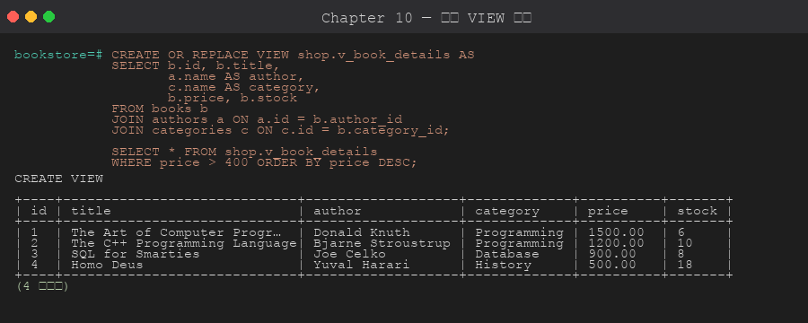

# 第 10 章 視圖 (View / Materialized View)

> 目標:能用 View 封裝複雜查詢、用 Materialized View 加速報表、了解可更新 View。

## 10.1 View 是什麼

View 是「**儲存起來的 SELECT 查詢**」,用起來像表,但**每次查詢都會即時執行底層 SQL**。



```sql
CREATE VIEW shop.v_book_full AS
SELECT
    b.id,
    b.title,
    a.name AS author,
    c.name AS category,
    b.price,
    b.stock
FROM shop.books b
LEFT JOIN shop.authors a    ON a.id = b.author_id
LEFT JOIN shop.categories c ON c.id = b.category_id;

-- 使用
SELECT * FROM shop.v_book_full WHERE price > 500;
```

**好處**:
- 抽象複雜邏輯,讓應用 SQL 簡潔
- 統一業務術語 (例如 v_active_users 各處都同義)
- 權限隔離:可以只授權 view,不授權底層表

## 10.2 替換、修改、刪除

```sql
-- 替換
CREATE OR REPLACE VIEW shop.v_book_full AS
SELECT ... ;     -- 新 SELECT
-- 限制:不能改欄位順序或型別,只能改邏輯

-- 重新命名
ALTER VIEW shop.v_book_full RENAME TO v_books;

-- 刪除
DROP VIEW shop.v_books;
```

## 10.3 可更新 View

PostgreSQL 自動讓「簡單 View」可被 INSERT / UPDATE / DELETE,條件:
- 只 FROM 一張表
- 沒 GROUP BY / DISTINCT / Window / 聚合 / SET 運算
- 沒 WITH (CTE)
- 全部欄位是純粹欄位 (沒運算)

```sql
CREATE VIEW shop.v_in_stock AS
SELECT id, title, price, stock FROM shop.books WHERE stock > 0;

-- 直接更新 view 等同於更新底表
UPDATE shop.v_in_stock SET price = price * 1.05 WHERE id = 1;

-- 帶 WITH CHECK OPTION:防止插入「跑出 view 範圍」的資料
CREATE VIEW shop.v_pending_orders AS
SELECT * FROM shop.orders WHERE status = 'pending'
WITH CHECK OPTION;

INSERT INTO shop.v_pending_orders (customer_id, status)
VALUES (1, 'completed');     -- ❌ 失敗:不在 view 條件內
```

## 10.4 INSTEAD OF Trigger (複雜 View 也能寫入)

當 View 太複雜無法自動更新時,可用 INSTEAD OF trigger 自訂寫入邏輯。**進階主題**,第 12 章會詳述 trigger。

## 10.5 Materialized View

「**物化視圖**」會把查詢結果**實際存成資料**,查詢時不需重新計算,但**內容會過時**,需要手動或排程 refresh。

```sql
-- 建立 (馬上計算)
CREATE MATERIALIZED VIEW shop.mv_category_sales AS
SELECT
    c.id AS category_id,
    c.name AS category,
    COUNT(DISTINCT o.id) AS orders,
    SUM(oi.quantity)     AS units_sold,
    SUM(oi.quantity * oi.unit_price) AS revenue
FROM shop.categories c
LEFT JOIN shop.books       b  ON b.category_id = c.id
LEFT JOIN shop.order_items oi ON oi.book_id    = b.id
LEFT JOIN shop.orders      o  ON o.id          = oi.order_id
GROUP BY c.id, c.name
WITH DATA;     -- 或 WITH NO DATA 先建空,稍後 refresh

-- 查詢 (跟普通表一樣快)
SELECT * FROM shop.mv_category_sales;

-- 更新 (鎖表,期間查不到)
REFRESH MATERIALIZED VIEW shop.mv_category_sales;

-- 不鎖讀取 (需要 UNIQUE INDEX!)
CREATE UNIQUE INDEX ON shop.mv_category_sales(category_id);
REFRESH MATERIALIZED VIEW CONCURRENTLY shop.mv_category_sales;

-- 也能加普通索引
CREATE INDEX ON shop.mv_category_sales(revenue);
```

**View vs Materialized View**:
| 維度 | View | Materialized View |
|------|------|-------------------|
| 儲存 | 沒 (只存 SQL) | 有 (存結果) |
| 查詢成本 | 每次重跑底層 | 快 (像普通表) |
| 即時性 | 永遠最新 | 依 refresh 頻率 |
| 寫入 | 簡單 view 可寫 | 不可直接寫 |
| 索引 | 透過底表索引 | 自己可建索引 |
| 用途 | 簡化查詢、權限 | 報表、儀表板加速 |

## 10.6 系統 View

PostgreSQL 內建大量 catalog view,例如:
```sql
-- 所有 view
SELECT viewname FROM pg_views WHERE schemaname = 'shop';

-- 表的所有欄位
SELECT * FROM information_schema.columns
WHERE table_schema = 'shop' AND table_name = 'books';
```

## 10.7 何時用 View / Materialized View

| 情境 | 用 |
|------|----|
| SQL 太長想複用 | View |
| 想授權只能看部分欄位 | View + GRANT |
| 報表很慢、即時性可妥協 | Materialized View + REFRESH 排程 |
| 多個 join 反覆出現 | View (邏輯封裝) |
| 跨資料庫整合中介 | View |

## 章節腳本

- [`scripts/01-views-basic.sql`](./scripts/01-views-basic.sql)
- [`scripts/02-materialized-view.sql`](./scripts/02-materialized-view.sql)

---

下一章 ➡ [第 11 章:函數與 Stored Procedure](../11-functions-procedures/)
