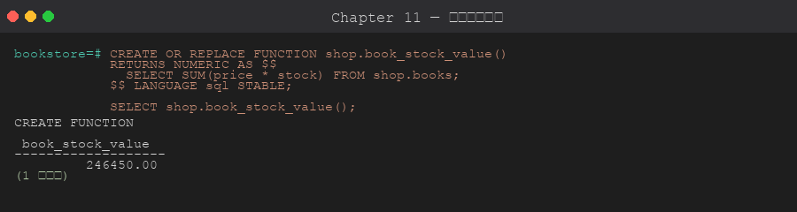

# 第 11 章 函數 與 Stored Procedure

> 目標:理解「為什麼要把邏輯放進資料庫」、**動手寫之前該做哪些取捨**,能用 SQL 與 PL/pgSQL 撰寫可重用的 Function 與 Procedure,並在它們出錯或變慢時有系統地排查。
>
> 🧰 **前置準備**:本章範例使用 `bookstore` 資料庫 (`shop` schema 與範例資料)。尚未建立的話,先在 repo 根目錄執行 `psql -d postgres -f setup/01-create-tutorial-db.sql` 與 `psql -d bookstore -f setup/02-sample-data.sql`,詳見[第 1 章 1.8 節](../01-installation/README.md#18-建立教學用資料庫)。
>
> 📐 **本章讀法**:每一節都先講「為什麼會需要這個」,再講「怎麼做」。11.2 是動手前的決策清單,11.12 是五個可以實際重現的故障情境與排查順序 — 建議先讀 11.1~11.2 建立判斷框架,再看語法。

## 11.1 為什麼需要 Function 與 Procedure

**沒有它們會發生什麼**:同一段商業邏輯 (算折扣、調庫存、產報表) 若散在每個應用程式裡,就會有三個問題 — 邏輯**重複**且各語言各寫一份、每次都把整批資料**撈到應用端**再算 (網路來回 + 記憶體)、規則改一次要改 N 個地方且容易漏。

**它們怎麼解決**:把邏輯收斂成資料庫裡一個具名、可重用的單位,讓運算**貼著資料執行** (減少來回)、規則**只有一份** (所有連線共用)、還能包成交易邊界。代價是邏輯進了資料庫就比較難版本控管與測試 (11.2 會談這個取捨)。

**Function 與 Procedure 的差別**:PostgreSQL **11+** 才有真正的 `PROCEDURE`;在那之前只能用 `FUNCTION` 兼做副作用。兩者最關鍵的差異是**能不能控制交易**。

| 特性 | FUNCTION | PROCEDURE |
|------|----------|-----------|
| 用 `SELECT` 呼叫 | ✅ | ❌ |
| 用 `CALL` 呼叫 | ❌ | ✅ |
| 在查詢中當值用 | ✅ | ❌ |
| 內部能 `COMMIT` / `ROLLBACK` | ❌ | ✅ |
| 必須有回傳值 | ✅ (可 void) | 無回傳 (用 OUT 參數) |

**白話**:
- 需要**回值用在 SQL 裡** → Function
- 需要**在中途控制交易**或**純執行一段流程** → Procedure

## 11.2 設計前的決策條件與考量重點

**為什麼要先想再寫**:函數一旦被很多查詢、觸發器、應用程式呼叫,就變成難以撼動的基礎設施 — volatility 標錯會讓 planner 拿到過期結果、SECURITY DEFINER 沒固定 search_path 會變成安全漏洞、簽章改錯會讓一堆呼叫端一起爆。這些在寫的當下都不會報錯,事後排查卻很貴 (11.12 的情境都是這樣來的)。

### 先確認的前提

| 問題 | 為什麼重要 | 怎麼確認 |
|------|-----------|---------|
| **這段邏輯該放資料庫還是應用程式?** | 放資料庫換來「貼近資料、單一真相」,但犧牲版本控管、測試、跨 DB 可攜性;規則穩定且資料密集的適合放,常變動的商業流程未必 | 看這段邏輯是「資料完整性規則」還是「產品需求」;前者放 DB,後者三思 |
| **要不要在中途 COMMIT?** | 需要分批提交 (大批次)、或做完一段就落地 → 只能用 PROCEDURE;Function 永遠在單一交易內 | 有沒有「跑到一半就要存檔」的需求 |
| **用 SQL 還是 PL/pgSQL 寫?** | 純查詢用 SQL 函數,planner 可**內聯 (inline)** 進外層查詢、最佳化;PL/pgSQL 是黑箱,有流程控制但無法被內聯 | 函數體只有一句 SELECT → SQL;有 IF/LOOP/變數 → PL/pgSQL |
| **這個函數的結果穩定嗎?(volatility)** | 標籤決定 planner 能不能摺疊/快取呼叫、能不能用在索引與平行查詢;標錯 = 過期結果或白白變慢 (情境 B) | 同樣輸入是否永遠同輸出 (IMMUTABLE) / 同交易內穩定 (STABLE) / 每次可能不同 (VOLATILE) |
| **要用誰的權限執行?** | SECURITY DEFINER 讓呼叫者以「定義者」權限執行 (受控地開放特權操作),但沒固定 search_path 就會被劫持 (情境 D) | 是否要讓低權限使用者做一件平常沒權限的事 |
| **回傳單值、一列、還是一張表?** | 決定用純量回傳 / OUT 參數 / RETURNS TABLE / SETOF;也影響呼叫端怎麼取用 | 呼叫端要「一個數字」「一筆多欄」還是「多列」 |

### 決策對照:遇到什麼選什麼

| 需求長這樣 | 選擇 | 理由 |
|-----------|------|------|
| 在 `SELECT`/`WHERE` 裡當值用、只有一句查詢 | SQL `FUNCTION`,標對 volatility | 可被 planner 內聯與最佳化,開銷最小 |
| 有 IF / LOOP / 變數 / 例外處理 | PL/pgSQL `FUNCTION` | 需要程序邏輯,SQL 函數表達不了 |
| 大批次處理、要分段 COMMIT | `PROCEDURE` + `CALL` | 只有 procedure 能在內部控制交易 |
| 讓一般使用者執行一件需要特權的固定操作 | `SECURITY DEFINER` + `SET search_path=...` | 受控開放權限;固定 search_path 防劫持 (11.12-D) |
| 同輸入永遠同輸出 (數學、格式化) | 標 `IMMUTABLE` | 可被摺疊成常數、可用於表達式索引 (第 9 章) |
| 讀資料但同交易內穩定 (查設定、查匯率) | 標 `STABLE` | 同一 statement 內只算一次 |
| 會改資料 / 用 `random()` / `now()` 逐次變 | 標 `VOLATILE` (預設) | 語意正確優先;別為了快而標錯 |
| 要回傳多列 | `RETURNS TABLE(...)` 或 `RETURNS SETOF` | 呼叫端可 `SELECT * FROM f(...)` 當表用 |

### 上線 / 實務考量

- **volatility 是「承諾」不是「提示」**:標 IMMUTABLE 等於向 planner 保證結果不變,它會據此摺疊與快取;對其實會變的邏輯標 IMMUTABLE,會拿到**過期的錯誤結果**,而且不報錯。寧可標保守 (VOLATILE) 也不要標錯。
- **SECURITY DEFINER 一定要 `SET search_path`**:否則物件名稱照呼叫者的 search_path 解析,可被植入同名物件劫持 (11.12-D)。函數內也建議一律用 `schema.物件` 全名。
- **例外區塊有成本**:每個 `BEGIN ... EXCEPTION` 會建立一個 subtransaction (存一個 savepoint),在高頻迴圈裡逐列包 EXCEPTION 會明顯拖慢。只在真的要攔的地方包。
- **`CREATE OR REPLACE` 不能改簽章**:改參數/回傳型別要先 `DROP FUNCTION`;overloaded (同名不同參數) 函數刪除時要指定完整參數型別,否則報 ambiguous。
- **部署順序**:函數依賴的表/型別要先存在;被觸發器或視圖引用的函數不能隨意 DROP。
- **測試**:邏輯進了 DB 就要有對應的 SQL 測試 (像本章的情境腳本);不要只在應用端測。

## 11.3 簡單 Function (SQL 語言)

**為什麼先學 SQL 函數**:函數體如果只是一句查詢,用 `LANGUAGE sql` 寫最划算 — planner 能把它**內聯**進外層查詢一起最佳化,幾乎沒有呼叫開銷。PL/pgSQL 留給真的需要流程控制時再用。



```sql
CREATE OR REPLACE FUNCTION shop.add(a INT, b INT)
RETURNS INT
LANGUAGE sql
IMMUTABLE
AS $$
    SELECT a + b;
$$;

SELECT shop.add(3, 4);   -- 7
```

**volatility 標籤 (整章最容易標錯、後果最隱晦的地方)**:標籤是你給 planner 的承諾,決定它能不能省下重複計算。

- `IMMUTABLE` — 同輸入永遠同輸出,與資料庫狀態無關 (如 `a + b`)。planner 可**預先摺疊成常數**,也可用於表達式索引。
- `STABLE` — 同一個 statement 內結果穩定 (讀資料但不改,如查目前匯率)。同 query 內只算一次。
- `VOLATILE` (**預設**) — 每次呼叫都可能不同 (`random()`、`now()`、或會改資料的)。planner 不敢做任何省略。

> ⚠️ 標籤標錯不會報錯,只會默默給錯結果或白白變慢 — 這正是 11.12 情境 B 的主題。不確定就用預設的 VOLATILE。

## 11.4 PL/pgSQL Function (流程控制)

**為什麼需要 PL/pgSQL**:SQL 函數只能是「一個運算式」,無法表達「如果…就…否則…」「跑一個迴圈」「宣告中間變數」。需要這些程序邏輯時,就用 PostgreSQL 內建的 PL/pgSQL (語法近似 Oracle PL/SQL)。代價:它對 planner 是黑箱,不能被內聯。

```sql
CREATE OR REPLACE FUNCTION shop.price_tier(p NUMERIC)
RETURNS TEXT
LANGUAGE plpgsql
IMMUTABLE
AS $$
BEGIN
    IF p IS NULL THEN
        RETURN 'unknown';
    ELSIF p < 400 THEN
        RETURN 'cheap';
    ELSIF p < 1000 THEN
        RETURN 'normal';
    ELSE
        RETURN 'expensive';
    END IF;
END;
$$;

SELECT title, price, shop.price_tier(price) AS tier
FROM shop.books;
```

### 變數宣告與賦值

**為什麼要宣告變數**:當一段運算需要中間結果、或同一個值要用很多次,用變數存起來比重複寫運算式清楚、也避免重算。

```sql
CREATE OR REPLACE FUNCTION shop.calc_discount(p NUMERIC, off NUMERIC)
RETURNS NUMERIC
LANGUAGE plpgsql
AS $$
DECLARE
    v_result NUMERIC;
    v_min    CONSTANT NUMERIC := 0;
BEGIN
    v_result := p * (1 - off/100);
    IF v_result < v_min THEN
        v_result := v_min;
    END IF;
    RETURN ROUND(v_result, 2);
END;
$$;
```

## 11.5 控制流程

**為什麼**:這些是 PL/pgSQL 的骨架 — 條件分支、各種迴圈、逐列處理查詢結果。實務上「逐列處理」最常用 (`FOR rec IN SELECT ... LOOP`),但也要記得:能用一句 SQL 做完的事,通常比迴圈快,別把 SQL 當程式語言硬跑迴圈。

```sql
-- 條件
IF cond THEN ... ELSIF cond THEN ... ELSE ... END IF;

-- 簡單 LOOP
LOOP
    EXIT WHEN i > 10;
    i := i + 1;
END LOOP;

-- FOR 計數
FOR i IN 1..10 LOOP ... END LOOP;
FOR i IN REVERSE 10..1 LOOP ... END LOOP;

-- FOR 跑 query 結果
FOR rec IN SELECT * FROM books WHERE price > 500 LOOP
    RAISE NOTICE 'Book: %', rec.title;
END LOOP;

-- WHILE
WHILE x > 0 LOOP x := x - 1; END LOOP;

-- CASE
CASE x
    WHEN 1 THEN ...
    WHEN 2 THEN ...
    ELSE ...
END CASE;
```

## 11.6 回傳多列 / 表 (Set-returning function)

**為什麼**:有時你要的不是一個值,而是「一張算好的表」— 例如「某分類的書」「近 N 天的新書」。`RETURNS TABLE(...)` 讓函數可以被當表用:`SELECT * FROM f(...)`,還能再接 WHERE / JOIN。

```sql
CREATE OR REPLACE FUNCTION shop.recent_books(days INT)
RETURNS TABLE (id INT, title TEXT, published_at DATE)
LANGUAGE sql
AS $$
    SELECT id, title, published_at
    FROM shop.books
    WHERE published_at >= CURRENT_DATE - (days || ' days')::interval;
$$;

SELECT * FROM shop.recent_books(36500);  -- 近 100 年
```

PL/pgSQL 版本用 `RETURN QUERY` 或 `RETURN NEXT`:

```sql
CREATE OR REPLACE FUNCTION shop.books_in_category(c_name TEXT)
RETURNS TABLE (id INT, title TEXT)
LANGUAGE plpgsql
AS $$
BEGIN
    RETURN QUERY
    SELECT b.id, b.title::TEXT
    FROM shop.books b
    JOIN shop.categories c ON c.id = b.category_id
    WHERE c.name = c_name;
END;
$$;

SELECT * FROM shop.books_in_category('Database');
```

> ⚠️ 注意上面的 `b.title::TEXT`:`books.title` 是 `VARCHAR(200)`,但 `RETURNS TABLE` 宣告成 `TEXT`。`RETURN QUERY` 會**嚴格比對**每一欄型別,不加 `::TEXT` 就會報 `structure of query does not match function result type` — 這是 11.12 情境 A 的主題。

## 11.7 例外處理

**為什麼**:預設情況下,函數裡任何一句出錯,整個函數 (連同它所在的交易) 就中止。當你想「攔下特定錯誤、改用備援行為繼續」(如重複鍵就當更新、除以零就回 NULL),就用 `BEGIN ... EXCEPTION`。

```sql
CREATE OR REPLACE FUNCTION shop.safe_divide(a NUMERIC, b NUMERIC)
RETURNS NUMERIC
LANGUAGE plpgsql
AS $$
BEGIN
    RETURN a / b;
EXCEPTION
    WHEN division_by_zero THEN
        RAISE NOTICE '0 除錯誤,改回傳 NULL';
        RETURN NULL;
    WHEN OTHERS THEN
        RAISE NOTICE '未知錯誤: %', SQLERRM;
        RETURN NULL;
END;
$$;

SELECT shop.safe_divide(10, 0);
```

常用例外名:`unique_violation`, `foreign_key_violation`, `check_violation`, `division_by_zero`, `not_null_violation`, `data_exception`, `OTHERS`。

> ⚠️ **成本提醒**:每個 `BEGIN ... EXCEPTION` 區塊會建立一個 subtransaction (內部存一個 savepoint)。在逐列的高頻迴圈裡包 EXCEPTION,累積開銷很可觀 — 只在真的需要攔錯的地方用。

## 11.8 PROCEDURE (PG 11+)

**為什麼需要 Procedure**:Function 永遠跑在單一交易裡,無法在中途 `COMMIT`。當你要**分批提交** (百萬列批次,每一批落地一次,避免單一巨大交易) 或做一段「執行流程」而非「算一個值」,就需要 Procedure。它用 `CALL` 呼叫,而且**可以在內部控制交易**。

```sql
CREATE OR REPLACE PROCEDURE shop.transfer_stock(
    src_book_id INT,
    dst_book_id INT,
    qty         INT
)
LANGUAGE plpgsql
AS $$
BEGIN
    UPDATE shop.books SET stock = stock - qty WHERE id = src_book_id;
    UPDATE shop.books SET stock = stock + qty WHERE id = dst_book_id;

    IF (SELECT stock FROM shop.books WHERE id = src_book_id) < 0 THEN
        RAISE EXCEPTION 'Source stock cannot go below zero';
    END IF;

    COMMIT;     -- procedure 內可控制交易!function 不行
END;
$$;

CALL shop.transfer_stock(1, 2, 1);
```

> ⚠️ procedure 內的 `COMMIT` 只有在它**自成頂層交易**時才能用。如果外面已經 `BEGIN;` 開了交易再 `CALL`,會報 `invalid transaction termination` — 這是 11.12 情境 C 的主題。

## 11.9 OUT / INOUT 參數

**為什麼**:Procedure 沒有回傳值,但你常需要它「算完把結果交出來」。`OUT` 參數就是 procedure 的輸出管道;`INOUT` 則是「傳進去、改一改、再傳出來」。

```sql
CREATE OR REPLACE PROCEDURE shop.summarize_book(
    IN  book_id  INT,
    OUT out_title TEXT,
    OUT out_revenue NUMERIC
)
LANGUAGE plpgsql
AS $$
BEGIN
    SELECT b.title,
           COALESCE(SUM(oi.quantity * oi.unit_price), 0)
      INTO out_title, out_revenue
      FROM shop.books b
      LEFT JOIN shop.order_items oi ON oi.book_id = b.id
     WHERE b.id = book_id
     GROUP BY b.title;
END;
$$;

CALL shop.summarize_book(1, NULL, NULL);
```

## 11.10 RAISE 訊息與例外

**為什麼**:`RAISE` 一身兩用 — 一是**輸出診斷訊息** (NOTICE/WARNING,除錯與稽核用),二是**主動拋出錯誤**中止流程 (EXCEPTION,搭配自訂 ERRCODE 讓呼叫端能分辨)。

```sql
RAISE NOTICE  'Hello %', name;     -- 提示
RAISE WARNING '注意 %', code;
RAISE EXCEPTION '錯誤 %', code USING ERRCODE = 'P0001';
```

## 11.11 修改、刪除

**為什麼要小心**:`CREATE OR REPLACE` 只能改函數**內容**,不能改簽章 (參數、回傳型別);要改簽章得先 `DROP`。而 overloaded 函數 (同名不同參數) 刪除時**必須指定參數型別**,否則 PostgreSQL 不知道你要刪哪一個。

```sql
-- 列出
\df shop.*

-- 看程式碼
\sf shop.price_tier

-- 刪除 (注意 overloaded function 要指定參數型別)
DROP FUNCTION shop.add(INT, INT);
DROP PROCEDURE shop.transfer_stock(INT, INT, INT);
```

## 11.12 問題排查:情境模擬與排查順序

**為什麼要練這個**:函數的問題有個共同特徵 — **寫的當下不會報錯**,是被呼叫、或資料/search_path 變了才爆,而且錯誤訊息常常指向函數內部而非呼叫點。能不能從錯誤訊息與 `\df`/`EXPLAIN` 有系統地縮小範圍,比背語法更重要。

> 🧪 所有情境都在 [`scripts/04-troubleshooting-scenarios.sql`](./scripts/04-troubleshooting-scenarios.sql) 裡,用自己的 demo 物件、跑完自動清掉、不動 `shop.*` 既有資料。情境 A / A-2 / C 會各刻意出現一個錯誤 (A、A-2 被 `EXCEPTION` 攔成 NOTICE,C 是真的 ERROR),都已在腳本標注「← 預期的」。

### 通用排查順序:「函數出錯 / 變慢」

順序的邏輯是**先讀訊息、先分離變因,再動手改**:

```
1. 完整讀錯誤:ERROR 那行 + DETAIL + CONTEXT + HINT
   → CONTEXT 會告訴你錯在函數的哪一行;DETAIL 常直接講出型別/物件
2. 把函數體的 SQL 單獨拉出來跑
   → 單獨跑沒事、包成函數才錯 → 問題在「介面」(回傳型別/參數型別),不在邏輯本身
3. 確認簽章與 volatility:\df 函數名、\sf 看定義、pg_proc.provolatile
   → 引數型別對不上?volatility 標籤是不是害了 planner?
4. 交易語境對嗎?
   → 有沒有被外層 BEGIN 包住 (procedure COMMIT)?例外區塊是不是吞掉了真正的錯?
5. 名稱解析對嗎?(SECURITY DEFINER 尤其要查)
   → search_path 有沒有固定?函數內物件有沒有加 schema 前綴?
6. 才動手修,然後驗證
   → 改完重跑同一段,確認錯誤消失 / 計畫與時間改善
```

### 情境 A:structure of query does not match function result type

**症狀**:`RETURNS TABLE` 的函數,把裡面那句 `SELECT` 單獨貼到 psql 跑得好好的,一旦 `SELECT * FROM f(...)` 呼叫就報錯。

**排查順序與線索**:

| 步驟 | 做什麼 | 看到什麼 |
|------|-------|---------|
| 1 | 完整讀錯誤的 **DETAIL** | `Returned type character varying(200) does not match expected type text in column 2.` — 直接點名第 2 欄型別不符 |
| 2 | 單獨跑函數體那句 SELECT | 完全正常 → 問題不在查詢邏輯,在「回傳介面的型別宣告」 |
| 3 | 比對 `RETURNS TABLE` 宣告 vs 來源欄位型別 | 宣告 `title TEXT`,但 `books.title` 是 `VARCHAR(200)` |

**根因**:`RETURN QUERY` 會把查詢每一欄的型別和 `RETURNS TABLE` 宣告做**嚴格**比對,`varchar(200)` 與 `text` 被視為不同型別,不自動放行。

**修正**:把回傳欄位明確轉成宣告型別:`SELECT b.id, b.title::TEXT ...`(或把宣告改成 `VARCHAR`)。

**驗證**:呼叫回傳 `3 | SQL for Smarties`,不再報錯。

**同類問題 A-2:`function shop.tax(text) does not exist`**。函數定義成 `tax(NUMERIC)`,但呼叫時傳進的是 `text` 值 (常見於「把字串欄位直接丟進數值參數」)。PostgreSQL 找不到 `tax(text)` 這個簽章 → 報「does not exist」並提示加型別轉換。排查:`\df shop.tax` 看實際參數型別;修正:呼叫端明確轉型 `shop.tax('100'::NUMERIC)`,或修好來源欄位型別。

### 情境 B:查詢突然變慢 — 函數標成 VOLATILE 無法被摺疊

**症狀**:`WHERE` 用了一個引數是**常數**的函數,查 20 萬列的表比預期慢很多;把函數體改一行標籤就快了好幾倍。

**排查順序與線索**:

| 步驟 | 做什麼 | 看到什麼 |
|------|-------|---------|
| 1 | `EXPLAIN (ANALYZE)` 看 Filter 那行 | VOLATILE 版:`Filter: (n = slow_square(500))` — 函數呼叫留在計畫裡,逐列執行,`Execution Time ≈ 28~32 ms` |
| 2 | 對照 IMMUTABLE 版的同一查詢 | `Filter: (n = 250000)` — 函數被**摺疊成常數**,`Execution Time ≈ 4~5 ms` |
| 3 | `\sf` 或 `pg_proc.provolatile` 確認標籤 | VOLATILE 版標的是 `v`(預設),邏輯其實是純運算,可以更嚴格 |

**根因**:planner 不敢對 `VOLATILE` 函數做常數摺疊 (它「可能每次結果不同」),即使引數是常數 `500`,也只能保留成函數呼叫、對每一列各執行一次。`IMMUTABLE` 則向 planner 保證結果只由輸入決定,於是 `fast_square(500)` 直接被算成 `250000`。

**修正**:對「同輸入永遠同輸出」的函數標 `IMMUTABLE`(或至少 `STABLE`)。實測 20 萬列:**28ms → 4ms,約 7 倍**。

**驗證**:計畫的 Filter 從函數呼叫變成常數,Execution Time 同步下降。

> ⚠️ 反過來也要小心:volatility 是承諾。對其實會變的邏輯 (讀會變的資料、用 `random()`) 標 IMMUTABLE,planner 會摺疊/快取而給你**過期的錯誤結果**,且不報錯。標籤要正確,不是越嚴格越好。

### 情境 C:PROCEDURE 裡 COMMIT 報 invalid transaction termination

**症狀**:一支含 `COMMIT` 的 procedure,直接 `CALL` 沒問題;但放進一段 `BEGIN; ... ; COMMIT;`、或某些 GUI 工具的「自動交易模式」裡執行就報錯。

**排查順序與線索**:

| 步驟 | 做什麼 | 看到什麼 |
|------|-------|---------|
| 1 | 讀 ERROR + CONTEXT | `ERROR: invalid transaction termination` / `CONTEXT: PL/pgSQL function ... line N at COMMIT` — 明指是 COMMIT 那行 |
| 2 | 第 4 步:檢查交易語境 | 這句 `CALL` 外面有沒有被 `BEGIN;` 包住?(工具的 auto-commit 關掉時,等於每句都被交易包住) |

**根因**:procedure 內的 `COMMIT` 要求它自己是**頂層交易**。外層已經 `BEGIN` 開了一個交易,procedure 就無權結束它 → `invalid transaction termination`。

**修正**:讓 procedure **自成頂層交易**地呼叫 — 不要用外層 `BEGIN` 包它;若用 GUI 工具,關掉「把每段包成一個交易」的選項,或改用 autocommit 模式送出 `CALL`。

**驗證**:不被 `BEGIN` 包住直接 `CALL`,`COMMIT` 成功,無 ERROR。

### 情境 D:SECURITY DEFINER 函數被 search_path 劫持

**症狀**:一支以「定義者權限」執行的函數,回傳結果竟然隨**呼叫者**的環境而變 — 同一支函數,不同人呼叫拿到不同答案。這不只是 bug,是**安全漏洞**。

**排查順序與線索**:

| 步驟 | 做什麼 | 看到什麼 |
|------|-------|---------|
| 1 | 正常呼叫 (search_path = shop) | `SELECT count(*) FROM books` 解析到 `shop.books`,回 8 — 正常 |
| 2 | 呼叫者在自己可寫的 schema 放同名 `books`,前置到 search_path | 未加前綴的 `books` 改解析到 `demo_evil.books`,回 0 — 函數行為被外部改變 |
| 3 | 第 5 步:檢查函數定義有沒有 `SET search_path`、物件有沒有加 schema 前綴 | 兩者都沒有 → 可被劫持 |

**根因**:`SECURITY DEFINER` 用定義者的**權限**執行,但物件名稱仍照**呼叫者**的 search_path 解析。未固定 search_path + 未加 schema 前綴,呼叫者就能植入同名物件,讓特權函數去存取 (甚至寫入) 攻擊者控制的物件。

**修正**:函數宣告固定 search_path,並在函數內對所有物件加 schema 前綴:

```sql
CREATE OR REPLACE FUNCTION shop.safe_count() RETURNS BIGINT
LANGUAGE plpgsql SECURITY DEFINER
SET search_path = shop, pg_temp        -- 釘死解析路徑
AS $$ ... $$;
```

**驗證**:即使呼叫者的 search_path 前面有 `demo_evil`,`safe_count()` 仍解析到 `shop.books`,回 8。

## 章節腳本

- [`scripts/01-simple-functions.sql`](./scripts/01-simple-functions.sql) — SQL 與 PL/pgSQL 簡單函數、volatility、例外
- [`scripts/02-plpgsql-control-flow.sql`](./scripts/02-plpgsql-control-flow.sql) — LOOP / FOR / WHILE / CASE / 嵌套例外
- [`scripts/03-procedure-and-transaction.sql`](./scripts/03-procedure-and-transaction.sql) — PROCEDURE、內部交易控制、OUT 參數
- [`scripts/04-troubleshooting-scenarios.sql`](./scripts/04-troubleshooting-scenarios.sql) — 11.12 五個排查情境 (可重現)

---

下一章 ➡ [第 12 章:Trigger](../12-triggers/)
