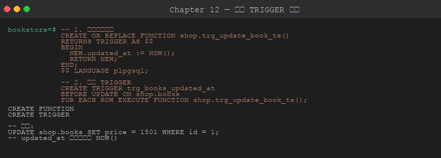

# 第 12 章 觸發器 (Trigger)

> 目標:能設計各類 trigger 自動維護衍生欄位、稽核紀錄、防止非法操作。
>
> 🧰 **前置準備**:本章範例使用 `bookstore` 資料庫 (`shop` schema 與範例資料)。尚未建立的話,先在 repo 根目錄執行 `psql -d postgres -f setup/01-create-tutorial-db.sql` 與 `psql -d bookstore -f setup/02-sample-data.sql`,詳見[第 1 章 1.8 節](../01-installation/README.md#18-建立教學用資料庫)。

## 12.1 Trigger 的組成



一個 trigger 由兩部分組成:
1. **Trigger function**:`RETURNS TRIGGER`,描述要做什麼
2. **Trigger 本身**:綁定到表 + 事件 + 條件

```sql
CREATE OR REPLACE FUNCTION fn_xxx() RETURNS TRIGGER LANGUAGE plpgsql AS $$
BEGIN ... END $$;

CREATE TRIGGER trg_xxx
BEFORE INSERT OR UPDATE ON some_table
FOR EACH ROW EXECUTE FUNCTION fn_xxx();
```

## 12.2 Trigger 屬性

| 維度 | 選項 |
|------|------|
| 時機 | `BEFORE` / `AFTER` / `INSTEAD OF` (僅 view) |
| 事件 | `INSERT` / `UPDATE` / `DELETE` / `TRUNCATE` |
| 粒度 | `FOR EACH ROW` / `FOR EACH STATEMENT` |
| 過濾 | `WHEN (condition)` / `OF column_list` |
| 順序 | 同表多 trigger 按**名稱字典序**執行 |

## 12.3 函數內可用變數

```text
NEW         INSERT/UPDATE 的「新值」(DELETE 時為 NULL)
OLD         UPDATE/DELETE 的「舊值」(INSERT 時為 NULL)
TG_OP       'INSERT' / 'UPDATE' / 'DELETE' / 'TRUNCATE'
TG_TABLE_NAME, TG_TABLE_SCHEMA, TG_NAME, TG_WHEN, TG_LEVEL
```

回傳值規則:
- `BEFORE ROW` 回 NULL → 該列不執行
- `BEFORE ROW` 回 NEW → 用此值繼續
- `AFTER` / `STATEMENT` → 回 NULL 即可,值不重要

## 12.4 範例 A:自動維護 `updated_at`

```sql
CREATE OR REPLACE FUNCTION shop.fn_touch_updated_at()
RETURNS TRIGGER LANGUAGE plpgsql AS $$
BEGIN
    NEW.updated_at := NOW();
    RETURN NEW;
END;
$$;

CREATE TRIGGER trg_books_updated_at
BEFORE UPDATE ON shop.books
FOR EACH ROW EXECUTE FUNCTION shop.fn_touch_updated_at();
```

## 12.5 範例 B:稽核 (Audit Log)

記錄每次 UPDATE / DELETE 的舊值。

```sql
CREATE TABLE IF NOT EXISTS shop.audit_log (
    id          BIGSERIAL PRIMARY KEY,
    table_name  TEXT NOT NULL,
    op          TEXT NOT NULL,
    old_data    JSONB,
    new_data    JSONB,
    changed_by  TEXT DEFAULT CURRENT_USER,
    changed_at  TIMESTAMPTZ DEFAULT NOW()
);

CREATE OR REPLACE FUNCTION shop.fn_audit_books()
RETURNS TRIGGER LANGUAGE plpgsql AS $$
BEGIN
    INSERT INTO shop.audit_log(table_name, op, old_data, new_data)
    VALUES (
        TG_TABLE_NAME,
        TG_OP,
        CASE WHEN TG_OP IN ('UPDATE','DELETE') THEN to_jsonb(OLD) END,
        CASE WHEN TG_OP IN ('INSERT','UPDATE') THEN to_jsonb(NEW) END
    );
    RETURN COALESCE(NEW, OLD);   -- AFTER 不重要,但要回非 NULL
END;
$$;

CREATE TRIGGER trg_audit_books
AFTER INSERT OR UPDATE OR DELETE ON shop.books
FOR EACH ROW EXECUTE FUNCTION shop.fn_audit_books();
```

## 12.6 範例 C:防止非法更新

```sql
CREATE OR REPLACE FUNCTION shop.fn_no_lower_price()
RETURNS TRIGGER LANGUAGE plpgsql AS $$
BEGIN
    IF NEW.price < OLD.price THEN
        RAISE EXCEPTION '價格不可降低 (% → %)', OLD.price, NEW.price;
    END IF;
    RETURN NEW;
END;
$$;

CREATE TRIGGER trg_books_no_lower
BEFORE UPDATE OF price ON shop.books        -- 只對 price 變動觸發
FOR EACH ROW
WHEN (NEW.price <> OLD.price)               -- 額外條件
EXECUTE FUNCTION shop.fn_no_lower_price();
```

## 12.7 範例 D:維護衍生欄位 (訂單總額)

```sql
CREATE OR REPLACE FUNCTION shop.fn_update_order_total()
RETURNS TRIGGER LANGUAGE plpgsql AS $$
DECLARE
    v_order_id INT := COALESCE(NEW.order_id, OLD.order_id);
BEGIN
    UPDATE shop.orders SET total = COALESCE((
        SELECT SUM(quantity * unit_price)
        FROM shop.order_items
        WHERE order_id = v_order_id
    ), 0)
    WHERE id = v_order_id;
    RETURN NULL;  -- AFTER trigger,回值不重要
END;
$$;

CREATE TRIGGER trg_order_items_total
AFTER INSERT OR UPDATE OR DELETE ON shop.order_items
FOR EACH ROW EXECUTE FUNCTION shop.fn_update_order_total();
```

## 12.8 STATEMENT-LEVEL Trigger 與 Transition Tables

當需要一次處理整批變動,用 `FOR EACH STATEMENT` + Transition Tables (PG 10+):

```sql
CREATE OR REPLACE FUNCTION shop.fn_bulk_audit()
RETURNS TRIGGER LANGUAGE plpgsql AS $$
BEGIN
    INSERT INTO shop.audit_log(table_name, op, new_data)
    SELECT TG_TABLE_NAME, 'BULK_INSERT', to_jsonb(n)
    FROM new_rows n;
    RETURN NULL;
END;
$$;

CREATE TRIGGER trg_bulk
AFTER INSERT ON shop.books
REFERENCING NEW TABLE AS new_rows
FOR EACH STATEMENT EXECUTE FUNCTION shop.fn_bulk_audit();
```

## 12.9 INSTEAD OF Trigger (僅 View)

讓不可自動更新的 view 也能被 INSERT/UPDATE/DELETE。

```sql
CREATE VIEW shop.v_book_with_author AS
SELECT b.id, b.title, a.name AS author_name
FROM shop.books b JOIN shop.authors a ON a.id = b.author_id;

CREATE OR REPLACE FUNCTION shop.fn_v_book_insert()
RETURNS TRIGGER LANGUAGE plpgsql AS $$
DECLARE v_author_id INT;
BEGIN
    SELECT id INTO v_author_id FROM shop.authors WHERE name = NEW.author_name;
    IF NOT FOUND THEN
        INSERT INTO shop.authors(name) VALUES (NEW.author_name) RETURNING id INTO v_author_id;
    END IF;
    INSERT INTO shop.books(title, author_id, price)
    VALUES (NEW.title, v_author_id, 0)
    RETURNING id INTO NEW.id;
    RETURN NEW;
END;
$$;

CREATE TRIGGER trg_v_book_ins
INSTEAD OF INSERT ON shop.v_book_with_author
FOR EACH ROW EXECUTE FUNCTION shop.fn_v_book_insert();
```

## 12.10 管理 Trigger

```sql
-- 列出
SELECT trigger_name, event_manipulation, action_timing, action_statement
FROM information_schema.triggers
WHERE event_object_schema = 'shop';

-- 暫停 / 啟用
ALTER TABLE shop.books DISABLE TRIGGER trg_audit_books;
ALTER TABLE shop.books ENABLE  TRIGGER trg_audit_books;
ALTER TABLE shop.books DISABLE TRIGGER ALL;     -- 全部

-- 刪除
DROP TRIGGER trg_audit_books ON shop.books;
```

## 12.11 注意事項

- Trigger 是「隱性魔法」,容易讓人困惑,**重要邏輯加註解**。
- Trigger 內**寫**同一張表會無限遞迴,小心。
- 大量 batch 操作時,row-level trigger 會慢上百倍,考慮 statement trigger。
- TRUNCATE **不會觸發** row-level INSERT/UPDATE/DELETE trigger。

## 章節腳本

- [`scripts/01-touch-and-audit.sql`](./scripts/01-touch-and-audit.sql)
- [`scripts/02-derived-total.sql`](./scripts/02-derived-total.sql)
- [`scripts/03-instead-of-view.sql`](./scripts/03-instead-of-view.sql)

---

下一章 ➡ [第 13 章:交易與並發控制](../13-transactions-concurrency/)
