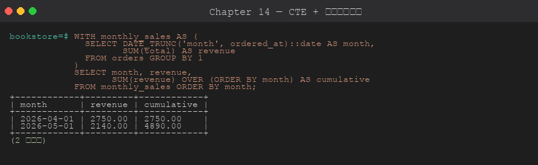
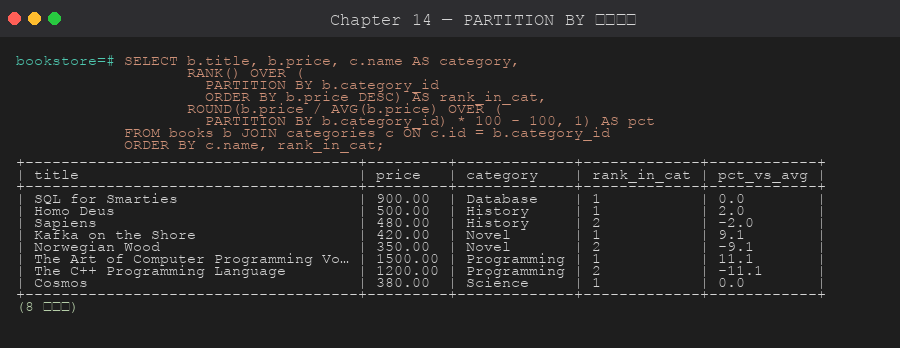

# 第 14 章 CTE 與視窗函數

> 目標:能用 CTE 簡化多層查詢、用遞迴 CTE 走階層資料、用視窗函數做排名與累積統計。
>
> 🧰 **前置準備**:本章範例使用 `bookstore` 資料庫 (`shop` schema 與範例資料)。尚未建立的話,先在 repo 根目錄執行 `psql -d postgres -f setup/01-create-tutorial-db.sql` 與 `psql -d bookstore -f setup/02-sample-data.sql`,詳見[第 1 章 1.8 節](../01-installation/README.md#18-建立教學用資料庫)。

## 14.1 CTE (Common Table Expression)

CTE 用 `WITH` 子句定義「臨時命名查詢」,讓複雜 SQL 更易讀。



```sql
WITH
    category_stats AS (
        SELECT category_id, COUNT(*) AS book_cnt, AVG(price) AS avg_price
        FROM shop.books
        GROUP BY category_id
    )
SELECT c.name, cs.book_cnt, cs.avg_price::NUMERIC(10,2)
FROM category_stats cs
JOIN shop.categories c ON c.id = cs.category_id
ORDER BY cs.book_cnt DESC;
```

### 多個 CTE

```sql
WITH
    paid_orders AS (
        SELECT * FROM shop.orders WHERE status IN ('paid','completed')
    ),
    revenue_by_customer AS (
        SELECT customer_id, SUM(total) AS revenue
        FROM paid_orders
        GROUP BY customer_id
    )
SELECT c.name, r.revenue
FROM revenue_by_customer r
JOIN shop.customers c ON c.id = r.customer_id
ORDER BY r.revenue DESC;
```

### CTE 可以寫入 (INSERT/UPDATE/DELETE)

```sql
-- 先準備封存表 (同第 6 章 6.1 的做法)
CREATE SCHEMA IF NOT EXISTS archive;
CREATE TABLE IF NOT EXISTS archive.books_old (LIKE shop.books INCLUDING ALL);

WITH deleted AS (
    DELETE FROM shop.books
    WHERE stock = 0 AND published_at < '2000-01-01'
    RETURNING *
)
INSERT INTO archive.books_old
SELECT * FROM deleted;
-- 練習完可清理:DROP SCHEMA archive CASCADE;
```

## 14.2 遞迴 CTE — `WITH RECURSIVE`

最適合走**樹狀 / 階層**資料。

```sql
-- 員工主管鏈:找 id=7 的員工所有上司
WITH RECURSIVE mgr_chain AS (
    -- 基礎條件 (起點)
    SELECT id, name, role, manager_id, 0 AS depth
    FROM shop.employees
    WHERE id = 7

    UNION ALL

    -- 遞迴部分
    SELECT e.id, e.name, e.role, e.manager_id, mc.depth + 1
    FROM shop.employees e
    JOIN mgr_chain mc ON mc.manager_id = e.id
)
SELECT depth, id, name, role FROM mgr_chain ORDER BY depth DESC;
```

另一個方向,**向下找所有下屬**:

```sql
WITH RECURSIVE subordinates AS (
    SELECT id, name, role, manager_id, 0 AS depth
    FROM shop.employees WHERE id = 1   -- CEO

    UNION ALL

    SELECT e.id, e.name, e.role, e.manager_id, s.depth + 1
    FROM shop.employees e
    JOIN subordinates s ON e.manager_id = s.id
)
SELECT depth, lpad('', depth*2, '  ') || name AS org_chart, role
FROM subordinates
ORDER BY depth, name;
```

## 14.3 視窗函數 (Window Functions)

視窗函數在**不折疊列**的前提下,對一組列做計算。

```sql
SELECT title, price,
       AVG(price) OVER () AS avg_all
FROM shop.books;
-- 每列都保留,但右邊多了「全表平均」
```

### OVER 語法

```sql
function_name() OVER (
    [PARTITION BY col1, col2]   -- 分組 (不合併列)
    [ORDER BY col3]              -- 排序 (影響累計型函數)
    [frame_clause]               -- 視窗框
)
```

## 14.4 排名函數



```sql
SELECT
    title, price, category_id,
    ROW_NUMBER()   OVER (PARTITION BY category_id ORDER BY price DESC) AS row_num,
    RANK()         OVER (PARTITION BY category_id ORDER BY price DESC) AS rank,
    DENSE_RANK()   OVER (PARTITION BY category_id ORDER BY price DESC) AS dense_rank,
    PERCENT_RANK() OVER (ORDER BY price)                               AS pct_rank,
    NTILE(3)       OVER (ORDER BY price)                               AS quartile
FROM shop.books;
```

`ROW_NUMBER` vs `RANK` vs `DENSE_RANK`:
- ROW_NUMBER:1,2,3,4 (永遠連續)
- RANK:1,2,2,4 (並列後跳號)
- DENSE_RANK:1,2,2,3 (並列後不跳)

## 14.5 累積型函數

```sql
SELECT
    id,
    title,
    price,
    SUM(price) OVER (ORDER BY price) AS running_sum,
    AVG(price) OVER (
        ORDER BY price
        ROWS BETWEEN 1 PRECEDING AND 1 FOLLOWING   -- 移動平均
    ) AS moving_avg_3
FROM shop.books;
```

### Frame Clause

| 語法 | 說明 |
|------|------|
| `ROWS BETWEEN UNBOUNDED PRECEDING AND CURRENT ROW` | 從頭到目前 (預設 with ORDER BY) |
| `ROWS BETWEEN 1 PRECEDING AND 1 FOLLOWING` | 前1列到後1列 |
| `RANGE BETWEEN ...` | 依值範圍 (不是列數) |

## 14.6 Lead / Lag / First_value / Last_value / Nth_value

```sql
SELECT
    id,
    ordered_at::date,
    total,
    LAG(total)  OVER (PARTITION BY customer_id ORDER BY ordered_at) AS prev_total,
    LEAD(total) OVER (PARTITION BY customer_id ORDER BY ordered_at) AS next_total,
    FIRST_VALUE(total) OVER (PARTITION BY customer_id ORDER BY ordered_at
                             ROWS BETWEEN UNBOUNDED PRECEDING AND UNBOUNDED FOLLOWING) AS first_order
FROM shop.orders
ORDER BY customer_id, ordered_at;
```

## 14.7 每組 Top-N 模式

不用 LATERAL,也可以用 ROW_NUMBER 實現:

```sql
WITH ranked AS (
    SELECT
        b.title, c.name AS category, b.price,
        ROW_NUMBER() OVER (PARTITION BY b.category_id ORDER BY b.price DESC) AS rn
    FROM shop.books b
    JOIN shop.categories c ON c.id = b.category_id
)
SELECT category, title, price
FROM ranked
WHERE rn = 1;   -- 每分類最貴的書
```

## 14.8 WINDOW 子句 (命名視窗)

當多個視窗函數共用同一個 OVER 定義:

```sql
SELECT
    title, category_id, price,
    SUM(price)  OVER w AS sum_price,
    AVG(price)  OVER w AS avg_price,
    MAX(price)  OVER w AS max_price
FROM shop.books
WINDOW w AS (PARTITION BY category_id ORDER BY price)
ORDER BY category_id, price;
```

## 章節腳本

- [`scripts/01-cte-basic.sql`](./scripts/01-cte-basic.sql)
- [`scripts/02-recursive-cte.sql`](./scripts/02-recursive-cte.sql)
- [`scripts/03-window-functions.sql`](./scripts/03-window-functions.sql)

---

下一章 ➡ [第 15 章:JSON / 全文搜尋](../15-json-fulltext/)
