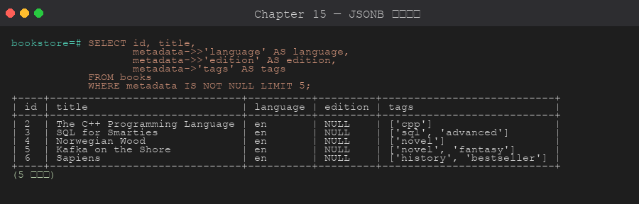

# 第 15 章 JSON / JSONB 與全文搜尋

> 目標:理解什麼時候該把資料放進 JSONB、什麼時候不該;學會 JSONB 的查詢、更新與索引;理解全文搜尋 (`tsvector` / `tsquery`) 與 `pg_trgm` 各自解決什麼問題,以及「搜不到 / 索引沒用到」時怎麼有系統地排查。
>
> 🧰 **前置準備**:本章範例使用 `bookstore` 資料庫 (`shop` schema 與範例資料)。尚未建立的話,先在 repo 根目錄執行 `psql -d postgres -f setup/01-create-tutorial-db.sql` 與 `psql -d bookstore -f setup/02-sample-data.sql`,詳見[第 1 章 1.8 節](../01-installation/README.md#18-建立教學用資料庫)。
>
> 📐 **本章讀法**:每一節都先講「為什麼會需要這個」,再講「怎麼做」。15.2 是動手前的決策清單,15.10 是四個可以實際重現的故障情境與排查順序 — 建議先讀 15.1~15.2 建立判斷框架,再看語法。

## 15.1 為什麼需要 JSONB 與全文搜尋

**關聯式資料表的前提是「欄位事先知道」**:`books` 有 `title`、`price`、`stock`,每一列長得一樣。但真實世界有兩類資料不符合這個前提:

1. **結構不固定的資料**:每本書的「附加屬性」不同 — 程式書有 `language`、`edition`,小說有 `series`、`translator`,而且供應商隨時會多送一個新欄位。硬塞進固定欄位的結果是幾十個大多為 NULL 的欄位,或是每次都要 `ALTER TABLE`。JSONB 讓你把這種「半結構化」資料存成一個欄位,還能查、能索引。
2. **要「找字」而不是「比對值」的資料**:`WHERE title = 'Sapiens'` 是比對值;「找標題或簡介裡提到 *database* 的書,拼錯也要能找到,相關的排前面」是搜尋。`LIKE '%database%'` 只能做子字串比對、不懂 databases = database、也無法排序相關性,大表上還必然全表掃描。全文搜尋與 `pg_trgm` 就是為這個而生。

**但兩者都有代價**,這是整章反覆出現的取捨:

- JSONB 裡的值**沒有型別、沒有約束、沒有外鍵**:`"pages": "n/a"` 存得進去,`(metadata->>'pages')::INT` 時才炸 (15.10 情境 B)
- JSONB 改一個 key 就是**整個值重寫**,GIN 索引要跟著維護,更新密集時成本很高 (15.10 情境 D 會量化)
- 全文搜尋的結果取決於**設定 (config)**:儲存端與查詢端設定不一致就是「明明有卻搜不到」(15.10 情境 C)

### JSON vs JSONB

**為什麼有兩種**:`JSON` 型別只是「檢查過語法的文字」,每次查詢都要重新解析;`JSONB` 在寫入時解析成二進位結構,查詢直接走結構、能建 GIN 索引。代價是寫入略慢、不保留原始空白與 key 順序。

| 特性 | JSON | JSONB |
|------|------|-------|
| 儲存 | 文字 (原始) | 二進位解析 |
| 空白/順序 | 保留 | 不保留 |
| 重複 key | 保留 | 後者覆蓋前者 |
| 索引支援 | ❌ | ✅ GIN |
| 查詢速度 | 慢 (每次重解析) | 快 |
| 寫入速度 | 略快 | 略慢 |

**結論:永遠用 JSONB**,除非你要原始格式保留 (例如法規要求原樣存證的 webhook payload)。

## 15.2 設計前的決策條件與考量重點

**為什麼要先想再建**:JSONB 最大的誘惑是「先塞進去再說」— 不用改 schema、不用想欄位。三個月後你會發現:常查的 key 沒索引、常改的 key 讓每次 UPDATE 重寫幾 KB、報表要 JOIN 的值卡在 JSON 裡沒有外鍵。全文搜尋則是反過來:一開始沒想清楚 config 與語言,上線後「搜不到」很難歸因。這些都是設計期五分鐘能避開的。

### 先確認的前提

| 問題 | 為什麼重要 | 怎麼確認 |
|------|-----------|---------|
| **這些 key 是「每列都有、固定型別」的嗎?** | 每列都有、型別固定的資料就是一般欄位,放進 JSONB 只是放棄型別檢查、約束與統計資料 (planner 對 JSONB 內容的選擇度估計很粗) | 列出前 10 個 key,問:哪些是所有列都有的? |
| **會用哪些 key 來 WHERE / JOIN / ORDER BY?** | 決定要不要索引、建哪種索引;拿來 JOIN 的值幾乎一定該是真欄位 (要外鍵) | 收集實際查詢,不要憑想像 |
| **會多常更新 JSONB 裡的值?** | JSONB 改一個 key 就整個值重寫 (含 TOAST 解壓/重壓),GIN 索引也要更新;高頻更新的計數器、狀態欄位放 JSONB 是效能陷阱 | `pg_stat_user_tables.n_tup_upd`;問「哪個 key 會一直變?」 |
| **單一 JSONB 值會多大?** | 超過約 2KB 會進 TOAST (壓縮、切片另存),讀取多一次間接存取;幾百 KB 的 JSON 每次讀寫都很痛 | `SELECT pg_column_size(metadata)` 看分布 |
| **要搜尋的文字是什麼語言?要不要詞幹 / 拼錯容忍 / 相關性排序?** | 決定全文搜尋 vs `pg_trgm` vs 外部搜尋引擎;內建 parser **不會斷中文詞** (15.10 情境 C-2) | 看實際資料:英文?中文?混合?使用者會怎麼打關鍵字? |
| **搜尋的資料量與更新頻率?** | tsvector 欄位 + GIN 是額外的儲存與寫入成本;幾千列直接 `to_tsvector()` 即時算就夠 | 表大小 + 寫入頻率 |

### 決策對照:什麼情況選什麼

| 情況 | 選擇 | 理由 |
|------|------|------|
| key 每列都有、型別固定、會拿來 WHERE / JOIN | **一般欄位** | 型別、約束、外鍵、統計資料全都有;JSONB 沒有任何優勢 |
| key 只有部分列有、來源不固定、主要是「整包讀出來給前端」 | **JSONB 欄位** | 不用為每個可能的 key 改 schema;整包讀寫最自然 |
| 屬性數量無上限、且要對「任意屬性」做嚴格型別查詢 | 考慮 **EAV 表** 或 JSONB + 驗證 CHECK | 純 EAV 查詢很難寫、效能差;多數情況 JSONB + `jsonb_typeof` 檢查更實際 |
| JSONB 裡某個 key 開始常被 WHERE / ORDER BY | **升格為真欄位** 或 **generated column** `(metadata->>'lang') STORED` | 有型別、有統計、能建 B-Tree;generated column 不用改寫入端 |
| 查詢是「包含 / 存在」:`@>`、`?`、`?|`、`?&` | **GIN (jsonb_ops)** | 支援全部包含與存在操作子;索引較大 |
| 只用 `@>` (與 `@?`/`@@` jsonpath),要索引小、查得快 | **GIN (jsonb_path_ops)** | 只索引「路徑+值」的雜湊,比 `jsonb_ops` 小約 30%、包含查詢更快;但**不支援 `?` 系列** |
| 查詢是 `metadata->>'key' = ?` / 範圍 / 排序 | **表達式 B-Tree** `((metadata->>'key'))` | GIN 對 `->>` 取出的 text 完全幫不上忙 (15.10 情境 A) |
| 要「找字」:詞幹化 (database = databases)、AND/OR/NOT、相關性排序 | **全文搜尋** tsvector + GIN | 這些是 FTS 的核心能力;`LIKE` 一項都做不到 |
| 要子字串比對 `%abc%`、拼錯容忍、**中文**、短欄位 (標題、姓名) | **`pg_trgm`** GIN + `LIKE`/`ILIKE`/`%` | 不需要分詞,天然支援中文與模糊比對;但不懂詞幹、不做相關性 (只有相似度) |
| 要多語言分詞、同義詞、facet、複雜排序、跨系統搜尋 | **外部搜尋引擎** (Elasticsearch / Meilisearch) | 超出 PostgreSQL FTS 的舒適區;代價是雙寫與資料同步 |
| tsvector 要存起來 (資料量大) | **generated column** `GENERATED ALWAYS AS (to_tsvector(...)) STORED` | 自動維護、不會忘記更新;trigger 版是 PG12 以前的做法 |
| tsvector 不想佔空間 | **表達式 GIN** `USING gin (to_tsvector('english', title))` | 不多一個欄位;但查詢必須寫**一模一樣**的表達式與 config |

### 上線時的考量

- **config 要固定寫死**:`to_tsvector('english', ...)` 而不是 `to_tsvector(...)`。單參數版本用 session 的 `default_text_search_config`,不同連線設定不同就會出現「有的人搜得到有的人搜不到」。儲存端與查詢端用同一個 config (15.10 情境 C)。
- **中文不能直接用內建 parser**:它只靠空白與標點切 token,`'PostgreSQL資料庫教學'` 是一個 token。中文要嘛裝 `zhparser` / `pg_jieba` 分詞,要嘛用 `pg_trgm` 子字串比對。
- **JSONB 沒有約束不代表不能加**:`CHECK (jsonb_typeof(metadata->'pages') = 'number')`、`CHECK (metadata ? 'language')` 都可以;至少擋住最常炸的型別問題。
- **更新模式決定成本**:改 JSONB 裡一個 key = 整個值重寫 + 所有 GIN 索引項目重算。15.10 情境 D 實測:有 GIN 時更新 5 萬列 680ms,沒有 GIN 125ms。常改的 key 不要留在 JSONB。
- **GIN 有 pending list (fastupdate)**:寫入先進暫存區、之後批次合併,所以寫入快但**剛寫入的資料查詢會變慢**直到合併;寫入密集的表考慮 `gin_pending_list_limit` 或 `fastupdate = off`。
- **ts_rank 是逐列計算**:GIN 只負責「找出符合的列」,排序要對每個結果算 `ts_rank`;結果集很大時要先 `LIMIT` 再排或改用 `ts_rank_cd` + 較窄的 query。
- **驗證再收工**:建完索引用 `EXPLAIN (ANALYZE, BUFFERS)` 確認查詢真的走 `Bitmap Index Scan on idx_...`;JSONB 查詢寫法稍有不同 (`->>` vs `@>`) 索引就不會被用。

## 15.3 JSONB 操作子

**為什麼有這麼多操作子**:JSONB 是巢狀結構,查詢時要區分三件事 — (1) 取出來的是 **JSONB 還是 TEXT** (`->` vs `->>`,決定後面能不能再往下取、能不能直接跟字串比較);(2) 是「取值」還是「問存不存在」(`?`、`@>`);(3) 是頂層 key 還是**路徑** (`#>`)。搞混第 (1) 點是本章最常見的錯誤來源 (15.10 情境 B)。



| 操作子 | 說明 | 範例 |
|--------|------|------|
| `->` | 取 JSON 子元素 (回 JSONB) | `data->'name'` |
| `->>` | 取 JSON 子元素 (回 TEXT) | `data->>'name'` |
| `#>` | 路徑取值 (回 JSONB) | `data#>'{addr,city}'` |
| `#>>` | 路徑取值 (回 TEXT) | `data#>>'{addr,city}'` |
| `?` | key 是否存在 | `data ? 'age'` |
| `?|` | 任一 key 存在 | `data ?| ARRAY['a','b']` |
| `?&` | 全部 key 存在 | `data ?& ARRAY['a','b']` |
| `@>` | 包含 (left ⊇ right) | `data @> '{"age":30}'` |
| `<@` | 被包含 (left ⊆ right) | `'{"x":1}' <@ data` |
| `\|\|` | 合併 (**淺合併**,同名 key 整個取代) | `data \|\| '{"new":1}'` |
| `-` | 刪除 key / 索引 | `data - 'key'` |
| `#-` | 刪除路徑 | `data #- '{addr,city}'` |

> 記法:**一個箭頭回 JSONB,兩個箭頭回 TEXT**。要繼續往下取用 `->`,要跟字串比較或轉型用 `->>`。

## 15.4 建立與查詢 JSONB

**為什麼用 `@>` 而不是 `->>' = '`**:兩者結果一樣,但 `@>` 是「包含」語意,**GIN 索引能用**;`->>` 先取出 text 再比對,GIN 幫不上忙。養成習慣:等值過濾優先寫 `@>`,`->>` 留給 SELECT 取值與轉型。

```sql
-- 查詢 books 的 metadata (已在 setup 建好)
SELECT title,
       metadata->>'language'      AS lang,
       metadata->'tags'           AS tags,
       metadata->'tags'->0        AS first_tag,
       (metadata->>'pages')::INT  AS pages
FROM shop.books
WHERE metadata @> '{"language":"en"}';
```

## 15.5 更新 JSONB

**為什麼要分 `jsonb_set` 與 `||`**:`||` 是**淺合併** — 頂層同名 key 直接被右邊整個取代,拿來改巢狀物件裡的一個值會把兄弟 key 一起蓋掉;`jsonb_set` 走**路徑**精準改一個位置,但父路徑不存在時會**默默不動、不報錯** (15.10 情境 D)。兩者都是回傳新值,所以更新就是「算出新 JSON 再整個寫回」。

```sql
-- jsonb_set(target, path, new_value):改路徑上的一個值
UPDATE shop.books
SET metadata = jsonb_set(metadata, '{pages}', '700')
WHERE id = 1;

-- 合併新欄位 (頂層 key)
UPDATE shop.books
SET metadata = metadata || '{"edition":4}'::jsonb
WHERE id = 1;

-- 刪除 key
UPDATE shop.books
SET metadata = metadata - 'edition'
WHERE id = 1;
```

## 15.6 JSONB 函數

**為什麼需要這些函數**:操作子適合「取一個值 / 問一個條件」;要把 JSON **展開成列** (每個 tag 一列,才能 GROUP BY、JOIN)、或反過來把查詢結果**聚合成 JSON** (直接回給 API),就要靠 set-returning 與聚合函數。

```sql
jsonb_each(jsonb)                 -- 展開 key-value
jsonb_each_text(jsonb)            -- key-value 都是 TEXT
jsonb_object_keys(jsonb)          -- 列出所有 key
jsonb_array_elements(jsonb)       -- 展開 JSON 陣列
jsonb_array_length(jsonb)         -- 陣列長度
jsonb_strip_nulls(jsonb)          -- 刪除 null 的 key
jsonb_build_object(k,v, ...)      -- 建立 JSON 物件
jsonb_agg(expr)                   -- 聚合成 JSON 陣列
json_build_array(v1, v2, ...)     -- 建立 JSON 陣列
to_jsonb(anyelement)              -- 轉成 JSONB
jsonb_typeof(jsonb)               -- 'string' / 'number' / 'object' ...:轉型前先檢查
```

## 15.7 JSONB 索引

**為什麼 B-Tree 不夠**:B-Tree 一列對應一個排序值;JSONB 一列裡有幾十個 key、陣列裡有幾十個元素,「這個 JSON 裡有沒有 `{"language":"en"}`」不是排序能回答的問題。GIN (倒排索引) 記的是「每個 key/值 → 出現在哪些列」,正好對應包含與存在查詢。

**怎麼選**:整欄 GIN 最泛用;只查特定路徑就對路徑建,小很多;查詢寫的是 `->>` 等值就要表達式 B-Tree (見 15.2 決策表)。

```sql
-- GIN 全欄位索引 (支援 @>、?、?|、?&)
CREATE INDEX idx_meta_gin ON shop.books USING gin (metadata);

-- 只用 @> 時的較小版本 (不支援 ? 系列)
CREATE INDEX idx_meta_gin_path ON shop.books USING gin (metadata jsonb_path_ops);

-- GIN 對特定路徑
CREATE INDEX idx_meta_tags ON shop.books USING gin ((metadata->'tags'));

-- B-Tree 對特定 key (轉成 text):給 ->> 等值 / 排序用
CREATE INDEX idx_meta_lang ON shop.books ((metadata->>'language'));
```

## 15.8 全文搜尋

**為什麼 `LIKE` 不夠**:`LIKE '%database%'` 找不到 *databases*、分不出 *data base*、無法排相關性、無法 AND/OR/NOT 組合,而且前置 `%` 讓 B-Tree 完全無用。全文搜尋把文件先**正規化** (切詞、去停用詞、詞幹化) 成 `tsvector`,查詢也用同樣規則變成 `tsquery`,兩邊在「詞幹」層級比對。

### 基礎型別

**為什麼要指定 config**:`'english'` 決定怎麼切詞、哪些是停用詞 (is / a)、怎麼詞幹化 (powerful → power)。儲存與查詢**必須用同一個 config**,否則詞幹對不上 (15.10 情境 C)。

```sql
-- tsvector:文件的索引表示
SELECT to_tsvector('english', 'PostgreSQL is a powerful database system');
-- 'databas':5 'postgresql':1 'power':4 'system':6

-- tsquery:搜尋條件
SELECT to_tsquery('english', 'powerful & database');
SELECT plainto_tsquery('english', 'powerful database');    -- 自動 &
SELECT websearch_to_tsquery('english', '"full text" -boring'); -- 引號 + 排除
```

### 比對操作子 `@@`

```sql
SELECT to_tsvector('english', 'PostgreSQL is a powerful database')
       @@ to_tsquery('english', 'powerful');   -- t

SELECT title FROM shop.books
WHERE to_tsvector('english', title) @@ websearch_to_tsquery('english', 'programming');
```

### 建立 tsvector 欄位 (效能用)

**為什麼要存起來**:上面那種寫法每次查詢都對每一列重算 `to_tsvector()`,而且沒有索引 → 全表掃描。把 tsvector 存成 generated column 並建 GIN,查詢就變成索引查找;generated column 由資料庫自動維護,不會有「忘了更新」的問題。

```sql
ALTER TABLE shop.books ADD COLUMN IF NOT EXISTS tsv tsvector
    GENERATED ALWAYS AS (
        to_tsvector('english', COALESCE(title, '') || ' ' ||
                    COALESCE((metadata->>'tags')::text, ''))
    ) STORED;

CREATE INDEX idx_books_tsv ON shop.books USING gin (tsv);

-- 使用
SELECT title FROM shop.books
WHERE tsv @@ websearch_to_tsquery('english', 'classic algorithm');
```

### ts_rank — 相關性排序

**為什麼需要**:`@@` 只回答「符不符合」;使用者要的是「最相關的排前面」。`ts_rank` 依詞頻與位置算分數;它是逐列計算,結果集大時先縮小範圍再排。

```sql
SELECT
    title,
    ts_rank(to_tsvector('english', title), q) AS rank
FROM shop.books,
     websearch_to_tsquery('english', 'programming') AS q
WHERE to_tsvector('english', title) @@ q
ORDER BY rank DESC;
```

### 關鍵字標示 (Headline)

**為什麼需要**:搜尋結果頁要顯示「命中的片段並把關鍵字標亮」;`ts_headline` 從原文抓出包含關鍵字的片段。注意 `MinWords` 必須小於 `MaxWords` (預設 15 / 35),只改其中一個很容易踩到 `MinWords must be less than MaxWords`。

```sql
SELECT
    title,
    ts_headline('english', title,
                websearch_to_tsquery('english', 'programming'),
                'StartSel=<b>, StopSel=</b>')
FROM shop.books
WHERE tsv @@ websearch_to_tsquery('english', 'programming');
```

## 15.9 pg_trgm — 模糊相似度搜尋

**為什麼還需要它**:全文搜尋解決「找詞」,但 (1) 拼錯 (*programing*) 找不到、(2) 子字串 `%abc%` 做不到、(3) **中文沒有分詞就整句是一個 token**。`pg_trgm` 把字串拆成所有 3 個字元的片段 (trigram),比對片段重疊度 — 不需要分詞、天然支援任何語言、容忍拼錯,還能讓 `LIKE`/`ILIKE '%...%'` 走 GIN 索引。代價是不懂詞幹、只有相似度沒有相關性排序、索引比較大。

```sql
CREATE EXTENSION IF NOT EXISTS pg_trgm;
CREATE INDEX idx_books_title_trgm ON shop.books USING gin (title gin_trgm_ops);

-- 相似度搜尋
SELECT title, similarity(title, 'programing') AS sim  -- 拼錯也能找到
FROM shop.books
WHERE title % 'programing'
ORDER BY sim DESC;

-- 子字串 / 中文:LIKE 也能用索引
SELECT title FROM shop.books WHERE title ILIKE '%kafka%';
```

## 15.10 問題排查:情境模擬與排查順序

**為什麼要練這個**:JSONB 與全文搜尋的問題有兩種面貌 — 一種**不報錯但結果不對** (搜不到、筆數怪、索引沒用到、更新沒生效),一種**報錯但訊息指向型別系統** (`operator does not exist: jsonb > integer`),都不會直接告訴你「你 `->` 和 `->>` 用反了」或「config 不一致」。本節先給通用排查順序,再用四個可重現的情境走一遍。

> 🧪 所有情境都在 [`scripts/03-troubleshooting-scenarios.sql`](./scripts/03-troubleshooting-scenarios.sql) 裡,用自己的 demo 表 (20 萬列商品 + 4 篇文件),跑完自動清掉。刻意觸發的錯誤都包在 `DO ... EXCEPTION` 裡以 NOTICE 顯示 SQLSTATE,不會中斷腳本。

### 通用排查順序:「JSONB 查詢慢 / 搜不到 / 結果不對」

順序的邏輯是**先確認事實、再看型別、再看索引與設定**:

```
1. 先用最笨的方法確認「資料真的在」
   → SELECT ... WHERE col::text LIKE '%關鍵字%' 或 body LIKE '%字%';不在就是資料問題,不是查詢問題
2. 報錯的話,看 SQLSTATE
   → 42883 operator does not exist:型別不對 (-> 回 jsonb、->> 回 text)
   → 22P02 invalid input syntax:轉型遇到髒資料,用 jsonb_typeof 找出來
3. 沒報錯但筆數不對:檢查比較的「型別」
   → ->> 出來是 text,'60' > '500' 是 true;數值一定要 ::INT 或用 jsonb 對 jsonb 比
4. 全文搜尋搜不到:把儲存端與查詢端的 token 印出來對照
   → SELECT to_tsvector(config, 文件), to_tsquery(config, 關鍵字);token 不同就是 config 不一致或分詞問題
5. 慢:EXPLAIN (ANALYZE, BUFFERS)
   → Seq Scan + Filter 裡出現 ->> 就是索引沒用到;GIN 只認 @>、?、@@
6. 更新「沒生效」:先在 SELECT 裡算出新值看結果
   → jsonb_set 父路徑不存在回原值;|| 是淺合併
7. 才動手修
   → 改寫查詢 (->> 換 @>) > 加表達式索引 > 統一 config / 改 generated column > 升格欄位
8. 驗證:再跑一次 EXPLAIN / 對照筆數;JSONB 更新後確認 GIN 成本可接受
```

### 情境 A:attrs 上有 GIN 索引,查品牌還是 Seq Scan

**症狀**:`ts_products.attrs` 上建了 `USING gin (attrs)`,但 `WHERE attrs->>'brand' = 'brand42'` 跑全表掃描,20 萬列 13ms;資料上億時就是每次幾秒。

**排查順序與線索**:

| 步驟 | 做什麼 | 看到什麼 |
|------|-------|---------|
| 1 | `pg_indexes` 確認索引存在、是 GIN、涵蓋整個欄位 | `idx_products_attrs_gin ... USING gin (attrs)` — 索引在 |
| 2 | `EXPLAIN (ANALYZE, BUFFERS)` | `Parallel Seq Scan` + `Filter: ((attrs ->> 'brand') = 'brand42')` + `Rows Removed by Filter: 66600` (×3 worker) |
| 3 | 條件在 **Filter** 不在 **Index Cond** → 通用順序第 5 步:查詢寫法 | `->>` 先取出 text 再比對 |

**根因**:GIN (`jsonb_ops`) 索引的是「key 與值的存在」,支援 `@>`、`?`、`?|`、`?&`;`attrs->>'brand'` 是算出來的 text,索引裡沒有這個值,planner 只能全掃後逐列算。

**修正**(二選一):

```sql
-- 1) 改寫成包含查詢,現有 GIN 直接能用
WHERE attrs @> '{"brand":"brand42"}'

-- 2) 查詢寫法動不了時,對表達式建 B-Tree
CREATE INDEX idx_products_brand ON ts_products ((attrs->>'brand'));
```

**驗證**:修正 1 計畫變成 `Bitmap Index Scan on idx_products_attrs_gin`,13ms → 0.7ms;修正 2 是 `Bitmap Index Scan on idx_products_brand`,0.35ms。

**延伸**:同一張表三種索引的大小 — `jsonb_ops` GIN 5976 kB、`jsonb_path_ops` GIN 4240 kB、單一 key 的表達式 B-Tree 1368 kB。只用 `@>` 的話 `jsonb_path_ops` 小 30% 且更快;只查一兩個 key 的話表達式索引最小 — 這就是 15.2 決策表的依據。

### 情境 B:數字比較「報錯」,改一下又「筆數不對」

**症狀**:`WHERE attrs->'pages' > 500` 直接報錯;同事改成 `attrs->>'pages' > '500'` 不報錯了,但報表數字跟預期差了一萬筆。

**排查順序與線索**:

| 步驟 | 做什麼 | 看到什麼 |
|------|-------|---------|
| 1 | 看 SQLSTATE 與訊息 | `42883 operator does not exist: jsonb > integer` — 通用順序第 2 步:型別 |
| 2 | 改成 `->>` 後對照筆數 | `attrs->>'pages' > '500'` = **111,403** 筆 |
| 3 | 懷疑 text 比較 → 直接測 | `SELECT '60' > '500'` → **t**;`60 > 500` → f |

**根因**:`->` 回傳 JSONB,JSONB 與 integer 之間沒有 `>`;`->>` 回傳 TEXT,`'60' > '500'` 是**字典序**比較 (`'6' > '5'`),所以 60 頁的書被算進「超過 500 頁」。兩個寫法一個報錯、一個默默給錯答案,後者更危險。

**修正**:

```sql
WHERE (attrs->>'pages')::INT > 500        -- 明確轉型
WHERE attrs->'pages' > '500'::jsonb       -- 或 jsonb 對 jsonb,依 JSON 數值比較
```

**驗證**:兩種正確寫法都是 **101,400** 筆,與 text 比較的 111,403 差了一萬筆。

**延伸**:轉型遇到髒資料 (`"pages": "n/a"`) 會炸 `22P02 invalid input syntax for type integer`。轉型前用 `jsonb_typeof(attrs->'pages') = 'number'` 過濾,或在寫入端加 CHECK 擋掉。

### 情境 C:全文搜尋找不到明明存在的字

**症狀**:文件裡明明有 "databases",`tsv @@ to_tsquery('english', 'databases')` 回 0 筆。

**排查順序與線索**:

| 步驟 | 做什麼 | 看到什麼 |
|------|-------|---------|
| 1 | 通用順序第 1 步:`body LIKE '%databases%'` | 2 篇 — 資料在 |
| 2 | 第 4 步:把儲存端與查詢端的 token 印出來 | 儲存端 `'databases':2` vs 查詢端 `'databas'` — **token 不同** |
| 3 | 找出儲存端用的 config:`pg_get_expr(adbin, adrelid) FROM pg_attrdef` | `to_tsvector('simple'::regconfig, body)` |

**根因**:當初建 tsvector 欄位用的是 `'simple'` (不做詞幹化,存原字),查詢端用 `'english'` (詞幹化成 `databas`)。兩邊規則不同,永遠對不上 — 而且沒有任何錯誤訊息。

**修正**:短期查詢端改用 `'simple'` (立刻 2 筆);根本解法是重建 generated column 用 `'english'`,並在所有查詢寫死同一個 config:

```sql
ALTER TABLE ts_docs DROP COLUMN tsv;
ALTER TABLE ts_docs ADD COLUMN tsv tsvector
    GENERATED ALWAYS AS (to_tsvector('english', body)) STORED;
CREATE INDEX idx_docs_tsv ON ts_docs USING gin (tsv);
```

**驗證**:`to_tsquery('english', 'database')` 同時命中 *databases* 的兩篇 (詞幹化的好處)。

**C-2 中文搜不到**:兩篇文件都含「資料庫」,`LIKE` 找到 2 篇,全文搜尋只找到 1 篇。印 token:`to_tsvector('english', 'PostgreSQL資料庫教學,從安裝到效能調校')` 得到 `'postgresql資料庫教學':1 '從安裝到效能調校':2` — **整句是一個 token**;有空白分隔的那篇才切得出 `'資料庫'`。根因:內建 parser 不會斷中文詞,只靠空白與標點切。修正:裝 `zhparser` / `pg_jieba` 做分詞,或改用 `pg_trgm`:

```sql
CREATE INDEX idx_docs_body_trgm ON ts_docs USING gin (body gin_trgm_ops);
SELECT id, body FROM ts_docs WHERE body ILIKE '%資料庫%';   -- 2 篇都命中
```

驗證時注意 demo 表只有 4 列,planner 會選 Seq Scan;腳本用 `SET LOCAL enable_seqscan = off` 證明計畫能變成 `Bitmap Index Scan on idx_docs_body_trgm`,真實資料量下不需要這一步。

### 情境 D:`jsonb_set` 沒生效、`||` 把巢狀物件整個蓋掉

**症狀 D-1**:`UPDATE ... SET attrs = jsonb_set(attrs, '{dims,h}', '10')` 回報 `UPDATE 1`,但 JSON 一點都沒變。

| 步驟 | 做什麼 | 看到什麼 |
|------|-------|---------|
| 1 | 通用順序第 6 步:在 SELECT 裡先算 | `jsonb_set('{"name":"x"}', '{dims,h}', '10')` → `{"name": "x"}` **原樣回傳** |
| 2 | 檢查父路徑 | 這一列沒有 `dims` |

**根因**:`jsonb_set` 的 `create_missing` (預設 true) 只會建立**最後一層** key;父物件 `dims` 不存在就整個略過,而且不報錯。

**修正**:先確保父物件存在再 set,或用 `||` 一次建好:

```sql
jsonb_set(jsonb_set(attrs, '{dims}', '{}', true), '{dims,h}', '10', true)
attrs || '{"dims":{"h":10}}'          -- dims 原本不存在時可以這樣
```

**症狀 D-2**:用 `attrs || '{"dims":{"h":99}}'` 改 `dims.h`,結果 `dims.w` 不見了 — `{"h": 1, "w": 1}` 變成 `{"h": 99}`。

**根因**:`||` 是**淺合併**,頂層同名 key 直接以右邊取代,不會遞迴合併子物件。

**修正**:巢狀值用路徑更新,或把子物件取出合併後放回:

```sql
jsonb_set(attrs, '{dims,h}', '99')                                    -- 路徑更新
attrs || jsonb_build_object('dims', (attrs->'dims') || '{"h":99}')    -- 子物件合併
```

**驗證**:兩種寫法都得到 `{"h": 99, "w": 1}`。

**延伸 — JSONB 的更新成本**:改 `dims.h` 一個小值,實測更新 5 萬列:有 GIN 索引時 **680ms** (`Buffers: shared hit=473277`),拿掉 GIN 後 **125ms**。JSONB 改一個 key 就是整個值重寫,GIN 還要重算該列所有 key 的索引項目。常被更新的 key 應該升格成一般欄位 (15.2 決策表),不要留在 JSONB 裡。

## 章節腳本

- [`scripts/01-jsonb-operations.sql`](./scripts/01-jsonb-operations.sql) — JSONB 查詢、展開、更新、聚合
- [`scripts/02-fulltext-search.sql`](./scripts/02-fulltext-search.sql) — tsvector / tsquery / GIN / ts_rank / pg_trgm
- [`scripts/03-troubleshooting-scenarios.sql`](./scripts/03-troubleshooting-scenarios.sql) — 15.10 四個排查情境 (可重現)

---

下一章 ➡ [第 16 章:角色與權限](../16-roles-permissions/)
