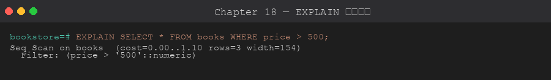
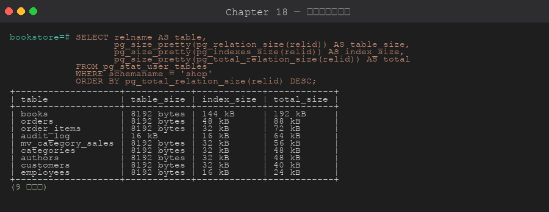
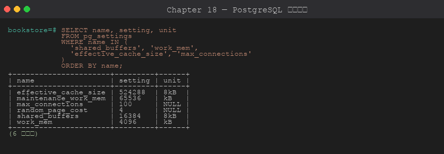

# 第 18 章 效能調校

> 目標:能用 EXPLAIN ANALYZE 讀執行計畫、設定 postgresql.conf 關鍵參數、用 VACUUM 維護資料庫健康。
>
> 🧰 **前置準備**:本章範例使用 `bookstore` 資料庫 (`shop` schema 與範例資料)。尚未建立的話,先在 repo 根目錄執行 `psql -d postgres -f setup/01-create-tutorial-db.sql` 與 `psql -d bookstore -f setup/02-sample-data.sql`,詳見[第 1 章 1.8 節](../01-installation/README.md#18-建立教學用資料庫)。

## 18.1 效能診斷流程

```
查詢慢 → EXPLAIN ANALYZE → 找慢節點 → 加索引/改 SQL/改設定 → 再測
```

## 18.2 EXPLAIN 進階閱讀



```sql
EXPLAIN (
    ANALYZE,     -- 實際執行並量測時間
    BUFFERS,     -- 顯示 buffer 命中/未命中
    VERBOSE,     -- 顯示輸出欄位
    FORMAT JSON  -- 輸出 JSON (方便程式解析)
)
SELECT b.title, a.name
FROM shop.books b
JOIN shop.authors a ON a.id = b.author_id
WHERE b.price > 500;
```

**關鍵節點解讀**:

```
Seq Scan on books (cost=0.00..1.18 rows=4 width=40)
  Filter: (price > 500)
  Rows Removed by Filter: 4
```

- `cost=啟動..總成本` — 估計成本 (非秒)
- `rows` — 估計回傳列數 (估計偏差大是問題根源!)
- `actual time=啟動..總耗時 ms`
- `loops=N` — 該節點執行 N 次

常見節點:
| 節點 | 說明 |
|------|------|
| Seq Scan | 全表掃描 |
| Index Scan | 用索引,再回表取列 |
| Index Only Scan | 用索引不回表 (最快) |
| Bitmap Index Scan + Heap Scan | 批次 bitmap 方式 |
| Hash Join | 雜湊連接 (中大型 JOIN) |
| Merge Join | 排序合併 (已排序輸入) |
| Nested Loop | 巢狀迴圈 (小表 inner) |
| Sort | 需要排序 (警惕大表) |
| Hash | 建雜湊表 |
| Materialize | 物化子查詢結果 |

## 18.3 VACUUM 與 ANALYZE

PostgreSQL 的 MVCC 會產生「死行 (dead tuples)」,`VACUUM` 回收它們。

```sql
-- 基本 VACUUM (不鎖表)
VACUUM shop.books;

-- VACUUM + ANALYZE 一起 (更新統計資料)
VACUUM ANALYZE shop.books;

-- FULL:完全重建表 (鎖表!非必要不用)
VACUUM FULL shop.books;

-- 只更新統計 (讓 planner 有準確資訊)
ANALYZE shop.books;
ANALYZE;   -- 整個 DB

-- 查看各表 vacuum 狀態
SELECT
    schemaname, relname,
    n_live_tup, n_dead_tup,
    last_vacuum, last_autovacuum,
    last_analyze
FROM pg_stat_user_tables
WHERE schemaname = 'shop'
ORDER BY n_dead_tup DESC;
```

## 18.4 Autovacuum 設定

`postgresql.conf` 的關鍵參數:
```ini
autovacuum = on
autovacuum_vacuum_threshold = 50    # 50 個 dead tuple 才觸發
autovacuum_vacuum_scale_factor = 0.2  # + 20% 的表大小
autovacuum_analyze_threshold = 50
autovacuum_analyze_scale_factor = 0.1

# 針對特定高寫入表調整
ALTER TABLE shop.order_items SET (autovacuum_vacuum_scale_factor = 0.01);
```

## 18.5 postgresql.conf 效能參數





```ini
# 記憶體
shared_buffers = 256MB          # 通常 25% 實體記憶體
work_mem = 4MB                  # 每個排序/hash 操作
maintenance_work_mem = 64MB     # VACUUM/CREATE INDEX 用
effective_cache_size = 768MB    # OS cache 估計值 (讓 planner 更準)

# WAL
wal_buffers = 16MB
checkpoint_completion_target = 0.9
max_wal_size = 1GB

# Planner
random_page_cost = 1.1          # SSD 設 1.1 (HDD 預設 4)
effective_io_concurrency = 200  # SSD 設高

# 連線
max_connections = 100           # 搭配 PgBouncer 可設低
```

修改 `shared_buffers` 等需要重啟。`work_mem` 等可 `ALTER SYSTEM SET ... ; SELECT pg_reload_conf();`。

## 18.6 慢查詢日誌

```ini
# postgresql.conf
log_min_duration_statement = 1000   # 超過 1 秒記錄
log_line_prefix = '%t [%p]: [%l-1] db=%d,user=%u,app=%a,client=%h '
```

配合 `pg_stat_statements`:
```sql
CREATE EXTENSION IF NOT EXISTS pg_stat_statements;

-- 找最慢的 10 個查詢
SELECT
    left(query, 80) AS query,
    calls,
    round(mean_exec_time::numeric, 2) AS avg_ms,
    round(total_exec_time::numeric, 2) AS total_ms,
    rows
FROM pg_stat_statements
ORDER BY mean_exec_time DESC
LIMIT 10;
```

## 18.7 連線池與 PgBouncer

PostgreSQL 每個連線都是一個 process (~5MB),高並發要用連線池:

```bash
# 安裝 PgBouncer (macOS)
brew install pgbouncer

# pgbouncer.ini 範例
[databases]
bookstore = host=localhost port=5432 dbname=bookstore

[pgbouncer]
listen_port = 6432
pool_mode = transaction       # session / transaction / statement
max_client_conn = 200
default_pool_size = 20
```

## 18.8 Keyset 分頁 (效能正確的分頁)

```sql
-- ❌ OFFSET 大時極慢 (掃描 OFFSET + LIMIT 列)
SELECT * FROM shop.books ORDER BY id LIMIT 10 OFFSET 10000;

-- ✅ Keyset:記住上一頁最後的 id
SELECT * FROM shop.books
WHERE id > :last_id     -- 上一頁最後一筆
ORDER BY id
LIMIT 10;               -- 永遠快!
```

## 18.9 其他調校技巧

```sql
-- 強制 planner 選特定 join 策略 (除錯用)
SET enable_seqscan = off;
SET enable_hashjoin = off;

-- 查詢統計視圖
SELECT * FROM pg_stat_user_tables  WHERE schemaname = 'shop';
SELECT * FROM pg_stat_user_indexes WHERE schemaname = 'shop';

-- Table bloat 查詢
SELECT
    schemaname || '.' || relname AS table,
    pg_size_pretty(pg_total_relation_size(relid)) AS total_size,
    pg_size_pretty(pg_relation_size(relid)) AS table_size,
    pg_size_pretty(pg_total_relation_size(relid) - pg_relation_size(relid)) AS index_size
FROM pg_stat_user_tables
WHERE schemaname = 'shop'
ORDER BY pg_total_relation_size(relid) DESC;
```

## 章節腳本

- [`scripts/01-explain-analyze.sql`](./scripts/01-explain-analyze.sql)
- [`scripts/02-vacuum-stats.sql`](./scripts/02-vacuum-stats.sql)
- [`scripts/03-pg-stat-statements.sql`](./scripts/03-pg-stat-statements.sql)

---

**🎉 恭喜完成 PostgreSQL 完整教程!**

回顧所學:
- 基礎:安裝、pgAdmin、資料庫/Schema、資料型別、資料表設計
- SQL:CRUD、JOIN、聚合、索引、視圖
- 進階:Function/Procedure、Trigger、交易、CTE/Window Function
- 應用:JSON、全文搜尋、權限管理、備份還原、效能調校
